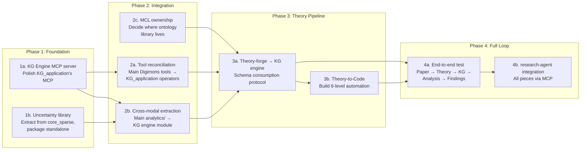

# KGAS Ecosystem Architecture Plan

How the Digimon/KGAS-related projects fit together, what work items remain, and in what order.

Created 2026-02-14. Living document — update as decisions are made.

---

## Component Diagram

```mermaid
graph TB
    subgraph "Research Layer (Orchestration)"
        RA[research-agent<br/>MCP Consumer<br/>STATUS: Working]
    end

    subgraph "Analysis Tools (MCP Servers)"
        CE[conspiracy_epistemics<br/>22-code discourse<br/>STATUS: Working]
        QC[qualitative_coding<br/>Thematic/grounded theory<br/>STATUS: Working]
        PT[process_tracing<br/>Bayesian hypothesis testing<br/>STATUS: Working]
        IW[investigative_wiki<br/>Entity/evidence storage<br/>STATUS: Working]
    end

    subgraph "KG Engine"
        KGA[Digimon_for_KG_application<br/>Modular operators, agent planning<br/>46 tools, 6 orchestrators<br/>STATUS: Working, needs MCP polish]
        CMA[Cross-Modal Analytics<br/>Graph↔Table↔Vector<br/>16,800 lines in main Digimons<br/>STATUS: Exists, not integrated]
        TOOLS[Tool Implementations<br/>37+ tools (Phase 1-3)<br/>In main Digimons<br/>STATUS: Exists, not integrated]
    end

    subgraph "Theory Pipeline"
        TF[theory-forge<br/>Extract theories from papers<br/>Owns meta-schema v13<br/>STATUS: Working MCP server]
        T2C[Theory-to-Code<br/>6-level automation<br/>Formulas→Algorithms→Procedures→<br/>Rules→Sequences→Frameworks<br/>STATUS: Level 1 only, rest is design docs]
    end

    subgraph "Shared Infrastructure"
        LLC[llm_client<br/>Multi-provider LLM wrapper<br/>STATUS: Working]
        UCL[Uncertainty Library<br/>IC-informed confidence<br/>CERQual + propagation<br/>STATUS: Code exists in core_sparse,<br/>not packaged]
        MCL[Master Concept Library<br/>80+ entity types, DOLCE-grounded<br/>STATUS: YAML exists in main Digimons]
    end

    %% Research agent consumes everything via MCP
    RA -->|MCP| CE
    RA -->|MCP| QC
    RA -->|MCP| PT
    RA -->|MCP| IW
    RA -->|MCP| KGA
    RA -->|MCP| TF

    %% KG Engine internals
    KGA -.->|needs| CMA
    KGA -.->|needs| TOOLS
    KGA -->|uses| LLC

    %% Theory pipeline
    TF -->|produces schemas| T2C
    T2C -->|produces operators| KGA
    TF -->|uses| LLC

    %% Cross-cutting
    KGA -.->|needs| UCL
    KGA -.->|needs| MCL
    CMA -.->|needs| UCL
    TF -.->|could use| MCL

    %% Analysis tools use KG engine
    CE -.->|could consume| KGA
    QC -.->|could consume| KGA
    PT -.->|could consume| KGA

    %% Styling
    classDef working fill:#2d5,stroke:#333,color:#fff
    classDef partial fill:#da3,stroke:#333,color:#fff
    classDef notbuilt fill:#d33,stroke:#333,color:#fff
    classDef infra fill:#36d,stroke:#333,color:#fff

    class RA,CE,QC,PT,IW,TF working
    class KGA,CMA,TOOLS partial
    class T2C notbuilt
    class LLC,UCL,MCL infra
```

**Legend**: Green = working, Orange = exists but needs integration, Red = not yet built, Blue = infrastructure

---

## Project Inventory

### Already Working (Green)

| Project | What it does | MCP Server? | Depends on |
|---------|-------------|-------------|------------|
| **research-agent** | Orchestrates all tools for investigations | Consumer | All MCP servers |
| **theory-forge** | Extract theories from PDFs → v13 schemas | Yes (4 tools) | llm_client |
| **conspiracy_epistemics** | 22-code epistemic discourse annotation | Yes (10 tools) | — |
| **qualitative_coding** | Thematic analysis + grounded theory | Yes (12 tools) | — |
| **process_tracing** | Van Evera Bayesian hypothesis testing | Yes (2 tools) | — |
| **investigative_wiki** | Entity/evidence knowledge graph | Yes (10 tools) | — |
| **llm_client** | Shared LLM wrapper (litellm + agent SDK) | — | — |

### Exists, Needs Work (Orange)

| Component | Where it lives | What's needed |
|-----------|---------------|---------------|
| **KG Engine (agent/operators)** | Digimon_for_KG_application | MCP server completion, integration testing |
| **Cross-Modal Analytics** | main Digimons `src/analytics/` | Extract from monorepo, integrate with KG engine |
| **Tool Implementations** | main Digimons `src/tools/` | Reconcile with KG_application's operator set |
| **Master Concept Library** | main Digimons `src/ontology_library/` | Decide ownership (KG engine? theory-forge? standalone?) |
| **Uncertainty/Confidence** | core_sparse `src/core/confidence_scoring/` | Package as reusable library |

### Not Yet Built (Red)

| Component | Design docs exist? | What it would do |
|-----------|-------------------|-----------------|
| **Theory-to-Code** | Yes (6-level architecture in core_sparse) | Take theory-forge schemas → generate executable analysis code |

---

## Dependency Graph (Build Order)



---

## Work Items (Detail)

### Phase 1: Foundation (no cross-project dependencies)

**1a. KG Engine MCP Server**
- Project: Digimon_for_KG_application
- Goal: Complete, tested MCP server exposing core operators
- Current state: Partial MCP in `Core/MCP/`, 46 tools registered internally
- Work: Expose key operators via MCP (document ingestion, graph building, querying)
- Estimate: Small — the tools exist, just need MCP wrappers
- Blocker: None

**1b. Uncertainty Library**
- Source: `archive/digimon_core_sparse/src/core/confidence_scoring/`
- Goal: Standalone package (or llm_client module) for IC-informed uncertainty
- Contains: CERQual assessment, confidence calculator, temporal range methods, combination methods
- Work: Extract, clean imports, add tests, package
- Estimate: Small — code exists, needs packaging
- Blocker: None
- Decision needed: Where does it live? Options:
  - `llm_client[uncertainty]` optional dep
  - Standalone `kgas-uncertainty` package
  - Module inside KG_application

### Phase 2: Integration (depends on Phase 1)

**2a. Tool Reconciliation**
- Problem: Main Digimons has 37+ tools (Phase 1-3), KG_application has 46 operators. Overlap is unclear.
- Goal: Single canonical set of tools/operators in KG_application
- Work: Audit overlap, port missing tools from main as KG_application operators
- Estimate: Medium — needs careful comparison
- Blocker: 1a (need working KG engine first)

**2b. Cross-Modal Extraction**
- Source: Main Digimons `src/analytics/` (16,800 lines)
- Goal: Cross-modal analysis available in KG engine
- Contains: Format converters, mode selection, orchestrator, linker, validator, resilience
- Work: Extract from monorepo, resolve dependencies, integrate with KG engine
- Estimate: Medium-Large — significant code, many internal dependencies
- Blocker: 1a, 1b (uncertainty feeds into cross-modal confidence)

**2c. MCL Ownership Decision**
- Problem: Master Concept Library (80+ entity types, DOLCE-grounded) exists in main Digimons
- Question: Does it belong in KG engine (ontology for extraction), theory-forge (theory alignment), or standalone?
- Work: Decide ownership, move files, update imports
- Estimate: Small once decided
- Blocker: None, but informs 3a

### Phase 3: Theory Pipeline (depends on Phase 2)

**3a. Theory-forge → KG Engine Protocol**
- Goal: KG engine can consume theory-forge schemas to guide extraction
- Example: "Apply Prospect Theory to this corpus" → theory-forge provides schema → KG engine uses schema to configure entity/relationship extraction
- Work: Define consumption interface, implement in both projects
- Estimate: Medium — protocol design + implementation on both sides
- Blocker: 2a, 2b, 2c

**3b. Theory-to-Code (6-Level Automation)**
- Source: Design docs in `archive/digimon_core_sparse/docs/architecture/Thinking_out_loud/`
- Goal: Take theory-forge schema → generate executable analysis at all 6 levels
- Current state: Level 1 (formulas) implemented, rest is architecture
- Work: Implement levels 2-6
- Estimate: Large — this is new development
- Blocker: 3a (need working theory→KG pipeline first)
- Decision needed: Separate project or extension of theory-forge?

### Phase 4: Full Loop (depends on Phase 3)

**4a. End-to-End Test**
- Goal: Academic paper → theory-forge extracts theory → schema guides KG engine → cross-modal analysis → research findings with uncertainty
- Work: Integration test across all components
- Blocker: 3a minimum, 3b for full loop

**4b. research-agent Integration**
- Goal: research-agent can orchestrate the full pipeline via MCP
- Work: Update research-agent's tool catalog, add workflow patterns
- Blocker: 4a

---

## Open Architectural Decisions

1. **Main Digimons fate**: Does it become archive once tools/analytics are extracted? Or does it remain the development repo and KG_application gets absorbed into it?

2. **Uncertainty location**: llm_client module vs standalone package vs KG engine internal?

3. **MCL ownership**: KG engine vs theory-forge vs standalone?

4. **Theory-to-code home**: Extension of theory-forge or new project?

5. **MCP vs library imports**: Should KG engine consume theory-forge via MCP (loose coupling) or direct Python imports (tight coupling)?

---

## What We're NOT Building

- Enterprise features (OAuth, RBAC, multi-tenant, Kubernetes)
- New UI (Streamlit app exists in main, good enough)
- New agent brain (use OpenClaw/Codex CLI/Claude Code)
- New MCP framework (use existing fastmcp/mcp patterns)
