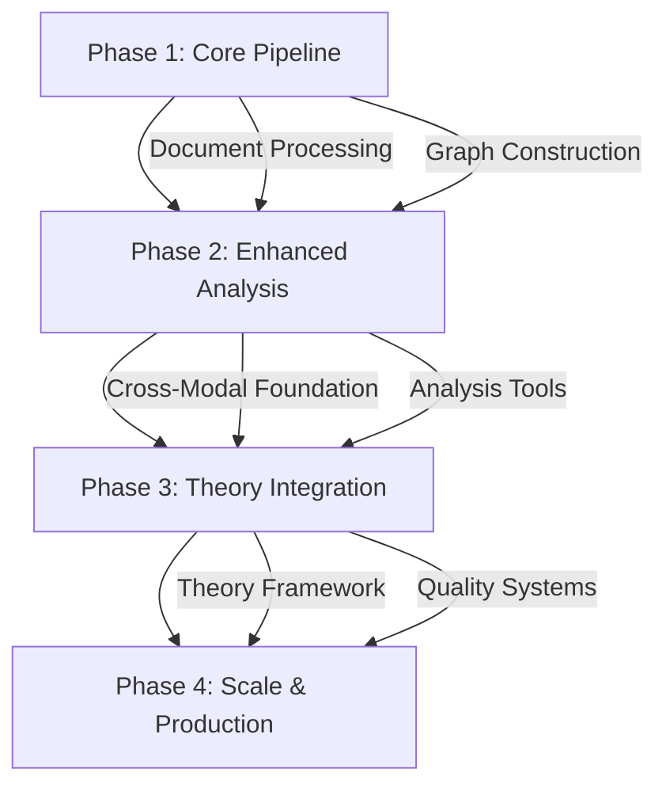

# KGAS Architecture Implementation Phases

**Version**: 1.0
**Status**: Active Planning
**Last Updated**: 2025-07-22

## Overview

This document outlines the phased implementation approach for the Knowledge Graph Analysis System (KGAS). Each phase builds upon the previous, delivering incremental value while managing complexity and risk.

## Phase 1: Core Pipeline (MVP)

**Timeline**: 3-4 months
**Goal**: Establish basic document processing and knowledge graph construction

### Components to Implement

#### Document Processing
- **T01**: PDF Loader - Extract text and metadata from PDFs
- **T02**: Word Document Loader - Support for .docx files
- **T03**: Markdown Loader - Process .md files
- **T04**: Text File Loader - Handle plain text
- **T05**: CSV Loader - Import structured data

#### Text Processing
- **T15A**: Smart Text Chunker - Context-aware text segmentation
- **T23A**: Entity Extractor - NER with confidence scores
- **T27**: Coreference Resolver - Link entity mentions

#### Graph Construction
- **T31**: Entity Node Builder - Create knowledge graph nodes
- **T34**: Edge Builder - Construct relationships between entities
- **T49**: Basic Query Tool - Simple Cypher queries

#### Core Infrastructure
- SQLite document storage (documents, chunks, mentions tables)
- Neo4j graph database setup
- Basic workflow orchestration
- Single confidence score tracking

### Deliverables
- Working pipeline from PDF to knowledge graph
- Basic entity extraction and relationship building
- Simple query interface
- Provenance tracking for all operations

### Success Criteria
- Process 10-50 documents reliably
- Extract entities with 80%+ accuracy
- Build navigable knowledge graph
- Complete audit trail

## Phase 2: Enhanced Analysis

**Timeline**: 3-4 months
**Goal**: Add advanced graph algorithms and begin cross-modal capabilities

### Components to Implement

#### Graph Analysis Tools
- **T06**: Centrality Analyzer - PageRank, betweenness, closeness
- **T07**: Community Detector - Louvain, modularity optimization
- **T08**: Path Finder - Shortest paths, reachability
- **T09**: Subgraph Extractor - Extract relevant neighborhoods
- **T10**: Graph Summarizer - Statistical summaries

#### Table Analysis Tools
- **T11**: Graph to Table Converter - Export for statistical analysis
- **T12**: Table Aggregator - Group and summarize data
- **T13**: Statistical Analyzer - Correlations, distributions
- **T14**: Table Joiner - Combine multiple data sources

#### Vector Analysis Tools
- **T15**: Text Embedder - Generate embeddings
- **T16**: Similarity Calculator - Cosine similarity
- **T17**: Clustering Tool - K-means, DBSCAN
- **T18**: Dimensionality Reducer - PCA, t-SNE

#### Cross-Modal Foundation
- **T91**: Graph to Table Bridge - Initial conversion
- **T92**: Table to Vector Bridge - Basic transformation
- Implement 2-layer uncertainty model
- Performance monitoring framework

### Deliverables
- Full suite of graph algorithms
- Basic cross-modal conversions
- Enhanced uncertainty tracking
- Performance optimization

### Success Criteria
- Process 100-500 documents efficiently
- Support 3+ analysis modalities
- Track uncertainty through pipeline
- Sub-second query performance

## Phase 3: Theory Integration

**Timeline**: 4-6 months
**Goal**: Implement theory-aware processing and advanced cross-modal analysis

### Components to Implement

#### Theory-Aware Tools
- **T50-T55**: Theory extraction and validation
- **T56-T60**: Ontology integration tools
- **MCL**: Master Concept Library implementation
- Theory schema validation framework

#### Advanced Cross-Modal
- **T93**: Vector to Graph Bridge - Embedding-based graph construction
- **T94**: Table to Graph Bridge - Structured data import
- **T95**: Full Modal Orchestrator - Intelligent format selection
- 4-layer uncertainty architecture

#### Quality & Validation
- **T80-T85**: Quality assessment tools
- **T86-T90**: Validation frameworks
- Comprehensive testing suite
- Benchmarking infrastructure

### Deliverables
- Theory-aware extraction pipeline
- DOLCE ontology integration
- Full cross-modal orchestration
- Advanced uncertainty quantification

### Success Criteria
- Support 5+ domain ontologies
- Seamless modal conversion
- Theory-guided extraction
- Research-grade validation

## Phase 4: Scale & Production

**Timeline**: 6+ months
**Goal**: Production-ready system with advanced features

### Components to Implement

#### Scaling Infrastructure
- Distributed processing support
- Advanced caching strategies
- Resource optimization
- Horizontal scaling capability

#### Advanced Features
- **T96-T100**: Specialized domain tools
- **T101-T121**: Research-specific capabilities
- Real-time processing options
- Advanced visualization

#### Governance & Operations
- Tool governance framework
- Automated quality monitoring
- Performance dashboards
- Security hardening

### Deliverables
- Production-ready system
- Complete 121-tool ecosystem
- Operational dashboards
- Deployment automation

### Success Criteria
- Process 10,000+ documents
- Support concurrent users
- 99.9% availability
- Enterprise security

## Implementation Guidelines

### Phase Transition Criteria

Before moving to the next phase:
1. All phase components implemented and tested
2. Success criteria met with evidence
3. Documentation complete and current
4. Team trained on new capabilities
5. Retrospective completed

### Risk Management

#### Technical Risks
- **Complexity Growth**: Mitigate through modular design
- **Performance Degradation**: Continuous monitoring
- **Integration Challenges**: Well-defined interfaces
- **Data Quality**: Validation at each step

#### Mitigation Strategies
1. **Incremental Delivery**: Small, tested releases
2. **Continuous Integration**: Automated testing
3. **Architecture Reviews**: Regular assessments
4. **User Feedback**: Early and often

### Resource Allocation

#### Phase 1 Team
- 2 Backend Engineers
- 1 Data Engineer
- 1 QA Engineer
- 0.5 DevOps

#### Phase 2-3 Team
- 3 Backend Engineers
- 1 Data Scientist
- 1 ML Engineer
- 1 QA Engineer
- 1 DevOps

#### Phase 4 Team
- 4 Backend Engineers
- 2 Data Scientists
- 1 ML Engineer
- 2 QA Engineers
- 2 DevOps

## Phase Dependencies

## Success Metrics

### Phase 1 Metrics
- Documents processed: 50+
- Entity extraction F1: 0.80+
- Pipeline reliability: 95%+
- Query response time: <1s

### Phase 2 Metrics
- Documents processed: 500+
- Cross-modal conversions: 3 types
- Algorithm accuracy: 85%+
- Performance improvement: 2x

### Phase 3 Metrics
- Theory schemas: 5+
- Ontology coverage: 80%+
- Uncertainty tracking: 4 layers
- Validation coverage: 90%+

### Phase 4 Metrics
- Documents processed: 10,000+
- Concurrent users: 10+
- System availability: 99.9%
- Tool ecosystem: 121 tools

## Decision Points

### After Phase 1
- Validate core architecture
- Assess performance bottlenecks
- Review user feedback
- Decide on Phase 2 priorities

### After Phase 2
- Evaluate cross-modal effectiveness
- Measure analysis accuracy
- Review scalability needs
- Plan theory integration approach

### After Phase 3
- Assess theory-aware benefits
- Validate research outcomes
- Review production requirements
- Plan scaling strategy

## Communication Plan

### Stakeholder Updates
- Monthly progress reports
- Quarterly demos
- Phase completion reviews
- Annual strategy sessions

### Documentation
- Architecture updates per phase
- API documentation
- User guides
- Training materials

### Knowledge Transfer
- Phase retrospectives
- Technical deep-dives
- Cross-training sessions
- Best practices documentation

## Conclusion

This phased approach allows KGAS to grow from a minimum viable product to a comprehensive research platform. Each phase delivers value while maintaining flexibility to adapt based on learnings and changing requirements.

The key to success is maintaining architectural integrity while iterating quickly, always keeping the end vision in sight while delivering incremental value.