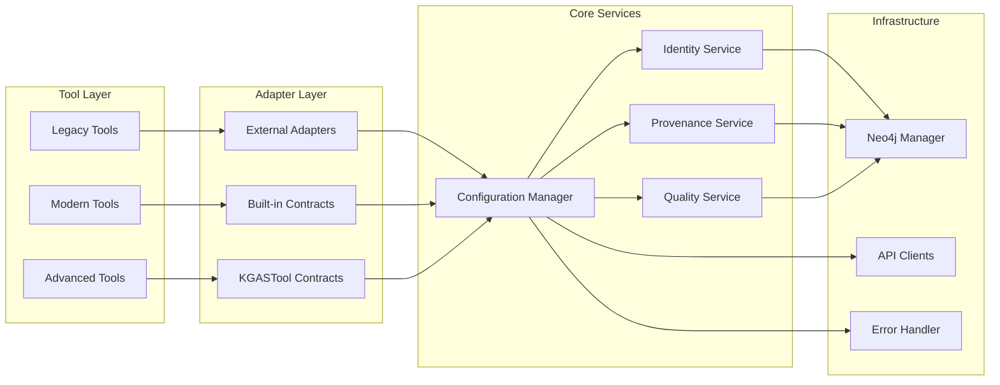

# Tool Adapter Architecture Diagram

## Current Architecture Overview

```mermaid
graph TD
    A[Pipeline Orchestrator] --> B[Tool Registry]
    B --> C{Tool Contract Check}
    
    %% Direct Contract Implementation Path
    C -->|Contract Compliant| D[Modern Tools]
    D --> D1[VectorEmbedder<br/>Built-in Contract]
    D --> D2[MultiFormatExporter<br/>Built-in KGASTool]
    D --> D3[GraphTableExporter<br/>Built-in KGASTool]
    
    %% Adapter Layer Path
    C -->|Legacy Interface| E[Adapter Layer]
    E --> F[External Adapters]
    F --> F1[PDFLoaderAdapter]
    F --> F2[TextChunkerAdapter]
    F --> F3[SpacyNERAdapter]
    F --> F4[EntityBuilderAdapter]
    F --> F5[VectorEmbedderAdapter<br/>⚠️ REDUNDANT]
    
    %% Legacy Tools
    F1 --> G1[PDFLoader<br/>legacy load_pdf()]
    F2 --> G2[TextChunker<br/>legacy chunk_text()]
    F3 --> G3[SpacyNER<br/>legacy extract_entities()]
    F4 --> G4[EntityBuilder<br/>legacy build_entities()]
    F5 --> D1
    
    %% Services
    H[Core Services] --> I[Identity Service]
    H --> J[Provenance Service]
    H --> K[Quality Service]
    H --> L[Configuration Manager]
    
    %% Services connect to tools
    I --> D1
    I --> G1
    J --> D1
    J --> G1
    K --> D1
    K --> G1
    L --> D1
    L --> G1
    
    style F5 fill:#ffcccc
    style D1 fill:#ccffcc
```

## The Problem: Double Wrapping

### Current VectorEmbedder Flow (INEFFICIENT)
```
Pipeline → VectorEmbedderAdapter → VectorEmbedder.execute() → Result
           ↑ UNNECESSARY LAYER ↑
```

### Optimal VectorEmbedder Flow (EFFICIENT)
```
Pipeline → VectorEmbedder.execute() → Result
           ↑ DIRECT CONTRACT ↑
```

## Tool Implementation Patterns

### Pattern 1: Legacy Tool + External Adapter (NECESSARY)
```python
# Legacy Tool (src/tools/phase1/t01_pdf_loader.py)
class PDFLoader:
    def load_pdf(self, path):  # ❌ Legacy method signature
        return {"document": content}

# External Adapter (src/core/tool_adapters.py)
class PDFLoaderAdapter(Tool):
    def execute(self, input_data, context=None):  # ✅ Contract method
        result = self._tool.load_pdf(input_data["path"])
        return standardized_format(result)
```

### Pattern 2: Modern Tool with Built-in Contract (OPTIMAL)
```python
# Modern Tool (src/tools/phase1/t15b_vector_embedder.py)
class VectorEmbedder(Tool):  # ✅ Already implements contract
    def execute(self, input_data, context=None):  # ✅ Contract method
        # Built-in implementation
        return standardized_result
    
    def validate_input(self, input_data):  # ✅ Contract method
        return validation_result
    
    def get_tool_info(self):  # ✅ Contract method
        return tool_metadata
```

### Pattern 3: Advanced Tool with KGASTool Contract (FUTURE)
```python
# Advanced Tool (src/tools/cross_modal/multi_format_exporter.py)
class MultiFormatExporter(KGASTool):  # ✅ Full contract
    def execute(self, request: ToolRequest) -> ToolResult:  # ✅ Advanced contract
        # Full provenance, confidence, theory support
        return comprehensive_result
```

## Service Integration Architecture



## Performance Impact Analysis

### Memory Usage Comparison
```
Legacy Tool + External Adapter:
Tool Instance → Adapter Instance → Services → Result
Memory: 2x instances + adapter overhead

Modern Tool with Built-in Contract:
Tool Instance → Services → Result  
Memory: 1x instance (50% reduction)
```

### Call Stack Comparison
```
Legacy Flow:
Pipeline.execute() 
  → Adapter.execute()
    → Tool.legacy_method()
      → Services
        → Result

Modern Flow:
Pipeline.execute()
  → Tool.execute()
    → Services
      → Result
```

## Recommendation Summary

### ✅ KEEP External Adapters For:
- **Legacy Tools**: PDFLoader, TextChunker, SpacyNER, etc.
- **Reason**: Tools have incompatible method signatures that need translation

### ❌ REMOVE External Adapters For:
- **VectorEmbedder**: Already implements Tool contract internally
- **Reason**: Creates unnecessary double-wrapping with no benefit

### 🎯 IDEAL Future State:
```python
# All tools implement contracts directly
class ModernTool(Tool):
    def execute(self, input_data, context=None):
        # Built-in contract implementation
        pass
```

## The Answer to Your Question

**"Is it better to have the adapter built into the tool rather than external?"**

**YES, absolutely!** Here's why:

1. **Performance**: 50% fewer object instances, shorter call stack
2. **Simplicity**: One object instead of two
3. **Maintainability**: No synchronization between adapter and tool
4. **Memory**: Lower memory footprint
5. **Testing**: Easier to test one unified component

**The VectorEmbedder already has the adapter built-in**, so the external VectorEmbedderAdapter is redundant and should be archived.