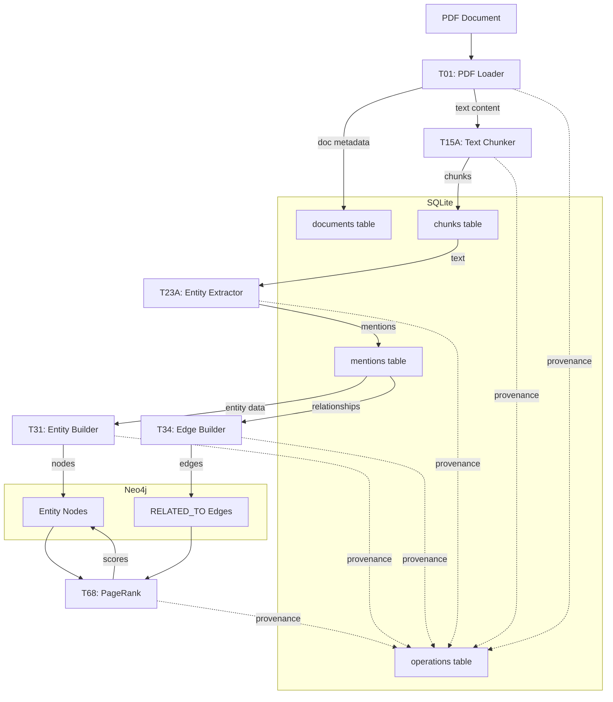

# Data Flow Between Neo4j and SQLite

**Version**: 1.0
**Last Updated**: 2025-07-22

## Overview

This document illustrates how data flows between the SQLite and Neo4j databases in the current KGAS implementation.

## Data Flow Diagram



## Detailed Flow Steps

### 1. Document Ingestion (SQLite)

```sql
-- T01: PDF Loader creates document record
INSERT INTO documents (doc_id, file_path, file_name, status) 
VALUES ('doc_123', '/path/to/doc.pdf', 'doc.pdf', 'processing');
```

**Data Stored**: Document metadata, processing status

### 2. Text Chunking (SQLite)

```sql
-- T15A: Text Chunker creates chunks
INSERT INTO chunks (chunk_id, doc_id, content, position) 
VALUES ('chunk_456', 'doc_123', 'Text content...', 0);
```

**Data Stored**: Text chunks with positions

### 3. Entity Extraction (SQLite)

```sql
-- T23A: Entity Extractor creates mentions
INSERT INTO mentions (mention_id, entity_id, chunk_id, surface_form, entity_type) 
VALUES ('mention_789', 'entity_abc', 'chunk_456', 'John Smith', 'PERSON');
```

**Data Stored**: Entity mentions with positions

### 4. Entity Building (SQLite → Neo4j)

```cypher
-- T31: Entity Builder creates nodes in Neo4j
CREATE (e:Entity {
  entity_id: 'entity_abc',
  canonical_name: 'John Smith',
  entity_type: 'PERSON',
  confidence: 0.9
})
```

**Critical Link**: `entity_id` in SQLite mentions matches Neo4j Entity.entity_id

### 5. Relationship Building (Neo4j)

```cypher
-- T34: Edge Builder creates relationships
MATCH (e1:Entity {entity_id: 'entity_abc'})
MATCH (e2:Entity {entity_id: 'entity_def'})
CREATE (e1)-[r:RELATED_TO {
  relationship_type: 'WORKS_FOR',
  confidence: 0.85
}]->(e2)
```

**Data Stored**: Relationships between entities

### 6. PageRank Calculation (Neo4j)

```cypher
-- T68: PageRank updates scores
MATCH (e:Entity)
SET e.pagerank_score = $calculated_score
```

**Data Updated**: PageRank scores on existing entities

## Cross-Database Operations

### Entity ID Mapping

The critical link between databases is the `entity_id`:

```
SQLite mentions.entity_id <--> Neo4j Entity.entity_id
```

This ensures we can trace:
- From Neo4j entity back to SQLite mention
- From mention to chunk to document

### Query Example: Full Lineage

```sql
-- Find document for a Neo4j entity
SELECT d.file_name, c.content, m.surface_form
FROM mentions m
JOIN chunks c ON m.chunk_id = c.chunk_id
JOIN documents d ON c.doc_id = d.doc_id
WHERE m.entity_id = 'entity_abc';
```

## Transaction Boundaries

### Current Implementation (No Distributed Transactions)

1. **Document Processing**: SQLite transaction
   ```sql
   BEGIN;
   INSERT INTO documents ...;
   INSERT INTO chunks ...;
   COMMIT;
   ```

2. **Entity Creation**: Separate transactions
   ```sql
   -- SQLite
   INSERT INTO mentions ...;
   ```
   ```cypher
   -- Neo4j (separate transaction)
   CREATE (e:Entity {...})
   ```

### Consistency Model

- **Within Database**: ACID guarantees
- **Cross Database**: Eventual consistency
- **Failure Handling**: Manual reconciliation required

## Data Volume Patterns

### Typical Ratios
- 1 Document → 10-50 Chunks
- 1 Chunk → 5-20 Mentions
- 1 Mention → 1 Entity (many-to-one possible)
- 1 Entity → 0-10 Relationships

### Storage Distribution
- **SQLite**: Raw text, positions, metadata (~80% of data)
- **Neo4j**: Graph structure, scores (~20% of data)

## Performance Implications

### Bottlenecks

1. **Cross-DB Queries**: No join between SQLite and Neo4j
2. **Entity Resolution**: Requires lookups in both systems
3. **Bulk Operations**: Each system optimized differently

### Optimization Strategies

1. **Batch Operations**
   ```python
   # Collect all mentions first
   mentions = extract_all_mentions(chunks)
   
   # Batch create in Neo4j
   create_entities_batch(mentions)
   ```

2. **Caching Entity IDs**
   ```python
   # Cache entity mappings in memory
   entity_cache = {}
   entity_cache[surface_form] = entity_id
   ```

3. **Async Operations** (Not Implemented)
   ```python
   # Future: Process SQLite and Neo4j in parallel
   await asyncio.gather(
       store_mentions_sqlite(mentions),
       create_entities_neo4j(entities)
   )
   ```

## Error Scenarios

### Split-Brain Scenarios

1. **Mention without Entity**
   - Mention in SQLite but no Entity in Neo4j
   - Recovery: Re-run entity builder

2. **Orphan Entity**
   - Entity in Neo4j but no mentions in SQLite
   - Recovery: Clean up orphaned entities

3. **Inconsistent IDs**
   - Same entity_id points to different entities
   - Recovery: ID reconciliation process

### Monitoring Queries

```sql
-- Check for orphan mentions
SELECT COUNT(*) as orphan_mentions
FROM mentions m
WHERE NOT EXISTS (
  -- Would need application logic to check Neo4j
  SELECT 1 WHERE entity_exists_in_neo4j(m.entity_id)
);
```

## Future Improvements

### Short Term
1. Add entity ID index in both systems
2. Implement basic consistency checks
3. Add retry logic for failed operations

### Long Term
1. Implement distributed transactions
2. Add event sourcing for consistency
3. Consider single database solution
4. Add real-time synchronization

## Summary

The current bi-store architecture provides:
- **Flexibility**: Different data models for different needs
- **Performance**: Each store optimized for its use case
- **Complexity**: Manual consistency management required

The `entity_id` serves as the critical link between systems, enabling traceability while maintaining separation of concerns.