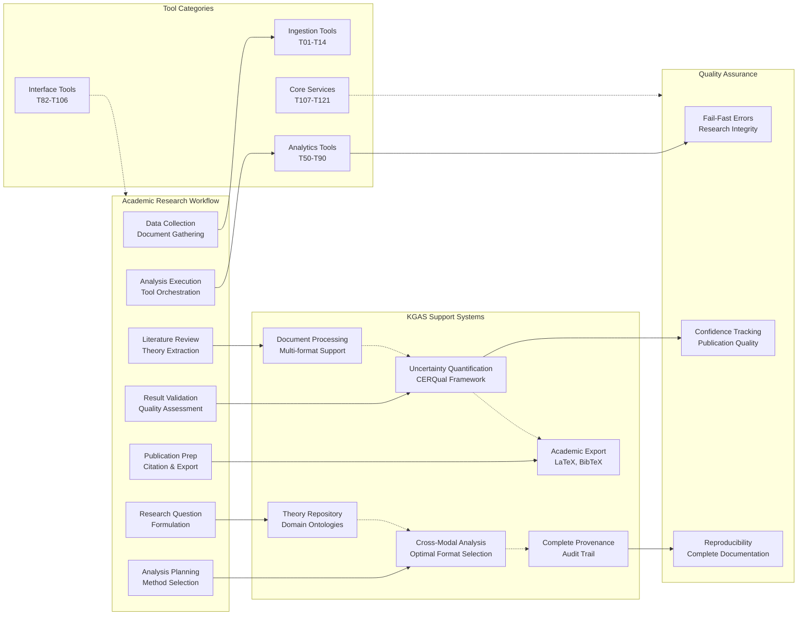

# KGAS Component Interaction Diagrams

**Purpose**: Visual representations of component interactions, service flows, and data movement in KGAS  
**Status**: Living Architecture Document  
**Last Updated**: 2025-07-23

## Overview

This document provides comprehensive visual diagrams showing how KGAS components interact, how data flows through the system, and how services coordinate to deliver cross-modal analysis capabilities.

## 1. Service Interaction Flow

```mermaid
graph TB
    %% User Interface Layer
    UI[User Interface Layer<br/>Natural Language → Agent → Workflow → Results]
    
    %% Agent Interface
    subgraph Agent["Multi-Layer Agent Interface"]
        A1[Layer 1: Agent-Controlled<br/>Complete Automation]
        A2[Layer 2: Agent-Assisted<br/>Human-in-the-Loop]
        A3[Layer 3: Manual Control<br/>Expert Control]
    end
    
    %% Core Services
    subgraph Services["Core Services Layer"]
        PO[Pipeline Orchestrator<br/>Workflow Coordination]
        AS[Analytics Service<br/>Cross-Modal Orchestration]
        IS[Identity Service<br/>Entity Resolution]
        PS[Provenance Service<br/>Lineage Tracking]
        QS[Quality Service<br/>Confidence Assessment]
        TR[Theory Repository<br/>Schema Management]
        WS[Workflow State Service<br/>Process Management]
    end
    
    %% Data Storage
    subgraph Storage["Data Storage Layer"]
        Neo4j[(Neo4j v5.13+<br/>Graph & Vectors)]
        SQLite[(SQLite<br/>Operational Metadata)]
    end
    
    %% Tool Layer
    subgraph Tools["Tool Execution Layer"]
        T1[Phase 1 Tools<br/>T01-T14]
        T2[Phase 2 Tools<br/>T50-T60]
        T3[Phase 3 Tools<br/>T61-T90]
    End
    
    %% Connections
    UI --> Agent
    Agent --> PO
    PO --> AS
    PO --> IS
    PO --> PS
    PO --> QS
    PO --> TR
    PO --> WS
    
    AS --> Tools
    IS --> Tools
    QS --> Tools
    
    Services --> Neo4j
    Services --> SQLite
    Tools --> Neo4j
    Tools --> SQLite
    
    %% Service Coordination
    AS -.-> IS
    AS -.-> QS
    IS -.-> PS
    QS -.-> PS
    PO -.-> WS
```

## 2. Cross-Modal Analysis Workflow


## 3. Tool Orchestration Patterns


## 4. Data Flow Between Neo4j and SQLite


## 5. Uncertainty Propagation Flow

```mermaid
graph TD
    %% Input Sources
    subgraph Sources["Uncertainty Sources"]
        TEXT_Q[Text Quality<br/>OCR Errors, Formatting]
        MODEL_Q[Model Uncertainty<br/>LLM Confidence, NLP Accuracy]
        DATA_Q[Data Quality<br/>Missing Values, Inconsistencies]
        DOMAIN_Q[Domain Competence<br/>Model Familiarity]
    end
    
    %% Four-Layer Architecture  
    subgraph Layer1["Layer 1: Contextual Entity Resolution"]
        CONTEXT[Transformer-based<br/>Contextual Embeddings]
        ENTITY_PROB[Probability Distributions<br/>Over Entity Candidates]
    end
    
    subgraph Layer2["Layer 2: Temporal Knowledge Graph"]
        TKG[Temporal Facts<br/>Time-bounded Confidence]
        INTERVAL[Interval Confidence<br/>[lower, upper] bounds]
    end
    
    subgraph Layer3["Layer 3: Bayesian Aggregation + IC"]
        INFO_VALUE[Information Value<br/>Assessment (Heuer's 4 Types)]
        ACH[Analysis of Competing<br/>Hypotheses]
        BAYESIAN[LLM-based Bayesian<br/>Parameter Estimation]
        CALIBRATION[Calibration System<br/>Confidence Adjustment]
    end
    
    subgraph Layer4["Layer 4: Distribution Preservation"]
        MIXTURE[Mixture Models<br/>Distribution Parameters]
        HIERARCHY[Bayesian Hierarchical<br/>Models]
        POLARIZATION[Polarization Detection<br/>Subgroup Structure]
    end
    
    %% CERQual Assessment
    subgraph CERQual["CERQual Framework Assessment"]
        METHOD[Methodological<br/>Limitations]
        RELEVANCE[Relevance to<br/>Research Context]
        COHERENCE[Internal Consistency<br/>& Logic]
        ADEQUACY[Adequacy of<br/>Supporting Data]
    end
    
    %% Output
    subgraph Output["Uncertainty Output"]
        CONFIDENCE[Advanced Confidence Score<br/>Multi-dimensional Assessment]
        DISTRIBUTION[Full Uncertainty<br/>Distribution]
        EXPLANATION[Explainable Uncertainty<br/>Reasoning Chain]
        VISUALIZATION[Uncertainty<br/>Visualization]
    end
    
    %% Flow
    Sources --> Layer1
    Layer1 --> CONTEXT
    CONTEXT --> ENTITY_PROB
    ENTITY_PROB --> Layer2
    
    Layer2 --> TKG
    TKG --> INTERVAL
    INTERVAL --> Layer3
    
    Layer3 --> INFO_VALUE
    INFO_VALUE --> ACH
    ACH --> BAYESIAN
    BAYESIAN --> CALIBRATION
    CALIBRATION --> Layer4
    
    Layer4 --> MIXTURE
    MIXTURE --> HIERARCHY
    HIERARCHY --> POLARIZATION
    POLARIZATION --> CERQual
    
    CERQual --> METHOD
    METHOD --> RELEVANCE
    RELEVANCE --> COHERENCE
    COHERENCE --> ADEQUACY
    ADEQUACY --> Output
    
    Output --> CONFIDENCE
    Output --> DISTRIBUTION
    Output --> EXPLANATION
    Output --> VISUALIZATION
```

## 6. Academic Research Workflow Integration



## Implementation Status

This document describes **visual representations of the target architecture** - intended component interactions and data flows. For current implementation status of these interactions, see:

- **[Roadmap Overview](../../roadmap/ROADMAP_OVERVIEW.md)** - Current component implementation status
- **[Phase TDD Progress](../../roadmap/phases/phase-tdd/tdd-implementation-progress.md)** - Active service integration progress
- **[Service Implementation Evidence](../../roadmap/phases/phase-2-implementation-evidence.md)** - Completed service interactions

*This diagram document contains no implementation status information by design - all status tracking occurs in the roadmap documentation.*

---

These diagrams provide comprehensive visual representations of KGAS component interactions, showing how the sophisticated academic research architecture coordinates services, tools, and data flows to deliver cross-modal analysis capabilities with appropriate uncertainty quantification and academic integrity.