# Uncertainty Propagation Flow Diagrams

## Overview

This document visualizes how uncertainty propagates through the KGAS system across all four layers of the uncertainty architecture.

## Layer 1: Basic Confidence Score Propagation

```mermaid
flowchart TD
    subgraph "Document Processing"
        D1[PDF Document<br/>OCR Quality: 0.95] --> C1[Chunk 1<br/>Confidence: 0.95]
        D1 --> C2[Chunk 2<br/>Confidence: 0.95]
        D1 --> C3[Chunk 3<br/>Confidence: 0.95]
    end
    
    subgraph "Entity Extraction"
        C1 --> E1[Entity: Apple<br/>NER Confidence: 0.85]
        C1 --> E2[Entity: Jobs<br/>NER Confidence: 0.90]
        C2 --> E3[Entity: iPhone<br/>NER Confidence: 0.92]
        C3 --> E4[Entity: Apple Inc<br/>NER Confidence: 0.88]
    end
    
    subgraph "Confidence Aggregation"
        E1 --> A1[Min(0.95, 0.85) = 0.85]
        E2 --> A2[Min(0.95, 0.90) = 0.90]
        E3 --> A3[Min(0.95, 0.92) = 0.92]
        E4 --> A4[Min(0.95, 0.88) = 0.88]
    end
    
    subgraph "Relationship Building"
        A1 --> R1[Jobs works_at Apple<br/>Confidence: Min(0.85, 0.90) = 0.85]
        A3 --> R2[Apple makes iPhone<br/>Confidence: Min(0.85, 0.92) = 0.85]
    end
```

## Layer 2: Contextual Entity Resolution Flow

```mermaid
flowchart LR
    subgraph "Mention Detection"
        M1[Mention: "Apple"<br/>Context: "tech giant"] --> CM1{Context<br/>Analysis}
        M2[Mention: "Apple"<br/>Context: "fruit nutrition"] --> CM2{Context<br/>Analysis}
        M3[Mention: "Jobs"<br/>Context: "CEO founder"] --> CM3{Context<br/>Analysis}
    end
    
    subgraph "Contextual Scoring"
        CM1 --> |Tech context| CS1[Apple Inc: 0.95<br/>Apple fruit: 0.05]
        CM2 --> |Food context| CS2[Apple Inc: 0.10<br/>Apple fruit: 0.90]
        CM3 --> |Business context| CS3[Steve Jobs: 0.92<br/>Other Jobs: 0.08]
    end
    
    subgraph "Entity Resolution"
        CS1 --> ER1[Resolved: Apple Inc<br/>Confidence: 0.95<br/>Context Weight: 15]
        CS2 --> ER2[Resolved: Apple (fruit)<br/>Confidence: 0.90<br/>Context Weight: 12]
        CS3 --> ER3[Resolved: Steve Jobs<br/>Confidence: 0.92<br/>Context Weight: 18]
    end
    
    subgraph "Confidence Enhancement"
        ER1 --> CE1[Enhanced Confidence:<br/>Base: 0.85 → Context: 0.95]
        ER2 --> CE2[New Entity Created:<br/>Confidence: 0.90]
        ER3 --> CE3[Enhanced Confidence:<br/>Base: 0.90 → Context: 0.92]
    end
```

## Layer 3: Temporal Knowledge Graph Flow

```mermaid
flowchart TB
    subgraph "Time-Stamped Entities"
        E1[Entity: COVID Stats<br/>Created: 2020-03-01<br/>Initial Conf: 0.95] 
        E2[Entity: Stock Price<br/>Created: 2023-01-15<br/>Initial Conf: 0.90]
        E3[Entity: Climate Data<br/>Created: 2022-06-01<br/>Initial Conf: 0.88]
    end
    
    subgraph "Temporal Decay Functions"
        E1 --> TD1[News Domain<br/>Half-life: 7 days<br/>λ = 0.099/day]
        E2 --> TD2[Financial Domain<br/>Half-life: 1 day<br/>λ = 0.693/day]
        E3 --> TD3[Scientific Domain<br/>Half-life: 365 days<br/>λ = 0.0019/day]
    end
    
    subgraph "Query Time: 2025-07-22"
        TD1 --> Q1[Age: 1969 days<br/>Decay: 0.5^281 ≈ 0<br/>Current Conf: ~0.001]
        TD2 --> Q2[Age: 918 days<br/>Decay: 0.5^918 ≈ 0<br/>Current Conf: ~0.001]
        TD3 --> Q3[Age: 1147 days<br/>Decay: 0.5^3.14<br/>Current Conf: 0.88 × 0.113 = 0.099]
    end
    
    subgraph "Temporal Query Results"
        Q1 --> R1[COVID Stats: Unreliable<br/>Suggest: Recent data needed]
        Q2 --> R2[Stock Price: Stale<br/>Suggest: Real-time API]
        Q3 --> R3[Climate Data: Degraded<br/>Suggest: Verify with update]
    end
```



## Layer 4: Bayesian Uncertainty Propagation

```mermaid
flowchart TD
    subgraph "Input Distributions"
        I1[Entity A<br/>μ=0.85, σ=0.05<br/>Beta(17,3)] 
        I2[Entity B<br/>μ=0.70, σ=0.10<br/>Beta(7,3)]
        I3[Entity C<br/>μ=0.92, σ=0.03<br/>Beta(92,8)]
    end
    
    subgraph "Relationship Operations"
        I1 --> OP1{AND Operation}
        I2 --> OP1
        OP1 --> D1[P(A∩B) = P(A)×P(B)<br/>μ=0.595, σ=0.087]
        
        I2 --> OP2{OR Operation}
        I3 --> OP2
        OP2 --> D2[P(A∪B) = P(A)+P(B)-P(A)P(B)<br/>μ=0.976, σ=0.021]
    end
    
    subgraph "Monte Carlo Sampling"
        D1 --> MC1[10,000 samples<br/>from joint distribution]
        D2 --> MC2[10,000 samples<br/>from combined dist]
        
        MC1 --> S1[Sample Results:<br/>5th percentile: 0.42<br/>95th percentile: 0.75]
        MC2 --> S2[Sample Results:<br/>5th percentile: 0.94<br/>95th percentile: 0.99]
    end
    
    subgraph "Analysis Output"
        S1 --> A1[Relationship A-B<br/>Confidence: 0.595 ± 0.165<br/>High Uncertainty]
        S2 --> A2[Combined B+C<br/>Confidence: 0.976 ± 0.025<br/>Low Uncertainty]
    end
```

## End-to-End Uncertainty Flow

```mermaid
flowchart LR
    subgraph "Document Input"
        DOC[Research Paper<br/>PDF Quality: 0.95]
    end
    
    subgraph "Layer 1: Basic"
        DOC --> L1A[Text Extraction<br/>Conf: 0.95]
        L1A --> L1B[Entity Detection<br/>Conf: 0.85-0.92]
        L1B --> L1C[Simple Propagation<br/>Min/Max rules]
    end
    
    subgraph "Layer 2: Contextual"
        L1C --> L2A[Context Analysis<br/>+5-10% accuracy]
        L2A --> L2B[Disambiguation<br/>Conf: 0.90-0.98]
        L2B --> L2C[Enhanced Entities<br/>With context scores]
    end
    
    subgraph "Layer 3: Temporal"
        L2C --> L3A[Timestamp Entities<br/>Track creation time]
        L3A --> L3B[Apply Decay<br/>Domain-specific]
        L3B --> L3C[Time-aware Graph<br/>Current confidence]
    end
    
    subgraph "Layer 4: Bayesian"
        L3C --> L4A[Convert to Distributions<br/>μ, σ, shape]
        L4A --> L4B[Propagate Uncertainty<br/>Through operations]
        L4B --> L4C[Output Distributions<br/>With confidence intervals]
    end
    
    subgraph "Analysis Results"
        L4C --> R1[Point Estimate: 0.875]
        L4C --> R2[95% CI: [0.82, 0.91]]
        L4C --> R3[Uncertainty: ±0.045]
    end
```

## Uncertainty Propagation Rules

```mermaid
graph TD
    subgraph "Propagation Operations"
        A[Operation Types] --> A1[Intersection/AND]
        A --> A2[Union/OR]
        A --> A3[Aggregation]
        A --> A4[Transformation]
        
        A1 --> R1[Rule: Multiply distributions]
        A2 --> R2[Rule: P(A)+P(B)-P(A)P(B)]
        A3 --> R3[Rule: Weighted combination]
        A4 --> R4[Rule: Function composition]
    end
    
    subgraph "Confidence Combination"
        B[Multiple Sources] --> B1[Independent: Multiply]
        B --> B2[Correlated: Min/Max]
        B --> B3[Weighted: Σ(wi × ci)]
        B --> B4[Bayesian: Update prior]
    end
    
    subgraph "Quality Preservation"
        C[Quality Rules] --> C1[Never increase confidence]
        C --> C2[Track uncertainty sources]
        C --> C3[Preserve provenance]
        C --> C4[Allow user override]
    end
```

## Uncertainty Visualization in UI

```mermaid
flowchart TD
    subgraph "Entity Display"
        E1[Entity Name] --> V1[Confidence Bar: ████████░░ 85%]
        E1 --> V2[Uncertainty: ±5%]
        E1 --> V3[Decay Status: 🟡 Moderate]
        E1 --> V4[Sources: 3 documents]
    end
    
    subgraph "Relationship Display"
        R1[Relationship] --> RV1[Strength: ████████░░ 78%]
        R1 --> RV2[Confidence Range: [72%, 84%]]
        R1 --> RV3[Evidence: 5 mentions]
        R1 --> RV4[Temporal: Valid 2023-2025]
    end
    
    subgraph "Graph Visualization"
        G1[Node Size] --> GV1[Proportional to confidence]
        G2[Edge Thickness] --> GV2[Proportional to strength]
        G3[Color Coding] --> GV3[Green=High, Yellow=Med, Red=Low]
        G4[Opacity] --> GV4[Fade with uncertainty]
    end
```

## Uncertainty Reporting Format

```mermaid
graph LR
    subgraph "Analysis Report"
        A[Query Result] --> R1[Best Estimate: X]
        A --> R2[Confidence Interval: [X-δ, X+δ]]
        A --> R3[Uncertainty Sources:<br/>- Extraction: 15%<br/>- Temporal: 25%<br/>- Ambiguity: 10%]
        A --> R4[Recommendations:<br/>- Verify old data<br/>- Resolve ambiguities<br/>- Add context]
    end
```

These diagrams illustrate the complete uncertainty propagation flow through all four layers of the KGAS uncertainty architecture, from basic confidence scores to full Bayesian uncertainty quantification.