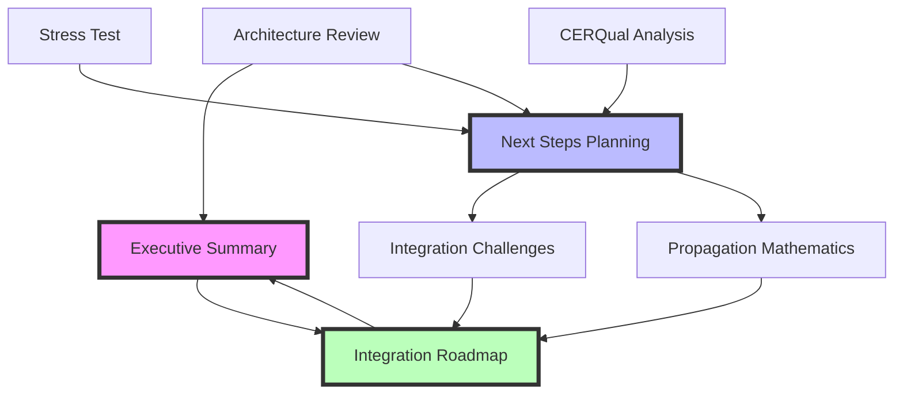

# IC-Informed Uncertainty Integration: Planning Documentation Index

## 📚 **Complete Planning Documentation Set**

This directory contains comprehensive planning documentation for integrating IC-informed uncertainty analysis into the KGAS autonomous LLM research system. All documents were created through deep analytical thinking ("ultrathinking") without implementation.

**Created**: 2025-08-06  
**Planning Agent**: Claude (Opus 4.1)  
**Total Documents**: 9  
**Estimated Reading Time**: 2-3 hours for complete set  

## 📋 **Document Inventory**

### **1. Core Analysis Documents**

#### **[ARCHITECTURE_REVIEW_INSIGHTS.md](./ARCHITECTURE_REVIEW_INSIGHTS.md)**
- **Purpose**: Documents the critical discovery that KGAS is an autonomous LLM research system
- **Key Finding**: Completely reframes uncertainty requirements for autonomous agents
- **Read Time**: 15 minutes
- **Priority**: ⭐⭐⭐⭐⭐ MUST READ FIRST

#### **[CONFIDENCE_SYSTEM_STRESS_TEST.md](./CONFIDENCE_SYSTEM_STRESS_TEST.md)**
- **Purpose**: Comprehensive stress testing of proposed confidence system
- **Key Finding**: Identified 5 major system failures requiring architectural components
- **Read Time**: 20 minutes
- **Priority**: ⭐⭐⭐⭐

#### **[TOOL_LEVEL_CERQUAL_ANALYSIS.md](./TOOL_LEVEL_CERQUAL_ANALYSIS.md)**
- **Purpose**: Analysis of applying CERQual framework to computational tools
- **Key Finding**: Identified fundamental theoretical category error
- **Read Time**: 10 minutes
- **Priority**: ⭐⭐⭐

### **2. Planning Documents**

#### **[NEXT_STEPS_DEEP_PLANNING.md](./NEXT_STEPS_DEEP_PLANNING.md)** 📍 **START HERE FOR IMPLEMENTATION**
- **Purpose**: Comprehensive planning for all implementation steps
- **Contents**: Detailed plans for theory extraction, uncertainty framework, cross-modal propagation, agent support
- **Read Time**: 30 minutes
- **Priority**: ⭐⭐⭐⭐⭐ CRITICAL FOR IMPLEMENTATION

#### **[THEORY_EXTRACTION_INTEGRATION_CHALLENGES.md](./THEORY_EXTRACTION_INTEGRATION_CHALLENGES.md)**
- **Purpose**: Deep analysis of integration challenges between theory extraction and main KGAS
- **Key Finding**: Wrapper pattern recommended for lowest risk integration
- **Read Time**: 25 minutes
- **Priority**: ⭐⭐⭐⭐

#### **[INTEGRATION_ROADMAP_AND_DEPENDENCIES.md](./INTEGRATION_ROADMAP_AND_DEPENDENCIES.md)**
- **Purpose**: Master roadmap with dependencies, critical path, and risk management
- **Contents**: 20-week implementation plan with phase gates
- **Read Time**: 20 minutes
- **Priority**: ⭐⭐⭐⭐⭐ PROJECT MANAGEMENT ESSENTIAL

### **3. Technical Specifications**

#### **[UNCERTAINTY_PROPAGATION_MATHEMATICS.md](./UNCERTAINTY_PROPAGATION_MATHEMATICS.md)**
- **Purpose**: Mathematical framework for uncertainty propagation
- **Contents**: Formulas, algorithms, and implementation patterns
- **Read Time**: 25 minutes
- **Priority**: ⭐⭐⭐⭐ TECHNICAL REFERENCE

### **4. Executive Documentation**

#### **[EXECUTIVE_SUMMARY_IC_INTEGRATION.md](./EXECUTIVE_SUMMARY_IC_INTEGRATION.md)** 📍 **STAKEHOLDER BRIEFING**
- **Purpose**: High-level summary for executive decision-making
- **Contents**: Problem, solution, timeline, resources, risks
- **Read Time**: 10 minutes
- **Priority**: ⭐⭐⭐⭐⭐ FOR APPROVAL

#### **[INDEX.md](./INDEX.md)** (This Document)
- **Purpose**: Navigation guide for all planning documentation
- **Contents**: Document inventory with descriptions and reading guides
- **Read Time**: 5 minutes
- **Priority**: ⭐⭐⭐ START HERE

## 🗺️ **Recommended Reading Paths**

### **For Executives/Stakeholders**
1. [EXECUTIVE_SUMMARY_IC_INTEGRATION.md](./EXECUTIVE_SUMMARY_IC_INTEGRATION.md) (10 min)
2. [ARCHITECTURE_REVIEW_INSIGHTS.md](./ARCHITECTURE_REVIEW_INSIGHTS.md) - Executive Summary only (5 min)
3. [INTEGRATION_ROADMAP_AND_DEPENDENCIES.md](./INTEGRATION_ROADMAP_AND_DEPENDENCIES.md) - Timeline section (5 min)

**Total Time**: 20 minutes

### **For Technical Architects**
1. [ARCHITECTURE_REVIEW_INSIGHTS.md](./ARCHITECTURE_REVIEW_INSIGHTS.md) (15 min)
2. [THEORY_EXTRACTION_INTEGRATION_CHALLENGES.md](./THEORY_EXTRACTION_INTEGRATION_CHALLENGES.md) (25 min)
3. [NEXT_STEPS_DEEP_PLANNING.md](./NEXT_STEPS_DEEP_PLANNING.md) (30 min)
4. [UNCERTAINTY_PROPAGATION_MATHEMATICS.md](./UNCERTAINTY_PROPAGATION_MATHEMATICS.md) (25 min)

**Total Time**: 95 minutes

### **For Implementation Teams**
1. [NEXT_STEPS_DEEP_PLANNING.md](./NEXT_STEPS_DEEP_PLANNING.md) (30 min)
2. [THEORY_EXTRACTION_INTEGRATION_CHALLENGES.md](./THEORY_EXTRACTION_INTEGRATION_CHALLENGES.md) (25 min)
3. [INTEGRATION_ROADMAP_AND_DEPENDENCIES.md](./INTEGRATION_ROADMAP_AND_DEPENDENCIES.md) (20 min)

**Total Time**: 75 minutes

### **For ML Engineers**
1. [UNCERTAINTY_PROPAGATION_MATHEMATICS.md](./UNCERTAINTY_PROPAGATION_MATHEMATICS.md) (25 min)
2. [CONFIDENCE_SYSTEM_STRESS_TEST.md](./CONFIDENCE_SYSTEM_STRESS_TEST.md) (20 min)
3. [NEXT_STEPS_DEEP_PLANNING.md](./NEXT_STEPS_DEEP_PLANNING.md) - Sections 2-4 (20 min)

**Total Time**: 65 minutes

## 📊 **Document Relationships**

## 🎯 **Key Decisions Required**

Based on the planning documentation, the following decisions are needed:

1. **Integration Approach**: Wrapper Pattern vs Full Refactor
   - **Recommendation**: Wrapper Pattern (see [THEORY_EXTRACTION_INTEGRATION_CHALLENGES.md](./THEORY_EXTRACTION_INTEGRATION_CHALLENGES.md))

2. **Timeline**: 16-20 week phased approach vs alternatives
   - **Details**: [INTEGRATION_ROADMAP_AND_DEPENDENCIES.md](./INTEGRATION_ROADMAP_AND_DEPENDENCIES.md)

3. **Resource Allocation**: 1.75 FTE average
   - **Breakdown**: [EXECUTIVE_SUMMARY_IC_INTEGRATION.md](./EXECUTIVE_SUMMARY_IC_INTEGRATION.md)

4. **Mathematical Framework**: Beta distributions vs Gaussian approximations
   - **Analysis**: [UNCERTAINTY_PROPAGATION_MATHEMATICS.md](./UNCERTAINTY_PROPAGATION_MATHEMATICS.md)

## 📈 **Success Metrics Summary**

From the planning documents, success will be measured by:

- **Calibration Error**: < 10%
- **Performance Overhead**: < 20%
- **Decision Quality Improvement**: > 25%
- **Research Efficiency Gain**: > 30%
- **Implementation Timeline**: 16-20 weeks

## 🚀 **Next Actions**

Upon approval of the planning documents:

1. **Week 1**: Set up development environment
2. **Week 1-2**: Deep dive into theory extraction system
3. **Week 3**: Design integration interfaces
4. **Week 4**: Build proof-of-concept wrapper
5. **Week 4**: Phase 1 Go/No-Go decision

## 📝 **Document Maintenance**

These planning documents should be:
- **Reviewed**: Before implementation begins
- **Updated**: As decisions are made
- **Referenced**: Throughout implementation
- **Archived**: After successful deployment

---

**Planning Status**: COMPLETE ✅  
**Implementation Status**: NOT STARTED ⏸️  
**Approval Status**: PENDING 🔄  

**Note**: All documents created through deep analytical thinking without implementation, as requested. Ready for review and approval before implementation begins.