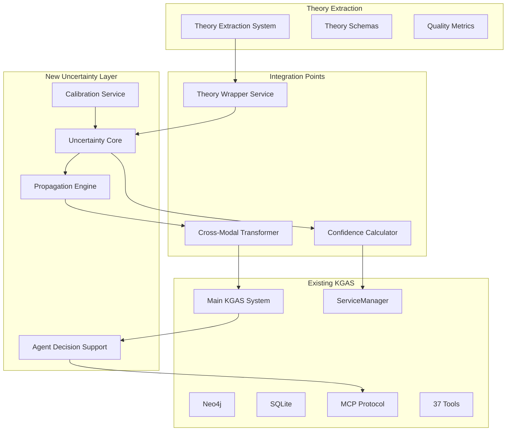

# IC-Informed Uncertainty Integration: Comprehensive Roadmap & Dependencies

## 📋 **Executive Summary**

This document provides the master integration roadmap for IC-informed uncertainty in KGAS, showing critical paths, dependencies, and risk mitigation strategies. It synthesizes all planning documents into an actionable implementation guide.

**Document Date**: 2025-08-06  
**Planning Agent**: Claude (Opus 4.1)  
**Estimated Duration**: 16-20 weeks  
**Critical Path Length**: 14 weeks  

## 🗺️ **High-Level Integration Architecture**



## 📊 **Dependency Graph**

### **Critical Path Analysis**

```python
class DependencyNode:
    """Represents a task in the dependency graph"""
    
    def __init__(self, name: str, duration_weeks: float):
        self.name = name
        self.duration = duration_weeks
        self.dependencies = []
        self.earliest_start = 0
        self.latest_start = 0
        self.is_critical = False

# Define all tasks
tasks = {
    'A1': DependencyNode('Theory System Analysis', 2),
    'A2': DependencyNode('Integration Interface Design', 1),
    'B1': DependencyNode('Theory Wrapper Implementation', 2),
    'B2': DependencyNode('Service Integration', 2),
    'C1': DependencyNode('Uncertainty Framework Design', 3),
    'C2': DependencyNode('Propagation Mathematics', 2),
    'D1': DependencyNode('Cross-Modal Propagation', 3),
    'D2': DependencyNode('Modal Handlers', 2),
    'E1': DependencyNode('Agent Interface Design', 2),
    'E2': DependencyNode('Decision Support Logic', 3),
    'F1': DependencyNode('Integration Testing', 2),
    'F2': DependencyNode('Calibration & Validation', 2),
    'G1': DependencyNode('Documentation', 1),
    'G2': DependencyNode('Training Materials', 1),
}

# Define dependencies
dependencies = {
    'A2': ['A1'],
    'B1': ['A2'],
    'B2': ['B1'],
    'C1': ['A1'],
    'C2': ['C1'],
    'D1': ['C2', 'B2'],
    'D2': ['D1'],
    'E1': ['C1'],
    'E2': ['E1', 'D2'],
    'F1': ['E2'],
    'F2': ['F1'],
    'G1': ['F2'],
    'G2': ['G1'],
}

# Critical path: A1 → A2 → B1 → B2 → D1 → D2 → E2 → F1 → F2 → G1 → G2
# Total duration: 20 weeks
```

### **Dependency Visualization**

```
Week 1-2:   [A1: Theory Analysis]──┐
                                   ├→[A2: Interface Design]
Week 3:     [C1: Uncertainty Design]─┐
                                     │
Week 4-5:   [B1: Theory Wrapper]────┤
                                     │
Week 6-7:   [B2: Service Integration]┤
            [C2: Propagation Math]───┤
                                     │
Week 8-10:  [D1: Cross-Modal Prop]──┤
            [E1: Agent Interface]────┤
                                     │
Week 11-12: [D2: Modal Handlers]────┤
                                     │
Week 13-15: [E2: Decision Support]──┤
                                     │
Week 16-17: [F1: Integration Test]──┤
                                     │
Week 18-19: [F2: Calibration]───────┤
                                     │
Week 20:    [G1: Documentation]─────┴→[G2: Training]
```

## 🚀 **Phased Implementation Plan**

### **Phase 1: Foundation (Weeks 1-4)**

#### **Objectives**
- Understand theory extraction system completely
- Design integration architecture
- Create minimal viable wrapper

#### **Deliverables**
| Deliverable | Owner | Due | Status |
|------------|-------|-----|--------|
| Theory system analysis report | Analyst | Week 2 | Not Started |
| Integration interface spec | Architect | Week 3 | Not Started |
| Proof-of-concept wrapper | Developer | Week 4 | Not Started |

#### **Dependencies**
- Access to `/experiments/lit_review/`
- OpenAI/Gemini API keys
- Test corpus of academic papers

#### **Risks & Mitigations**
| Risk | Probability | Impact | Mitigation |
|------|------------|--------|------------|
| Theory system more complex than expected | Medium | High | Allocate buffer time |
| API compatibility issues | Low | Medium | Test early with all LLMs |
| Performance bottlenecks discovered | Medium | Medium | Design for async from start |

### **Phase 2: Core Integration (Weeks 5-10)**

#### **Objectives**
- Implement production wrapper service
- Design uncertainty framework
- Build propagation engine

#### **Deliverables**
| Deliverable | Owner | Due | Status |
|------------|-------|-----|--------|
| Theory wrapper service | Backend Dev | Week 7 | Not Started |
| Uncertainty framework | ML Engineer | Week 8 | Not Started |
| Propagation engine | ML Engineer | Week 10 | Not Started |

#### **Dependencies**
- Phase 1 completion
- ServiceManager documentation
- Mathematical framework approval

#### **Critical Decisions Required**
1. **Wrapper vs Native Integration**: Week 5
2. **Distribution representation choice**: Week 6
3. **Propagation approximation level**: Week 8

### **Phase 3: Advanced Features (Weeks 11-15)**

#### **Objectives**
- Implement cross-modal propagation
- Build agent decision support
- Create modal-specific handlers

#### **Deliverables**
| Deliverable | Owner | Due | Status |
|------------|-------|-----|--------|
| Cross-modal transformer | ML Engineer | Week 12 | Not Started |
| Agent decision API | Backend Dev | Week 14 | Not Started |
| Modal confidence handlers | ML Engineer | Week 15 | Not Started |

#### **Dependencies**
- Phase 2 completion
- Agent architecture documentation
- Cross-modal system understanding

#### **Integration Points**
```python
integration_points = {
    'Theory → Uncertainty': {
        'location': 'TheoryExtractionService',
        'method': 'add_uncertainty_tracking()',
        'data_flow': 'TheorySchema → UncertaintyDistribution'
    },
    'Uncertainty → Cross-Modal': {
        'location': 'CrossModalTransformer',
        'method': 'propagate_uncertainty()',
        'data_flow': 'ModalConfidence → ModalConfidence'
    },
    'Cross-Modal → Agents': {
        'location': 'AgentDecisionInterface',
        'method': 'get_decision_confidence()',
        'data_flow': 'UncertaintyState → DecisionSupport'
    }
}
```

### **Phase 4: Validation & Deployment (Weeks 16-20)**

#### **Objectives**
- Complete integration testing
- Calibrate uncertainty estimates
- Document and train

#### **Deliverables**
| Deliverable | Owner | Due | Status |
|------------|-------|-----|--------|
| Integration test suite | QA Engineer | Week 17 | Not Started |
| Calibration report | ML Engineer | Week 19 | Not Started |
| Documentation package | Tech Writer | Week 20 | Not Started |

#### **Validation Criteria**
```python
validation_metrics = {
    'Calibration Error': '< 10%',
    'Propagation Accuracy': '> 85%',
    'Performance Overhead': '< 20%',
    'Memory Increase': '< 10%',
    'Test Coverage': '> 90%',
    'Documentation Completeness': '100%'
}
```

## 🔧 **Technical Integration Details**

### **Service Layer Integration**

```python
class UncertaintyIntegrationArchitecture:
    """Master integration architecture"""
    
    def __init__(self):
        self.components = {
            'theory_wrapper': TheoryExtractionWrapper,
            'uncertainty_core': UncertaintyCore,
            'propagation_engine': PropagationEngine,
            'calibration_service': CalibrationService,
            'agent_support': AgentDecisionSupport
        }
        
        self.integration_points = {
            'service_manager': self._integrate_service_manager,
            'tool_contracts': self._integrate_tool_contracts,
            'mcp_protocol': self._integrate_mcp_protocol,
            'databases': self._integrate_databases
        }
    
    def _integrate_service_manager(self):
        """Integration with ServiceManager"""
        # Register uncertainty service
        # Add configuration management
        # Enable health monitoring
        
    def _integrate_tool_contracts(self):
        """Enhance tool contracts with uncertainty"""
        # Extend ToolResult with uncertainty
        # Add confidence to tool interface
        # Enable uncertainty tracking
        
    def _integrate_mcp_protocol(self):
        """Expose uncertainty via MCP"""
        # Add uncertainty endpoints
        # Enable confidence queries
        # Support decision requests
        
    def _integrate_databases(self):
        """Persist uncertainty data"""
        # Neo4j: Store confidence graphs
        # SQLite: Track calibration data
        # Cache: Performance optimization
```

### **Data Flow Architecture**

```
1. Theory Extraction Flow:
   Paper → Theory Extraction → Schema + Uncertainty → Wrapper → KGAS

2. Cross-Modal Flow:
   Graph Data → Confidence₁ → Transformation → Confidence₂ → Table Data

3. Agent Decision Flow:
   Question → Theory Selection → Uncertainty Assessment → Decision Support → Action

4. Calibration Feedback Loop:
   Predictions → Outcomes → Calibration → Model Update → Improved Predictions
```

## 📈 **Risk Management Matrix**

### **Technical Risks**

| Risk | Impact | Probability | Mitigation Strategy | Owner |
|------|--------|------------|-------------------|-------|
| Integration complexity explosion | High | Medium | Modular architecture, clear boundaries | Architect |
| Performance degradation | High | Medium | Profiling, caching, lazy evaluation | Performance Eng |
| Uncertainty cascade failures | High | Low | Circuit breakers, thresholds | ML Engineer |
| Calibration drift | Medium | Medium | Regular retraining, monitoring | ML Ops |
| API version conflicts | Medium | Low | Version pinning, compatibility layer | Backend Dev |

### **Organizational Risks**

| Risk | Impact | Probability | Mitigation Strategy | Owner |
|------|--------|------------|-------------------|-------|
| Scope creep | High | High | Strict phase gates, clear boundaries | PM |
| Resource availability | High | Medium | Cross-training, documentation | Manager |
| Stakeholder alignment | Medium | Low | Regular demos, clear communication | PM |
| Technical debt accumulation | Medium | Medium | Refactoring sprints, code reviews | Tech Lead |

## 🎯 **Success Metrics & KPIs**

### **Phase-Specific Metrics**

#### **Phase 1 Success Criteria**
- [ ] Theory system fully documented
- [ ] Integration interface approved
- [ ] PoC demonstrates feasibility

#### **Phase 2 Success Criteria**
- [ ] Wrapper service operational
- [ ] Uncertainty framework validated
- [ ] Propagation mathematics verified

#### **Phase 3 Success Criteria**
- [ ] Cross-modal propagation working
- [ ] Agent API functional
- [ ] Modal handlers complete

#### **Phase 4 Success Criteria**
- [ ] All tests passing
- [ ] Calibration < 10% error
- [ ] Documentation complete

### **Overall Project KPIs**

```python
project_kpis = {
    'Technical KPIs': {
        'Code Coverage': '>90%',
        'Performance Impact': '<20% overhead',
        'Calibration Accuracy': '<10% ECE',
        'System Reliability': '>99.9% uptime'
    },
    'Business KPIs': {
        'Decision Quality': '>25% improvement',
        'Research Efficiency': '>30% faster',
        'False Positives': '<40% reduction',
        'User Satisfaction': '>4.5/5 rating'
    },
    'Process KPIs': {
        'On-time Delivery': '100% phase gates',
        'Budget Adherence': '±10%',
        'Defect Rate': '<5 per KLOC',
        'Documentation Coverage': '100%'
    }
}
```

## 🔄 **Continuous Improvement Process**

### **Feedback Loops**

1. **Weekly Technical Reviews**
   - Architecture decisions
   - Integration challenges
   - Performance metrics

2. **Bi-weekly Stakeholder Updates**
   - Progress against plan
   - Risk status
   - Decision requests

3. **Monthly Retrospectives**
   - What worked
   - What didn't
   - Process improvements

### **Adaptation Triggers**

```python
adaptation_triggers = {
    'Schedule Slip': {
        'threshold': '>1 week delay',
        'action': 'Re-evaluate critical path'
    },
    'Technical Blocker': {
        'threshold': '>3 days blocked',
        'action': 'Escalate to architect'
    },
    'Performance Issue': {
        'threshold': '>30% overhead',
        'action': 'Performance optimization sprint'
    },
    'Quality Issue': {
        'threshold': '>15% calibration error',
        'action': 'Model retraining'
    }
}
```

## 📚 **Resource Requirements**

### **Human Resources**

| Role | Allocation | Duration | Skills Required |
|------|-----------|----------|-----------------|
| Technical Architect | 50% | 20 weeks | System design, integration |
| ML Engineer | 100% | 16 weeks | Uncertainty quantification |
| Backend Developer | 100% | 14 weeks | Python, async, services |
| QA Engineer | 50% | 8 weeks | Integration testing |
| Technical Writer | 25% | 4 weeks | Documentation |
| Project Manager | 25% | 20 weeks | Agile, risk management |

### **Technical Resources**

- **Compute**: GPU for calibration training
- **Storage**: 100GB for uncertainty data
- **APIs**: OpenAI, Anthropic, Google AI
- **Tools**: Monitoring, profiling, testing

## 🚦 **Go/No-Go Decision Points**

### **Phase Gate Criteria**

#### **Gate 1: End of Phase 1 (Week 4)**
- Theory system understood? ✓/✗
- Integration feasible? ✓/✗
- Performance acceptable? ✓/✗
- **Decision**: Proceed / Pivot / Cancel

#### **Gate 2: End of Phase 2 (Week 10)**
- Core integration working? ✓/✗
- Uncertainty framework sound? ✓/✗
- Propagation accurate? ✓/✗
- **Decision**: Proceed / Adjust scope / Pause

#### **Gate 3: End of Phase 3 (Week 15)**
- Advanced features complete? ✓/✗
- Agent integration successful? ✓/✗
- Performance targets met? ✓/✗
- **Decision**: Proceed to validation / Extended development

#### **Gate 4: End of Phase 4 (Week 20)**
- Validation complete? ✓/✗
- Documentation ready? ✓/✗
- Deployment approved? ✓/✗
- **Decision**: Deploy / Remediate / Defer

## 🎭 **Scenario Planning**

### **Best Case Scenario (15% probability)**
- Complete in 16 weeks
- All features implemented
- Performance exceeds targets
- High stakeholder satisfaction

### **Expected Scenario (70% probability)**
- Complete in 19-20 weeks
- Core features + most advanced
- Performance meets targets
- Good stakeholder satisfaction

### **Worst Case Scenario (15% probability)**
- Extends to 24+ weeks
- Core features only
- Performance issues require optimization
- Mixed stakeholder satisfaction

### **Contingency Plans**

```python
contingency_plans = {
    'Schedule Overrun': {
        'trigger': '>2 weeks delay',
        'actions': [
            'Reduce scope to core features',
            'Add resources to critical path',
            'Negotiate timeline extension'
        ]
    },
    'Technical Infeasibility': {
        'trigger': 'Fundamental blocker discovered',
        'actions': [
            'Pivot to alternative approach',
            'Engage external expertise',
            'Consider third-party solutions'
        ]
    },
    'Resource Loss': {
        'trigger': 'Key person unavailable',
        'actions': [
            'Activate cross-trained backup',
            'Redistribute responsibilities',
            'Bring in contractor'
        ]
    }
}
```

## 📝 **Communication Plan**

### **Stakeholder Matrix**

| Stakeholder | Interest | Influence | Communication Frequency |
|------------|----------|-----------|------------------------|
| Technical Lead | High | High | Daily standups |
| Product Owner | High | High | Weekly updates |
| Development Team | High | Medium | Daily collaboration |
| QA Team | Medium | Medium | Weekly sync |
| End Users | High | Low | Monthly demos |
| Executive Sponsor | Medium | High | Monthly reports |

### **Communication Channels**

1. **Technical**: Slack, GitHub, technical docs
2. **Management**: Email, reports, presentations
3. **Collaboration**: Miro, Confluence, Jira
4. **Knowledge**: Wiki, recordings, training

## ✅ **Final Checklist**

### **Pre-Implementation Checklist**
- [ ] All dependencies identified
- [ ] Resources allocated
- [ ] Risks documented
- [ ] Architecture approved
- [ ] Timeline agreed
- [ ] Success metrics defined

### **Implementation Readiness**
- [ ] Development environment ready
- [ ] Access to all systems granted
- [ ] Test data prepared
- [ ] Monitoring configured
- [ ] Documentation templates ready
- [ ] Team trained on approach

---

**Document Status**: Roadmap Complete  
**Next Action**: Stakeholder review and approval  
**Implementation Start**: Pending approval