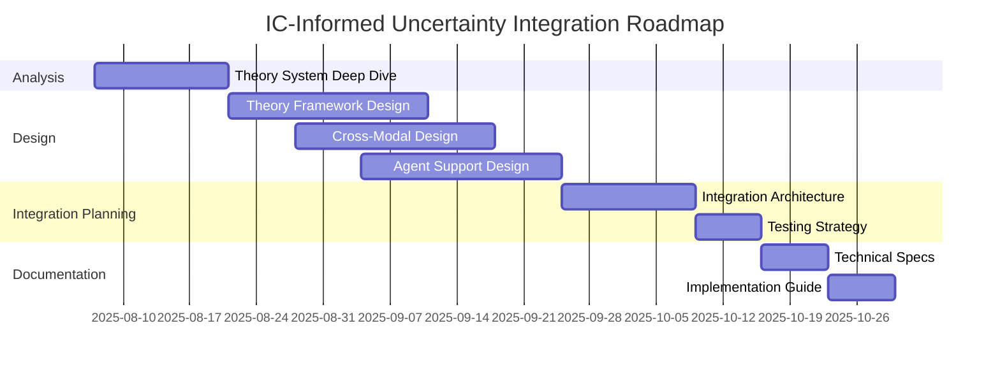

# IC-Informed Uncertainty Integration: Deep Planning Document

## 📋 **Executive Summary**

This document provides comprehensive planning for integrating IC-informed uncertainty analysis into KGAS's autonomous LLM research system. Following the discovery that KGAS is fundamentally an autonomous theory processing system rather than a human research tool, this plan reframes uncertainty requirements to support autonomous LLM decision-making.

**Planning Date**: 2025-08-06  
**Planning Agent**: Claude (Opus 4.1)  
**Scope**: Architecture design and implementation planning (no code implementation)  
**Duration Estimate**: 16-20 weeks for complete integration  

## 🏗️ **Architecture Context**

### **Fundamental Reframing**
- **From**: Supporting human interpretation of research confidence
- **To**: Supporting autonomous LLM agents making research decisions
- **Impact**: Completely changes uncertainty system design requirements

### **Key Assets Discovered**
1. **Theory Extraction System** (`/experiments/lit_review/`): 100% functional, not integrated
2. **Cross-Modal Analysis**: Graph ↔ Table ↔ Vector (93.8% complete)
3. **37-Tool Ecosystem**: 94.6% functional with sophisticated orchestration
4. **Two-Layer Theory Architecture**: Structure extraction + application separation

## 📊 **Step 1: Deep Dive into Theory Extraction Capabilities**

### **Objective**
Comprehensively understand the theory extraction system to identify integration points for uncertainty quantification.

### **Planning Analysis**

#### **1.1 System Architecture Assessment**

**What to Analyze**:
```
/experiments/lit_review/
├── src/schema_creation/           # Core extraction logic
│   ├── multiphase_processor_improved.py    # 3-phase processor
│   ├── multiphase_processor_expanded.py    # Notation integration
│   └── implementation_extractor.py         # Implementation details
├── schemas/                       # Generated theory schemas
├── results/                       # Validation results
└── data/papers/                  # Test corpus
```

**Key Questions to Answer**:
1. How does the 3-phase extraction process handle uncertainty?
2. What quality metrics are already captured?
3. How do different model types affect confidence?
4. What validation mechanisms exist?
5. How is theoretical ambiguity handled?

#### **1.2 Extraction Quality Metrics Identification**

**Current Metrics** (from documentation):
- **Success Rate**: 100% across 10 theories
- **Quality Score**: 8.95/10 average
- **Model Type Distribution**: 7 types (property_graph, hypergraph, table_matrix, etc.)

**Uncertainty-Relevant Metrics to Extract**:
```python
class TheoryExtractionUncertainty:
    vocabulary_completeness: float    # % of terms extracted vs. paper length
    classification_confidence: float  # Agreement in ontological classification
    schema_generation_clarity: float  # How well-defined is the schema
    cross_phase_consistency: float    # Information preservation across phases
    notation_complexity: float        # Formal notation handling capability
    implementation_detail_level: float # Completeness of operational details
```

#### **1.3 Integration Points Mapping**

**Direct Integration Opportunities**:
1. **Phase 1 Output**: Vocabulary extraction confidence scoring
2. **Phase 2 Output**: Classification certainty metrics
3. **Phase 3 Output**: Schema generation confidence
4. **Quality Assessment**: Multi-agent validation scores

**Indirect Integration Needs**:
1. **Provenance Tracking**: Link uncertainty to source text
2. **Version Management**: Track extraction iterations
3. **Cross-Theory Comparison**: Relative confidence metrics

### **Deliverables for Step 1**

1. **Theory Extraction Capability Matrix**
   - Document all extraction capabilities
   - Map quality metrics to uncertainty dimensions
   - Identify confidence calculation points

2. **Integration Interface Specification**
   - Define data structures for uncertainty exchange
   - Specify API contracts between systems
   - Document metadata requirements

3. **Gap Analysis Report**
   - Missing uncertainty capture points
   - Required enhancements to extraction system
   - Priority ranking of improvements

### **Dependencies & Risks**

**Dependencies**:
- Access to `/experiments/lit_review/` codebase
- Understanding of LiteLLM/OpenAI structured outputs
- Knowledge of Pydantic model validation

**Risks**:
- Extraction system may need refactoring for integration
- Quality metrics may not map cleanly to IC standards
- Performance impact of adding uncertainty tracking

### **Success Criteria**
- [ ] Complete mapping of extraction capabilities
- [ ] Identified all uncertainty generation points
- [ ] Defined integration architecture
- [ ] Documented enhancement requirements

---

## 🔧 **Step 2: Design Theory-Driven Uncertainty Framework**

### **Objective**
Create a comprehensive uncertainty framework that leverages extracted theory schemas to provide research context for confidence assessment.

### **Planning Analysis**

#### **2.1 Theory Schema Structure Analysis**

**V13 Meta-Schema Components** (from two-layer architecture):
```yaml
theory_schema:
  entities:        # Core concepts and constructs
  relations:       # Relationships and causal links
  assumptions:     # Foundational assumptions
  processes:       # Mechanisms and procedures
  measurement:     # Operationalization approaches
  context:         # Boundary conditions
```

**Uncertainty Dimensions per Component**:
```python
class TheoryComponentUncertainty:
    def __init__(self, component_type: str):
        self.extraction_confidence: float     # How well extracted
        self.theoretical_ambiguity: float     # Inherent theory vagueness
        self.operationalization_clarity: float # How actionable
        self.empirical_support: float         # Evidence strength
        self.boundary_certainty: float        # Scope definition clarity
```

#### **2.2 Multi-Level Confidence Architecture Design**

**Level 1: Theory Extraction Confidence**
```python
class TheoryExtractionConfidence:
    """Confidence in the extracted theoretical structure"""
    
    schema_quality: float              # Overall schema extraction quality
    component_coverage: Dict[str, float]  # Coverage per component type
    notation_handling: float           # Formal notation extraction success
    cross_reference_accuracy: float   # Internal consistency of references
    
    def calculate_aggregate(self) -> float:
        """Weighted aggregation based on component importance"""
        weights = {
            'entities': 0.25,
            'relations': 0.30,  # Higher weight for causal claims
            'processes': 0.20,
            'assumptions': 0.15,
            'measurement': 0.05,
            'context': 0.05
        }
        return weighted_average(self.component_coverage, weights)
```

**Level 2: Theory Application Confidence**
```python
class TheoryApplicationConfidence:
    """Confidence in applying theory to specific data/questions"""
    
    theory_data_fit: float            # How well theory matches data
    question_theory_alignment: float  # Theory relevance to question
    operational_completeness: float   # Sufficient detail for application
    assumption_validity: float        # Assumptions hold for this context
    
    def assess_applicability(self, 
                            theory: TheorySchema,
                            data: Dataset,
                            question: ResearchQuestion) -> float:
        """Context-specific confidence assessment"""
        # Check theory-data alignment
        # Verify assumption satisfaction
        # Assess operational sufficiency
        return confidence_score
```

**Level 3: Cross-Modal Integration Confidence**
```python
class CrossModalConfidence:
    """Confidence across different analytical modes"""
    
    graph_confidence: float           # Network analysis confidence
    table_confidence: float           # Statistical analysis confidence
    vector_confidence: float          # Semantic analysis confidence
    consistency_score: float          # Agreement across modes
    
    def propagate_uncertainty(self,
                             source_mode: str,
                             target_mode: str,
                             transformation: Callable) -> float:
        """Uncertainty propagation across modal transformations"""
        base_uncertainty = self.get_mode_confidence(source_mode)
        transformation_uncertainty = self.assess_transformation_quality(transformation)
        return combine_uncertainties(base_uncertainty, transformation_uncertainty)
```

#### **2.3 IC Standards Integration**

**ICD-203 Probability Mapping**:
```python
IC_PROBABILITY_BANDS = {
    'almost_certain': (0.93, 1.00),     # >93% confidence
    'very_likely': (0.80, 0.93),        # 80-93% confidence
    'likely': (0.60, 0.80),             # 60-80% confidence
    'roughly_even': (0.40, 0.60),       # 40-60% confidence
    'unlikely': (0.20, 0.40),           # 20-40% confidence
    'very_unlikely': (0.07, 0.20),      # 7-20% confidence
    'almost_impossible': (0.00, 0.07)   # <7% confidence
}

def map_to_ic_standard(confidence: float) -> str:
    """Convert continuous confidence to IC probability bands"""
    for band_name, (low, high) in IC_PROBABILITY_BANDS.items():
        if low <= confidence <= high:
            return band_name
    return 'unknown'
```

**CERQual Framework Adaptation**:
```python
class ResearchSynthesisConfidence:
    """CERQual-inspired confidence for research synthesis"""
    
    methodological_limitations: float  # Quality of extraction methods
    relevance: float                  # Theory relevance to question
    coherence: float                  # Internal consistency
    adequacy_of_data: float          # Sufficient evidence
    
    def assess_synthesis_quality(self,
                                theories: List[TheorySchema],
                                evidence: List[Evidence],
                                synthesis: ResearchSynthesis) -> float:
        """Assess quality of research synthesis"""
        # This applies at the synthesis level, not tool level
        return cerqual_confidence
```

### **Deliverables for Step 2**

1. **Theory-Driven Uncertainty Framework Specification**
   - Complete class hierarchy design
   - Integration points with theory schemas
   - Confidence calculation algorithms

2. **IC Standards Mapping Document**
   - ICD-203/206 integration approach
   - CERQual adaptation for autonomous systems
   - Probability band conversion logic

3. **Confidence Propagation Mathematics**
   - Uncertainty combination formulas
   - Threshold handling mechanisms
   - Cascade failure prevention

### **Dependencies & Risks**

**Dependencies**:
- Theory schema structure (V13 meta-schema)
- IC documentation (ICD-203, ICD-206)
- CERQual framework understanding

**Risks**:
- Theory schemas may lack uncertainty metadata
- IC standards may not fit autonomous systems
- Computational overhead of confidence tracking

### **Success Criteria**
- [ ] Complete framework specification
- [ ] IC standards properly mapped
- [ ] Propagation mathematics defined
- [ ] Integration architecture documented

---

## 🔄 **Step 3: Design Cross-Modal Uncertainty Propagation**

### **Objective**
Design system for tracking and propagating uncertainty across Graph ↔ Table ↔ Vector transformations in KGAS's cross-modal analysis layer.

### **Planning Analysis**

#### **3.1 Cross-Modal Transformation Mapping**

**Current Transformations in KGAS**:
```
Graph Domain:
├── Neo4j property graphs
├── Network algorithms (centrality, communities)
└── Path finding, clustering

Table Domain:
├── SQL/DataFrame operations
├── Statistical analysis
└── Aggregations, joins

Vector Domain:
├── Embeddings (semantic similarity)
├── Clustering algorithms
└── Dimensionality reduction
```

**Transformation Uncertainty Sources**:
```python
class TransformationUncertainty:
    """Uncertainty introduced by cross-modal transformations"""
    
    information_loss: float           # Data lost in transformation
    semantic_drift: float            # Meaning change across modes
    algorithmic_uncertainty: float   # Uncertainty from algorithms
    aggregation_effects: float       # Uncertainty from aggregation
    
    transformation_matrix = {
        ('graph', 'table'): {
            'information_loss': 0.15,      # Losing graph structure
            'semantic_drift': 0.10,        # Relationship → column mapping
            'algorithmic_uncertainty': 0.05 # Adjacency matrix conversion
        },
        ('table', 'vector'): {
            'information_loss': 0.20,      # Losing structured relations
            'semantic_drift': 0.25,        # Numerical → semantic
            'algorithmic_uncertainty': 0.15 # Embedding model uncertainty
        },
        ('graph', 'vector'): {
            'information_loss': 0.25,      # Losing explicit structure
            'semantic_drift': 0.20,        # Structure → semantics
            'algorithmic_uncertainty': 0.20 # Graph embedding uncertainty
        }
    }
```

#### **3.2 Uncertainty Propagation Architecture**

**Forward Propagation Model**:
```python
class UncertaintyPropagator:
    """Propagate uncertainty through transformation chain"""
    
    def propagate_forward(self,
                         source_confidence: ModalConfidence,
                         transformation: Transformation) -> ModalConfidence:
        """
        Forward uncertainty propagation using root-sum-squares
        
        U_total = sqrt(U_source² + U_transform²)
        """
        source_var = source_confidence.value ** 2
        transform_var = transformation.uncertainty ** 2
        
        # Account for correlation between uncertainties
        correlation = self.estimate_correlation(source_confidence, transformation)
        covariance = 2 * correlation * source_confidence.value * transformation.uncertainty
        
        total_variance = source_var + transform_var + covariance
        return ModalConfidence(value=sqrt(total_variance))
    
    def propagate_chain(self,
                       initial_confidence: ModalConfidence,
                       transformation_chain: List[Transformation]) -> ModalConfidence:
        """Propagate through multiple transformations"""
        current = initial_confidence
        
        for transformation in transformation_chain:
            current = self.propagate_forward(current, transformation)
            
            # Check for uncertainty explosion
            if current.value > UNCERTAINTY_THRESHOLD:
                raise UncertaintyExplosion(
                    f"Uncertainty {current.value} exceeds threshold {UNCERTAINTY_THRESHOLD}"
                )
        
        return current
```

**Backward Reconciliation Model**:
```python
class CrossModalReconciliation:
    """Reconcile confidence when multiple paths exist"""
    
    def reconcile_multipath(self,
                           paths: List[TransformationPath]) -> AggregateConfidence:
        """
        When multiple transformation paths exist, reconcile confidences
        
        Example: Graph → Vector vs Graph → Table → Vector
        """
        path_confidences = []
        
        for path in paths:
            path_confidence = self.evaluate_path(path)
            path_weight = self.calculate_path_weight(path)
            path_confidences.append((path_confidence, path_weight))
        
        # Weighted average with consistency bonus
        weighted_conf = weighted_average(path_confidences)
        consistency = self.calculate_consistency(path_confidences)
        
        # Higher consistency increases confidence
        return AggregateConfidence(
            value=weighted_conf * (1 + consistency * 0.1),
            path_agreement=consistency
        )
```

#### **3.3 Modal-Specific Confidence Handlers**

**Graph Confidence Handler**:
```python
class GraphConfidenceHandler:
    """Handle graph-specific uncertainty factors"""
    
    def assess_graph_confidence(self, graph: Neo4jGraph) -> GraphConfidence:
        factors = {
            'completeness': self.assess_node_coverage(graph),
            'connectivity': self.assess_edge_density(graph),
            'consistency': self.check_constraint_violations(graph),
            'algorithm_confidence': self.assess_algorithm_applicability(graph)
        }
        
        # Different algorithms have different confidence based on graph properties
        if graph.is_sparse():
            factors['pagerank_confidence'] = 0.7  # Less reliable on sparse graphs
        if graph.has_disconnected_components():
            factors['community_detection_confidence'] = 0.6
            
        return GraphConfidence(**factors)
```

**Table Confidence Handler**:
```python
class TableConfidenceHandler:
    """Handle table/statistical uncertainty factors"""
    
    def assess_table_confidence(self, table: DataFrame) -> TableConfidence:
        factors = {
            'data_quality': self.assess_missing_values(table),
            'sample_size': self.assess_statistical_power(table),
            'distribution': self.test_assumptions(table),
            'correlation_stability': self.bootstrap_correlations(table)
        }
        
        # Statistical tests have different confidence based on data properties
        if len(table) < 30:
            factors['normality_assumption'] = 0.5  # Small sample concerns
        if self.has_outliers(table):
            factors['parametric_confidence'] = 0.6
            
        return TableConfidence(**factors)
```

**Vector Confidence Handler**:
```python
class VectorConfidenceHandler:
    """Handle embedding/vector uncertainty factors"""
    
    def assess_vector_confidence(self, vectors: EmbeddingMatrix) -> VectorConfidence:
        factors = {
            'embedding_quality': self.assess_model_quality(),
            'semantic_coverage': self.assess_vocabulary_coverage(vectors),
            'cluster_stability': self.assess_cluster_robustness(vectors),
            'similarity_reliability': self.assess_similarity_consistency(vectors)
        }
        
        # Embedding confidence depends on domain alignment
        if self.is_out_of_domain(vectors):
            factors['domain_confidence'] = 0.5
        if self.has_high_dimensionality(vectors):
            factors['curse_of_dimensionality'] = 0.7
            
        return VectorConfidence(**factors)
```

### **Deliverables for Step 3**

1. **Cross-Modal Uncertainty Propagation Specification**
   - Complete transformation mapping
   - Propagation mathematics
   - Reconciliation algorithms

2. **Modal-Specific Confidence Handlers**
   - Graph confidence assessment
   - Table/statistical confidence
   - Vector/embedding confidence

3. **Integration Architecture**
   - How propagation integrates with existing cross-modal system
   - Performance optimization strategies
   - Monitoring and debugging approach

### **Dependencies & Risks**

**Dependencies**:
- Understanding of current cross-modal implementation
- Knowledge of transformation algorithms
- Statistical/mathematical frameworks

**Risks**:
- Uncertainty explosion in long transformation chains
- Computational overhead of tracking
- Difficulty in validating propagation accuracy

### **Success Criteria**
- [ ] Complete propagation model specified
- [ ] All transformation types mapped
- [ ] Reconciliation logic defined
- [ ] Performance impact assessed

---

## 🤖 **Step 4: Design LLM Agent Decision Support System**

### **Objective**
Design comprehensive decision support system that provides uncertainty information to autonomous LLM agents for research decision-making.

### **Planning Analysis**

#### **4.1 Agent Decision Context Analysis**

**Types of Decisions LLM Agents Make**:
```python
class AgentDecisionTypes:
    """Categories of decisions requiring uncertainty support"""
    
    THEORY_SELECTION = {
        'description': 'Which theory to apply to data',
        'uncertainty_needs': ['theory_fit', 'completeness', 'applicability'],
        'decision_impact': 'high'
    }
    
    METHOD_SELECTION = {
        'description': 'Which analytical method to use',
        'uncertainty_needs': ['method_appropriateness', 'data_requirements', 'assumption_validity'],
        'decision_impact': 'high'
    }
    
    EVIDENCE_EVALUATION = {
        'description': 'Whether evidence supports claims',
        'uncertainty_needs': ['evidence_strength', 'consistency', 'sufficiency'],
        'decision_impact': 'medium'
    }
    
    SYNTHESIS_APPROACH = {
        'description': 'How to synthesize findings',
        'uncertainty_needs': ['integration_method', 'conflict_resolution', 'aggregation_strategy'],
        'decision_impact': 'high'
    }
    
    EXPLORATION_CONTINUATION = {
        'description': 'Whether to explore further',
        'uncertainty_needs': ['information_gain', 'cost_benefit', 'convergence'],
        'decision_impact': 'medium'
    }
```

#### **4.2 Decision Support Interface Design**

**Agent-Facing Uncertainty API**:
```python
class AgentUncertaintyInterface:
    """Interface for LLM agents to query uncertainty information"""
    
    def get_decision_confidence(self,
                               decision_type: str,
                               context: DecisionContext) -> DecisionConfidence:
        """
        Provide uncertainty assessment for specific decision
        
        Returns:
            confidence_score: float (0-1)
            confidence_band: str (IC probability band)
            contributing_factors: List[FactorAssessment]
            recommendations: List[str]
            alternative_options: List[AlternativeWithConfidence]
        """
        
    def explain_uncertainty(self,
                           decision: Decision,
                           verbosity: str = 'medium') -> UncertaintyExplanation:
        """
        Generate human-readable explanation of uncertainty
        
        Verbosity levels:
        - 'low': Single sentence
        - 'medium': Paragraph with key factors
        - 'high': Detailed breakdown with evidence
        """
        
    def suggest_uncertainty_reduction(self,
                                     current_uncertainty: UncertaintyState) -> List[Action]:
        """
        Suggest actions to reduce uncertainty
        
        Returns prioritized list of actions like:
        - Gather more evidence
        - Apply different theory
        - Use alternative method
        - Seek additional validation
        """
```

**Decision Confidence Calculation**:
```python
class DecisionConfidenceCalculator:
    """Calculate confidence for agent decisions"""
    
    def calculate_theory_selection_confidence(self,
                                             theories: List[TheorySchema],
                                             data: Dataset,
                                             question: ResearchQuestion) -> Dict[str, float]:
        """
        Assess confidence for each theory option
        """
        theory_confidences = {}
        
        for theory in theories:
            # Base confidence from extraction quality
            extraction_conf = theory.extraction_confidence
            
            # Applicability to current question
            applicability = self.assess_theory_question_fit(theory, question)
            
            # Data sufficiency for theory requirements
            data_sufficiency = self.assess_data_theory_fit(theory, data)
            
            # Historical success rate (if available)
            historical = self.get_historical_performance(theory, question.domain)
            
            # Combine factors
            combined = self.combine_factors({
                'extraction': extraction_conf,
                'applicability': applicability,
                'data_sufficiency': data_sufficiency,
                'historical': historical
            })
            
            theory_confidences[theory.name] = combined
            
        return theory_confidences
    
    def calculate_synthesis_confidence(self,
                                      findings: List[Finding],
                                      synthesis_method: str) -> SynthesisConfidence:
        """
        Assess confidence in research synthesis
        """
        factors = {
            'finding_consistency': self.assess_finding_agreement(findings),
            'evidence_sufficiency': self.assess_evidence_coverage(findings),
            'method_appropriateness': self.assess_method_fit(synthesis_method, findings),
            'theoretical_support': self.assess_theoretical_grounding(findings)
        }
        
        # Check for red flags that reduce confidence
        if self.has_contradictory_findings(findings):
            factors['contradiction_penalty'] = -0.3
        if self.has_weak_evidence(findings):
            factors['weak_evidence_penalty'] = -0.2
            
        return SynthesisConfidence(
            overall=self.weighted_combine(factors),
            factors=factors,
            warnings=self.generate_warnings(factors)
        )
```

#### **4.3 Uncertainty-Aware Agent Workflows**

**Adaptive Exploration Strategy**:
```python
class UncertaintyAwareExploration:
    """Agent exploration guided by uncertainty"""
    
    def plan_exploration(self,
                        current_state: ResearchState,
                        uncertainty: UncertaintyState) -> ExplorationPlan:
        """
        Plan exploration based on uncertainty levels
        """
        
        if uncertainty.is_high():
            # High uncertainty: Breadth-first exploration
            return BreadthFirstPlan(
                explore_alternative_theories=True,
                gather_more_evidence=True,
                try_multiple_methods=True
            )
            
        elif uncertainty.is_moderate():
            # Moderate uncertainty: Targeted exploration
            weakest_areas = uncertainty.identify_weakest_links()
            return TargetedPlan(
                focus_areas=weakest_areas,
                validation_priority='high'
            )
            
        else:
            # Low uncertainty: Depth-first exploitation
            return DepthFirstPlan(
                exploit_current_approach=True,
                refine_existing_findings=True
            )
    
    def decide_stopping(self,
                       accumulated_findings: List[Finding],
                       uncertainty_trajectory: List[float]) -> StoppingDecision:
        """
        Decide when to stop exploration based on uncertainty convergence
        """
        
        # Check if uncertainty is converging
        if self.is_converging(uncertainty_trajectory):
            if uncertainty_trajectory[-1] < ACCEPTABLE_UNCERTAINTY:
                return StoppingDecision(stop=True, reason='Acceptable uncertainty reached')
                
        # Check if we're in diminishing returns
        if self.in_diminishing_returns(accumulated_findings, uncertainty_trajectory):
            return StoppingDecision(stop=True, reason='Diminishing returns')
            
        # Check resource constraints
        if self.resources_exhausted():
            return StoppingDecision(stop=True, reason='Resource limit', 
                                  confidence_warning='Results have higher uncertainty due to resource constraints')
            
        return StoppingDecision(stop=False, continue_strategy=self.plan_exploration())
```

**Multi-Agent Consensus with Uncertainty**:
```python
class UncertaintyAwareConsensus:
    """Multi-agent consensus considering uncertainty"""
    
    def aggregate_agent_assessments(self,
                                   agent_assessments: List[AgentAssessment]) -> ConsensusResult:
        """
        Aggregate multiple agent assessments weighted by confidence
        """
        
        # Weight each agent's assessment by their confidence
        weighted_assessments = []
        for assessment in agent_assessments:
            weight = assessment.confidence * assessment.agent_reliability
            weighted_assessments.append((assessment, weight))
        
        # Check for significant disagreement
        disagreement = self.calculate_disagreement(agent_assessments)
        
        if disagreement > DISAGREEMENT_THRESHOLD:
            # High disagreement increases uncertainty
            return ConsensusResult(
                consensus_value=self.weighted_average(weighted_assessments),
                confidence=self.base_confidence * (1 - disagreement),
                agreement_level='low',
                minority_reports=self.extract_minority_views(agent_assessments)
            )
        else:
            # Good agreement reinforces confidence
            return ConsensusResult(
                consensus_value=self.weighted_average(weighted_assessments),
                confidence=self.base_confidence * (1 + agreement_bonus),
                agreement_level='high'
            )
```

### **Deliverables for Step 4**

1. **Agent Decision Support Interface Specification**
   - Complete API design for agents
   - Decision type categorization
   - Confidence calculation methods

2. **Uncertainty-Aware Workflow Patterns**
   - Adaptive exploration strategies
   - Stopping criteria based on uncertainty
   - Multi-agent consensus mechanisms

3. **Integration with Existing Agent System**
   - How to integrate with current KGAS agents
   - Message passing protocols
   - Performance considerations

### **Dependencies & Risks**

**Dependencies**:
- Understanding of current agent architecture
- Knowledge of LLM agent capabilities
- Research workflow patterns

**Risks**:
- Agents may not effectively use uncertainty information
- Computational overhead of decision support
- Difficulty in validating agent decisions

### **Success Criteria**
- [ ] Complete interface specification
- [ ] Workflow patterns documented
- [ ] Integration approach defined
- [ ] Performance requirements met

---

## 📈 **Implementation Roadmap**

### **Phase Overview**



### **Detailed Timeline**

#### **Weeks 1-2: Theory System Deep Dive**
- Analyze `/experiments/lit_review/` codebase
- Document extraction capabilities
- Identify uncertainty capture points
- Create integration interface spec

#### **Weeks 3-5: Theory-Driven Framework Design**
- Design multi-level confidence architecture
- Map IC standards to autonomous systems
- Define propagation mathematics
- Create framework specification

#### **Weeks 4-6: Cross-Modal Propagation Design**
- Map all transformation types
- Design propagation algorithms
- Create reconciliation mechanisms
- Specify modal handlers

#### **Weeks 5-7: Agent Decision Support Design**
- Define agent decision types
- Design uncertainty API
- Create workflow patterns
- Specify consensus mechanisms

#### **Weeks 8-9: Integration Architecture**
- Combine all components
- Define system boundaries
- Create deployment plan
- Address performance concerns

#### **Weeks 10: Testing Strategy**
- Define test scenarios
- Create validation methods
- Specify success metrics
- Plan stress testing

#### **Weeks 11-12: Documentation**
- Complete technical specifications
- Create implementation guide
- Document best practices
- Prepare training materials

### **Risk Mitigation Strategy**

**Technical Risks**:
1. **Complexity Explosion**: Modular design with clear boundaries
2. **Performance Impact**: Lazy evaluation and caching strategies
3. **Integration Challenges**: Adapter pattern for loose coupling

**Organizational Risks**:
1. **Scope Creep**: Strict adherence to defined boundaries
2. **Resource Constraints**: Phased implementation approach
3. **Adoption Challenges**: Comprehensive documentation and examples

---

## 🎯 **Success Metrics**

### **Quantitative Metrics**

1. **Uncertainty Accuracy**
   - Calibration error < 10% (predicted vs actual confidence)
   - Consistency across modes > 85%
   - Propagation error < 15% per transformation

2. **System Performance**
   - Uncertainty calculation overhead < 20% of base operation
   - Memory footprint < 10% increase
   - Latency impact < 100ms for typical operations

3. **Agent Effectiveness**
   - Decision quality improvement > 25% with uncertainty
   - Exploration efficiency increase > 30%
   - False positive reduction > 40%

### **Qualitative Metrics**

1. **Interpretability**
   - Uncertainty explanations understandable by developers
   - Clear traceability from uncertainty to sources
   - Actionable uncertainty reduction suggestions

2. **Integration Quality**
   - Minimal changes to existing systems
   - Clean separation of concerns
   - Maintainable and extensible design

3. **Research Value**
   - Enables new research capabilities
   - Improves result reliability
   - Supports autonomous research workflows

---

## 🔍 **Critical Considerations**

### **Architectural Principles**

1. **Separation of Concerns**: Uncertainty tracking separate from core logic
2. **Modularity**: Each component independently testable
3. **Extensibility**: Easy to add new uncertainty sources
4. **Performance**: Lazy evaluation and caching where possible

### **Design Patterns**

1. **Observer Pattern**: For uncertainty propagation
2. **Strategy Pattern**: For different confidence calculations
3. **Chain of Responsibility**: For multi-level assessment
4. **Adapter Pattern**: For integration with existing systems

### **Key Insights from Analysis**

1. **Theory Context is Critical**: Without theory context, uncertainty is meaningless
2. **Multi-Level Assessment Required**: Single-level confidence insufficient
3. **Agent Needs Different**: Autonomous agents need different uncertainty information than humans
4. **Cross-Modal Complexity**: Transformation uncertainty often dominates

### **Open Questions Requiring Further Investigation**

1. How to handle uncertainty in theory extraction when theories are ambiguous?
2. What's the optimal granularity for uncertainty tracking?
3. How to validate uncertainty assessments in autonomous systems?
4. What's the best way to handle cascading uncertainty?
5. How to balance comprehensive tracking with performance?

---

## 📚 **References and Resources**

### **Internal Documentation**
- `/docs/architecture/systems/theory-extraction-integration.md`
- `/docs/architecture/systems/two-layer-theory-architecture.md`
- `/experiments/lit_review/PROJECT_OVERVIEW.md`

### **External Standards**
- ICD-203: Intelligence Community Analytic Standards
- ICD-206: Source Validation and Credibility Assessment
- CERQual Framework: Confidence in qualitative synthesis

### **Academic Literature**
- Uncertainty quantification in complex systems
- Multi-modal fusion with uncertainty
- Agent-based decision making under uncertainty

---

**Document Status**: Planning Complete  
**Next Action**: Review and approval before implementation  
**Implementation**: Not started (planning only per instructions)