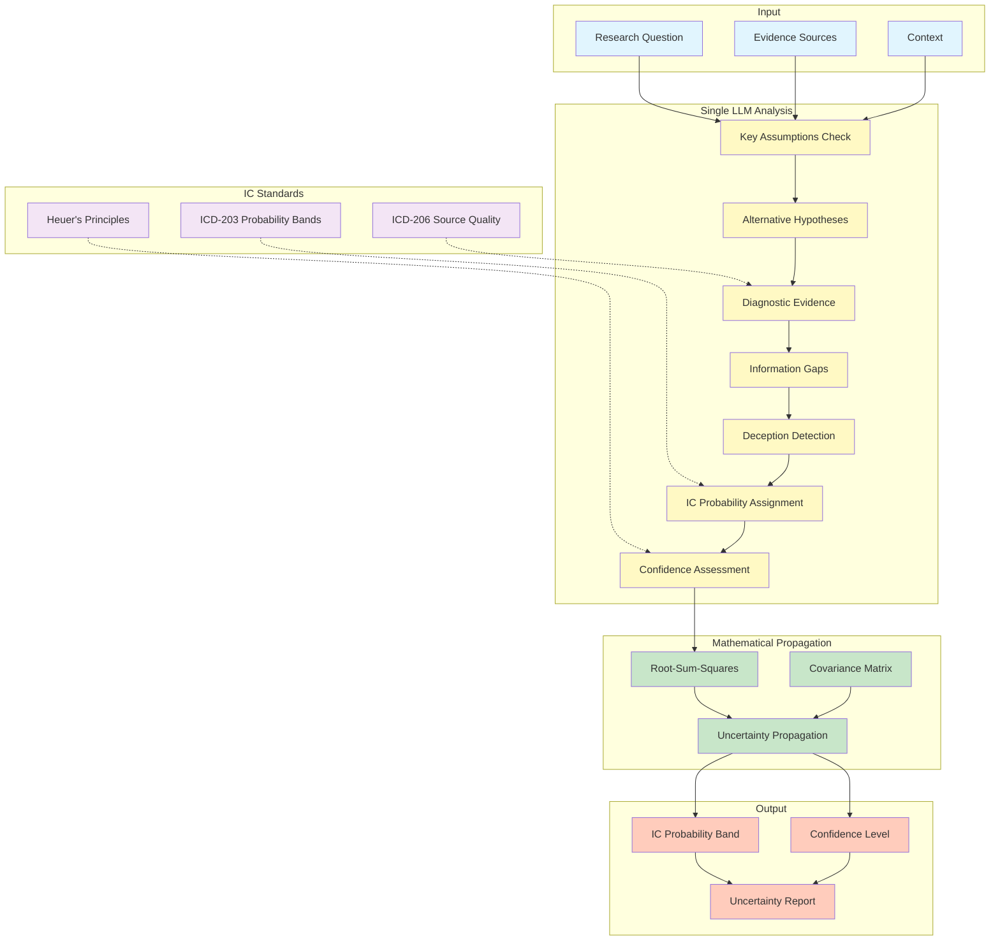
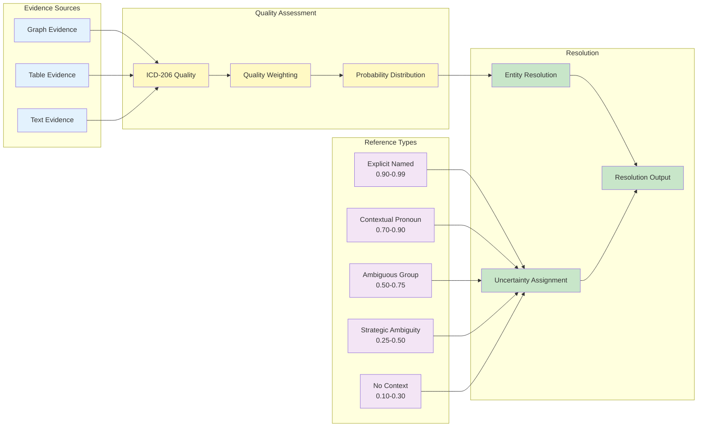
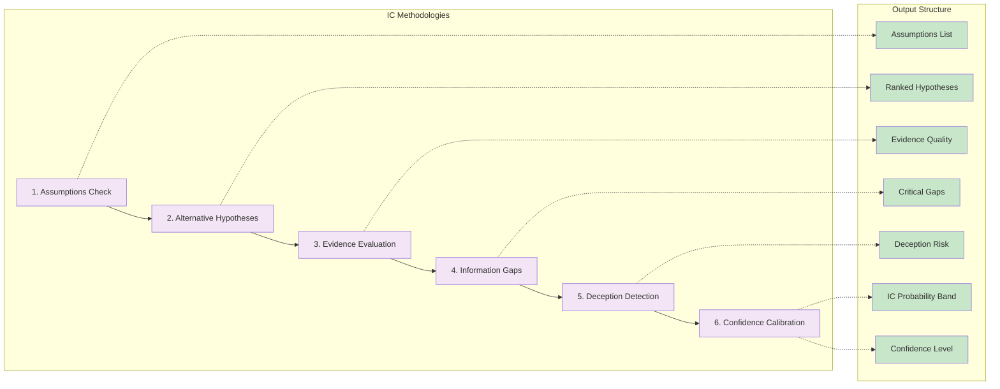

# IC-Informed Uncertainty Framework - Mermaid Diagrams

## Overall System Flow



## Entity Resolution Flow



## Uncertainty Propagation

```mermaid
graph TD
    subgraph "Stage Uncertainties"
        S1[σ_source = 0.10]
        S2[σ_entity = 0.05]
        S3[σ_process = 0.05]
    end
    
    subgraph "Propagation Method"
        IND{Independent?}
        RSS_CALC[["σ_total = √(σ₁² + σ₂² + σ₃²)"]]
        COV_CALC[["σ_total² = σᵀ Σ σ"]]
    end
    
    subgraph "IC Mapping"
        TOTAL[σ_total = 0.122]
        MAP{Map to IC Band}
        
        AC[Almost Certain<br/>σ < 0.05]
        VL[Very Likely<br/>0.05-0.10]
        L[Likely<br/>0.10-0.20]
        REC[Roughly Even<br/>0.20-0.30]
        U[Unlikely<br/>0.30-0.40]
        VU[Very Unlikely<br/>0.40-0.50]
        ANC[Almost No Chance<br/>σ > 0.50]
    end
    
    S1 --> IND
    S2 --> IND
    S3 --> IND
    
    IND -->|Yes| RSS_CALC
    IND -->|No| COV_CALC
    
    RSS_CALC --> TOTAL
    COV_CALC --> TOTAL
    
    TOTAL --> MAP
    
    MAP --> AC
    MAP --> VL
    MAP --> L
    MAP --> REC
    MAP --> U
    MAP --> VU
    MAP --> ANC
    
    L -.->|Selected| OUTPUT[IC Band: "Likely"]
    
    classDef stage fill:#e1f5fe
    classDef calc fill:#fff9c4
    classDef band fill:#c8e6c9
    classDef selected fill:#ffccbc,stroke:#f44336,stroke-width:3px
    
    class S1,S2,S3 stage
    class IND,RSS_CALC,COV_CALC,TOTAL,MAP calc
    class AC,VL,L,REC,U,VU,ANC band
    class L selected
```

## IC Analysis Components

