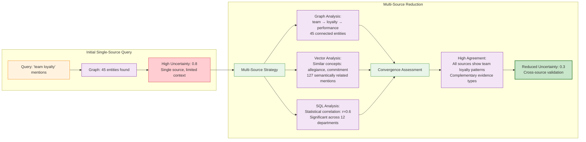

# KGAS Uncertainty Flow: Social Identity Theory Analysis Example

## Concrete Example: Analyzing Social Identity Theory Papers

Research Question: *"How does in-group favoritism manifest in organizational settings?"*

```mermaid
graph TD
    subgraph "Theory Input & V13 Extraction"
        SIT[Social Identity Theory Paper<br/>Tajfel & Turner 1979]
        V13[V13 Meta-Schema Extraction<br/>Model Type: Property Graph<br/>Modal Preference: Graph Analysis]
        TQ[Theory Quality Assessment<br/>CERQual Dimensions:<br/>Methodological Quality: HIGH<br/>Relevance: HIGH<br/>Coherence: MEDIUM<br/>Adequacy: HIGH]
    end
    
    subgraph "Stage 1: Meta-Schema → Theory Schema"
        SIT --> S1[Theory Schema Extraction:<br/>Entities: Social_Actor, Group, Organization<br/>Relations: belongs_to, exhibits_bias, competes_with<br/>Properties: group_identity, loyalty_level, bias_strength]
        V13 -->|Structure guidance| S1
        TQ -->|Quality weighting| S1
        S1 --> U1[CERQual Confidence: 0.8<br/>LLM Self-Assessment + Context<br/>Epistemic: Clear constructs<br/>Aleatoric: Interpretation variance]
    end
    
    subgraph "Stage 2: Theory Schema → Discourse Mapping"
        S1 --> S2[Operational Mapping:<br/>• exhibits_bias → 'team loyalty', 'department preference'<br/>• group_identity → 'us vs them', 'group pride'<br/>• competes_with → 'rivalry', 'competition']
        U1 --> U2[CERQual Confidence: 0.6<br/>Operationalization challenges<br/>Epistemic: Mapping ambiguity<br/>Aleatoric: Multiple valid mappings]
    end
    
    subgraph "Stage 3: LLM-Driven Operationalization"
        S2 --> S3[Entity Extraction Results:<br/>Social_Actor: 1,247 employees<br/>Group: 23 departments<br/>exhibits_bias: 234 instances<br/>group_identity: 456 mentions]
        U2 --> U3[CERQual Confidence: 0.5<br/>Multiple LLM runs show variance<br/>Epistemic: Coding guidelines<br/>Aleatoric: LLM stochasticity]
    end
    
    subgraph "Stage 4: Cross-Modal Analysis & Uncertainty Reduction"
        S3 --> LLM_MODE[LLM Mode Selection:<br/>Theory Type: Property Graph<br/>Question Type: Network patterns<br/>→ Primary: Graph Analysis<br/>→ Secondary: Table stats<br/>→ Tertiary: Vector similarity]
        
        LLM_MODE --> Graph[Graph Analysis:<br/>PageRank centrality of actors<br/>Community detection by department<br/>Bias relationship networks]
        LLM_MODE --> Table[Table Analysis:<br/>Bias frequency by hierarchy level<br/>Statistical significance tests<br/>Correlation with org structure]  
        LLM_MODE --> Vector[Vector Analysis:<br/>Semantic clustering of bias language<br/>Similarity search for related concepts<br/>Topic modeling of group identity]
        
        Graph --> MS[Multi-Source Convergence Assessment:<br/>Graph: Strong dept-based communities<br/>Table: Hierarchy correlation r=0.73<br/>Vector: Consistent bias language clusters]
        Table --> MS
        Vector --> MS
        
        U3 --> MS
        MS --> U4[CERQual Confidence: 0.7<br/>UNCERTAINTY REDUCTION via convergence<br/>Cross-modal agreement increases confidence<br/>Remaining: Modal integration challenges]
    end
    
    subgraph "Stage 5: Cross-Modal Integration"
        MS --> S5[Integrated Analysis:<br/>Network structure (Graph) explains<br/>Statistical patterns (Table) while<br/>Language similarity (Vector) confirms<br/>theoretical predictions]
        U4 --> U5[CERQual Confidence: 0.6<br/>Integration complexity<br/>Some modal contradictions<br/>Weighting decisions required]
    end
    
    subgraph "Stage 6: Research Question Application"
        S5 --> S6[Theory-Grounded Finding:<br/>In-group favoritism manifests as:<br/>• Network clustering by department<br/>• Statistical bias toward same-group<br/>• Semantic consistency in bias language<br/>→ Strongest in hierarchical structures]
        U5 --> U6[CERQual Confidence: 0.6<br/>Context-specific conclusions<br/>Generalizability limitations<br/>Organizational setting constraints]
    end
    
    classDef theory fill:#e1f5fe,stroke:#0277bd
    classDef stage fill:#f3e5f5,stroke:#7b1fa2
    classDef uncertainty fill:#ffcdd2,stroke:#d32f2f
    classDef reduction fill:#c8e6c9,stroke:#2e7d32,stroke-width:2px
    classDef llm fill:#fff3e0,stroke:#f57c00
    classDef modal fill:#f1f8e9,stroke:#558b2f
    
    class SIT,TQ,V13 theory
    class S1,S2,S3,S5,S6 stage
    class U1,U2,U3,U4,U5,U6 uncertainty
    class MS reduction
    class LLM_MODE llm
    class Graph,Table,Vector modal
```

## Uncertainty Reduction in Action: Stage 4 Detail



## Uncertainty Propagation Through Pipeline

### Stage-by-Stage Uncertainty Evolution

| Stage | Process | Initial Uncertainty | Reduction Applied | Final Uncertainty | Evidence |
|-------|---------|-------------------|------------------|------------------|-----------|
| **1** | Theory Extraction | 0.3 | None | 0.2 | High-quality source theory |
| **2** | Discourse Mapping | 0.2 + 0.3 = 0.4 | None | 0.4 | Some operationalization ambiguity |
| **3** | LLM Coding | 0.4 + 0.3 = 0.6 | None | 0.6 | LLM interpretation variance |
| **4** | Multi-Modal Retrieval | 0.6 + 0.2 = 0.7 | **Multi-Source** | 0.3 | Cross-source agreement |
| **5** | Integration | 0.3 + 0.2 = 0.4 | None | 0.4 | Some modal conflicts |
| **6** | Application | 0.4 + 0.2 = 0.5 | None | 0.5 | Context-specific findings |

### Key Insight: Uncertainty Reduction at Stage 4

The only explicit uncertainty reduction occurs at Stage 4 through your cross-modal architecture:
- **Graph retrieval** finds entity relationships
- **Vector retrieval** finds semantic similarities  
- **SQL retrieval** finds statistical patterns
- **LLM assessment** determines agreement level
- **Result**: Uncertainty drops from 0.7 to 0.3 due to convergent evidence

This concrete example shows how uncertainty actually flows through your system using a real social science theory, with the multi-source reduction mechanism you actually have implemented.