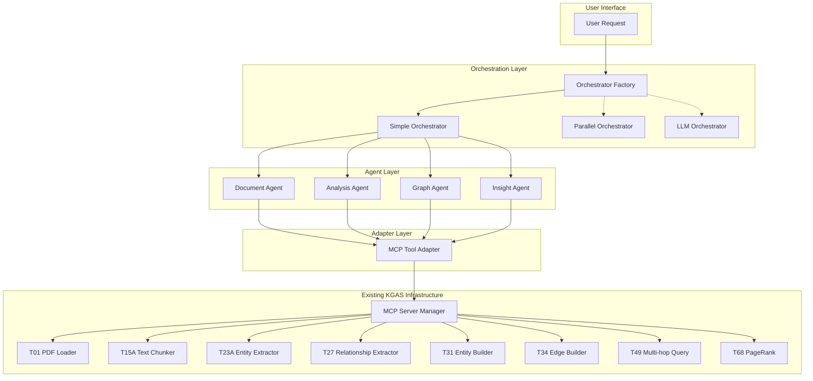

# Agent Orchestration Architecture

**Version**: 1.0  
**Last Updated**: July 26, 2025  
**Status**: **DESIGN PHASE** - Ready for Implementation  

---

## 🎯 **Architecture Overview**

The KGAS Agent Orchestration system is designed as a **flexible, minimal, and pivot-ready** architecture that enables immediate agent coordination while maintaining the ability to completely change orchestration approaches in the future.

### **Core Design Philosophy**

1. **Start Simple, Scale Smart**: Begin with minimal viable orchestration, add complexity only when needed
2. **Interface-Based Flexibility**: All components implement stable contracts that can be completely swapped
3. **Configuration-Driven Behavior**: Change orchestration without code modifications
4. **Leverage Existing Infrastructure**: Build on proven KGAS MCP tool foundation
5. **Production-Ready from Day 1**: Comprehensive error handling, logging, and monitoring

---

## 🏗️ **System Architecture**

### **Component Overview**



### **Directory Structure**

```
📁 src/orchestration/
├── 📄 __init__.py                # Public API exports
├── 📄 base.py                    # Core interfaces (Agent, Orchestrator, Task, Result)
├── 📄 mcp_adapter.py             # Adapter to existing KGAS MCP tools
├── 📄 simple_agents.py           # Basic agent implementations
├── 📄 simple_orchestrator.py     # Sequential orchestrator implementation
├── 📄 factory.py                 # Factory for creating orchestrators
├── 📄 config.py                  # Configuration management
├── 📁 strategies/                # Pluggable orchestration strategies
│   ├── 📄 __init__.py
│   ├── 📄 sequential.py          # Sequential execution strategy
│   ├── 📄 parallel.py            # Parallel execution strategy (future)
│   └── 📄 llm_planned.py         # LLM-driven planning strategy (future)
├── 📁 agents/                    # Agent implementations
│   ├── 📄 __init__.py
│   ├── 📄 document_agent.py      # Document processing agent
│   ├── 📄 analysis_agent.py      # Entity/relationship analysis agent
│   ├── 📄 graph_agent.py         # Graph building and analysis agent
│   └── 📄 insight_agent.py       # Insight generation agent
└── 📁 workflows/                 # Workflow definitions
    ├── 📄 __init__.py
    ├── 📄 research_workflow.py    # Research analysis workflow
    └── 📄 custom_workflows.py     # User-defined workflows
```

---

## 🔧 **Core Interfaces**

### **Task Interface**
```python
@dataclass
class Task:
    """Standardized task representation"""
    task_type: str                    # Type of task (document_processing, entity_extraction, etc.)
    parameters: Dict[str, Any]        # Task-specific parameters
    context: Dict[str, Any] = None    # Shared context from previous steps
    timeout: int = 300                # Execution timeout in seconds
    priority: int = 1                 # Task priority (1=highest)
```

### **Result Interface**
```python
@dataclass 
class Result:
    """Standardized result representation"""
    success: bool                     # Execution success flag
    data: Any                         # Result data
    metadata: Dict[str, Any] = None   # Execution metadata (timing, tools used, etc.)
    error: str = None                 # Error message if failed
    warnings: List[str] = None        # Non-fatal warnings
    execution_time: float = 0.0       # Execution time in seconds
```

### **Agent Interface**
```python
class Agent(ABC):
    """Base agent interface - stable contract for all agents"""
    
    @abstractmethod
    async def execute(self, task: Task) -> Result:
        """Execute a task and return result"""
        pass
    
    @abstractmethod
    def can_handle(self, task_type: str) -> bool:
        """Check if agent can handle specific task type"""
        pass
    
    @abstractmethod
    def get_capabilities(self) -> List[str]:
        """Get list of task types this agent can handle"""
        pass
    
    @property
    @abstractmethod
    def agent_id(self) -> str:
        """Unique identifier for this agent"""
        pass
```

### **Orchestrator Interface**
```python
class Orchestrator(ABC):
    """Base orchestrator interface - allows complete strategy swapping"""
    
    @abstractmethod
    async def process_request(self, request: str, context: Dict[str, Any] = None) -> Result:
        """Process user request and return comprehensive result"""
        pass
    
    @abstractmethod
    async def initialize(self) -> bool:
        """Initialize orchestrator and all dependencies"""
        pass
    
    @abstractmethod
    def get_status(self) -> Dict[str, Any]:
        """Get current orchestrator status and health"""
        pass
```

---

## 🔄 **Pivot Strategies**

The architecture is explicitly designed for easy pivoting. Here are the key pivot points:

### **1. Orchestration Strategy Pivots**

#### **Current: Simple Sequential**
```python
# Simple one-after-another execution
orchestrator = SimpleSequentialOrchestrator()
```

#### **Future Option: Parallel Execution**
```python
# Execute independent steps in parallel
orchestrator = ParallelOrchestrator()
```

#### **Future Option: LLM-Planned Workflows**
```python
# LLM analyzes request and plans optimal workflow
orchestrator = LLMPlannedOrchestrator()
```

#### **Future Option: External Frameworks**
```python
# Plug in LangChain, CrewAI, AutoGen, etc.
orchestrator = LangChainOrchestrator()
orchestrator = CrewAIOrchestrator()
```

### **2. Agent Implementation Pivots**

#### **Current: Simple Tool-Calling Agents**
```python
# Basic agents that call existing KGAS tools
agent = SimpleDocumentAgent(mcp_adapter)
```

#### **Future Option: Context-Aware Agents**
```python
# Agents with memory and context understanding
agent = ContextAwareDocumentAgent(mcp_adapter, memory_service)
```

#### **Future Option: LLM-Powered Agents**
```python
# Agents with built-in LLM reasoning
agent = LLMDocumentAgent(mcp_adapter, llm_service)
```

### **3. Workflow Definition Pivots**

#### **Current: Hardcoded Simple Workflows**
```python
def _determine_workflow(self, request: str) -> Dict:
    return {"steps": [...]}  # Simple hardcoded logic
```

#### **Future Option: Configuration-Driven**
```yaml
# External YAML workflow definitions
workflows:
  research_analysis:
    steps:
      - agent: document
        task: document_processing
```

#### **Future Option: LLM-Generated Workflows**
```python
# LLM analyzes request and generates optimal workflow
workflow = await llm_workflow_planner.plan(request)
```

### **4. Tool Integration Pivots**

#### **Current: MCP Tool Adapter**
```python
# Adapter to existing KGAS MCP tools
adapter = MCPToolAdapter()
```

#### **Future Option: Multi-Protocol Adapter**
```python
# Support multiple tool protocols
adapter = UniversalToolAdapter(protocols=["mcp", "openai", "langchain"])
```

#### **Future Option: Direct Integration**
```python
# Bypass adapters for performance
agent = DirectIntegrationAgent(tool_registry)
```

---

## ⚙️ **Configuration System**

### **Orchestration Configuration**

```json
{
  "orchestration": {
    "type": "simple_sequential",
    "max_execution_time": 600,
    "enable_parallel": false,
    "retry_strategy": {
      "max_retries": 3,
      "backoff_multiplier": 2.0
    }
  },
  "agents": {
    "document": {
      "class": "SimpleDocumentAgent",
      "tools": ["load_documents", "chunk_text"],
      "timeout": 120
    },
    "analysis": {
      "class": "SimpleAnalysisAgent", 
      "tools": ["extract_entities", "extract_relationships"],
      "timeout": 180
    },
    "graph": {
      "class": "SimpleGraphAgent",
      "tools": ["build_entities", "build_edges", "calculate_pagerank"],
      "timeout": 240
    },
    "insight": {
      "class": "SimpleInsightAgent",
      "tools": ["query_graph"],
      "timeout": 60
    }
  },
  "workflows": {
    "research_analysis": {
      "description": "Standard research document analysis",
      "strategy": "sequential",
      "steps": [
        {
          "agent": "document",
          "task_type": "document_processing",
          "required": true,
          "parameters": {
            "max_documents": 10
          }
        },
        {
          "agent": "analysis", 
          "task_type": "entity_extraction",
          "required": true,
          "depends_on": ["document"]
        },
        {
          "agent": "graph",
          "task_type": "graph_building",
          "required": true,
          "depends_on": ["analysis"]
        },
        {
          "agent": "insight",
          "task_type": "insight_generation",
          "required": false,
          "depends_on": ["graph"]
        }
      ]
    }
  }
}
```

---

## 🔌 **MCP Tool Integration**

### **Adapter Architecture**

The MCP Tool Adapter serves as the bridge between the new orchestration system and existing KGAS infrastructure:

```python
class MCPToolAdapter:
    """Isolation layer between orchestration and existing KGAS tools"""
    
    def __init__(self):
        self.server_manager = get_mcp_server_manager()
        self.mcp_server = None
        self.tool_registry = {}
    
    async def initialize(self):
        """Connect to existing KGAS MCP infrastructure"""
        # Use existing server manager
        self.server_manager.register_all_tools()
        self.mcp_server = self.server_manager.get_server()
        
        # Add Phase 1 tools using existing system
        from ..tools.phase1.phase1_mcp_tools import create_phase1_mcp_tools
        create_phase1_mcp_tools(self.mcp_server)
        
        # Build tool registry for quick access
        self._build_tool_registry()
    
    async def call_tool(self, tool_name: str, parameters: Dict[str, Any]) -> Result:
        """Call existing KGAS tools with standardized interface"""
        start_time = time.time()
        
        try:
            # Validate tool exists
            if tool_name not in self.tool_registry:
                return Result(
                    success=False,
                    error=f"Tool {tool_name} not found",
                    metadata={
                        "available_tools": list(self.tool_registry.keys()),
                        "execution_time": time.time() - start_time
                    }
                )
            
            # Execute tool using existing MCP infrastructure
            tool_func = self.tool_registry[tool_name]
            result = tool_func(**parameters) if parameters else tool_func()
            
            return Result(
                success=True,
                data=result,
                metadata={
                    "tool": tool_name,
                    "adapter": "mcp",
                    "execution_time": time.time() - start_time
                }
            )
            
        except Exception as e:
            return Result(
                success=False,
                error=f"Tool execution failed: {str(e)}",
                metadata={
                    "tool": tool_name,
                    "execution_time": time.time() - start_time
                }
            )
```

### **Tool Mapping**

| Agent Type | Primary Tools | KGAS Tool IDs | Purpose |
|------------|---------------|---------------|---------|
| **Document Agent** | load_documents, chunk_text | T01, T15A | Document ingestion and text chunking |
| **Analysis Agent** | extract_entities, extract_relationships | T23A, T27 | Entity and relationship extraction |
| **Graph Agent** | build_entities, build_edges, calculate_pagerank | T31, T34, T68 | Graph construction and analysis |
| **Insight Agent** | query_graph | T49 | Multi-hop queries and insight generation |

---

## 📊 **Monitoring and Observability**

### **Execution Tracking**

```python
@dataclass
class ExecutionMetrics:
    """Comprehensive execution metrics"""
    workflow_id: str
    start_time: datetime
    end_time: Optional[datetime]
    total_duration: float
    step_metrics: List[StepMetric]
    success_rate: float
    error_count: int
    tools_used: List[str]
    context_size: int
```

### **Health Monitoring**

```python
class OrchestrationHealthMonitor:
    """Monitor orchestration system health"""
    
    async def check_system_health(self) -> Dict[str, Any]:
        """Comprehensive health check"""
        return {
            "orchestrator": await self._check_orchestrator_health(),
            "agents": await self._check_agent_health(),
            "mcp_adapter": await self._check_mcp_health(),
            "tool_availability": await self._check_tool_availability()
        }
```

---

## 🧪 **Testing Strategy**

### **Unit Testing**
- Each agent tested in isolation with mock MCP adapter
- Orchestrator logic tested with mock agents
- Configuration parsing and validation tested independently

### **Integration Testing**
- End-to-end workflow execution with real KGAS tools
- MCP adapter integration with existing infrastructure
- Error handling and recovery scenarios

### **Performance Testing**
- Workflow execution timing and resource usage
- Concurrent request handling capabilities
- Memory usage and cleanup verification

---

## 🚀 **Implementation Phases**

### **Phase 1: Foundation (Week 1)**
- Core interfaces and base classes
- MCP tool adapter implementation
- Basic configuration system

### **Phase 2: Simple Agents (Week 2)**
- Document processing agent
- Analysis agent for entities/relationships
- Graph building agent
- Insight generation agent

### **Phase 3: Orchestration (Week 3)**
- Simple sequential orchestrator
- Workflow execution engine
- Error handling and recovery

### **Phase 4: Integration (Week 4)**
- Factory pattern for orchestrator creation
- Comprehensive testing suite
- Documentation and examples

### **Future Phases**
- Parallel execution capabilities
- LLM-driven workflow planning
- External framework integration
- Advanced monitoring and optimization

---

## 🎯 **Success Metrics**

### **Functional Metrics**
- End-to-end workflow execution success rate > 95%
- Agent task completion within expected timeframes
- Error handling and graceful degradation working
- Configuration-driven behavior modification working

### **Architectural Metrics**
- All components implement stable interfaces
- MCP adapter successfully isolates orchestration from tools
- Easy to swap orchestrator implementations
- Easy to replace agent implementations

### **Performance Metrics**
- Workflow execution overhead < 5% of total processing time
- Memory usage stable and predictable
- No resource leaks or cleanup issues
- Concurrent request handling working correctly

---

## 🔮 **Future Architecture Considerations**

### **Scalability Enhancements**
- Distributed orchestration across multiple nodes
- Workflow caching and optimization
- Advanced resource management and load balancing

### **Intelligence Enhancements**
- LLM-based workflow planning and optimization
- Adaptive agent selection based on request characteristics
- Machine learning for workflow performance prediction

### **Integration Enhancements**
- Multi-protocol tool support (OpenAI, LangChain, etc.)
- External service orchestration (APIs, databases, etc.)
- Real-time collaboration and workflow sharing

---

**🎉 This architecture provides immediate working agent orchestration while maintaining complete freedom to pivot to any approach as requirements evolve.**