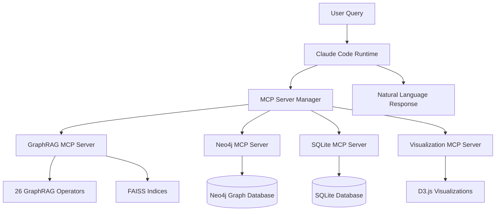

# Super-Digimon Agent Architecture Plan

## Executive Summary

Super-Digimon uses **Claude Code as its production runtime** for intelligent agent orchestration. This document outlines how Claude Code orchestrates 26 GraphRAG tools via MCP to create a powerful meta-analytic system.

### Key Architecture Decision
- **Runtime**: Claude Code (YOU are the agent!)
- **Tools**: 26 Python operators exposed via MCP
- **Storage**: Neo4j (graphs) + SQLite (metadata) + FAISS (vectors)
- **Goal**: Natural language interface to complex graph analysis

## Core Requirements (From User)

### Primary Goals
1. **Total Interoperability**: Handle any analytic query across different data types
2. **MCP-Based Tools**: All operators exposed as Model Context Protocol tools
3. **GB-Scale Data**: Handle gigabytes, not terabytes
4. **Multiple Output Formats**: Natural language, tables, structured data for analysis
5. **Research Flexibility**: Experimental and iterative capabilities
6. **SME-in-the-Loop**: Expert refinement and guidance
7. **Attribute-Based Graphs**: Graph types are composites of attributes, not fixed types

### Key Insights from Discussion
- "Good enough beats perfect" - pragmatic approach
- LLMs can handle semantic understanding without complex ontologies
- Aggregate tools (reified analyses) are the key innovation
- Simple attribute matching for compatibility
- Pass-by-reference for large data
- Atom of Thoughts (AoT) for efficient complex query processing
- Meta-cognitive reflection for strategy adaptation
- Blackboard coordination for multi-agent collaboration

## First Principles Analysis

### What the Agent Fundamentally Is

The agent is a **query-to-execution compiler** that:
1. **Decomposes** complex questions into operational subgoals
2. **Discovers** available resources (graphs, indexes, operators)
3. **Synthesizes** execution pipelines from available components
4. **Integrates** results into coherent answers

### Core Capabilities Required

1. **Semantic → Operational Mapping**
   - Translate "Find influential members" to specific operators
   - Understand implicit requirements in queries

2. **Dynamic Compatibility Checking**
   - Verify graph attributes match operator needs
   - Find alternative paths when blocked

3. **Multi-Strategy Execution**
   - Try multiple approaches in parallel
   - Combine evidence from different paths
   - Fall back gracefully

4. **Context-Aware Reasoning**
   - Remember available resources
   - Track computational costs
   - Consider data quality/freshness

## Claude Code as Production Runtime

### Why Claude Code?

1. **Battle-tested in production** - Thousands of users rely on it daily
2. **Natural language understanding** - No need to program query parsers
3. **Automatic tool orchestration** - Handles parallel execution, retries, errors
4. **Streaming interface** - Users see progress in real-time
5. **Context management** - Handles conversation history naturally

### How It Works

```
User: "Find the most influential members of the Celestial Council"
         ↓
Claude Code: Understands intent, breaks down into steps
         ↓
Calls MCP Tools: entity_vdb_search → entity_ppr → community_detection
         ↓
Python Executes: Tools run on Neo4j + FAISS data
         ↓
Results Return: Via MCP protocol
         ↓
Claude Code: Synthesizes natural language answer
```

## Architectural Patterns (Reference Only)

**Note**: The patterns below are from various agent frameworks and are included for educational purposes. Our prototype uses Claude Code, which handles these concerns automatically.

#### 1. **Streaming-First Design (Claude Code + PydanticAI)**
```python
# Everything is an async generator (Claude Code style)
async def* process_query(query):
    yield StatusUpdate("Analyzing query...")
    intent = await analyze_intent(query)
    yield IntentResult(intent)
    
    async for result in execute_plan(plan):
        yield result

# PydanticAI's graph iteration approach
async with agent.iter(query) as agent_run:
    async for node in agent_run:
        # Stream each execution step
        if Agent.is_model_request_node(node):
            async with node.stream(agent_run.ctx) as stream:
                async for event in stream:
                    yield event
```

**Benefits**:
- Immediate user feedback
- Clean cancellation via AbortSignal/AbortController
- Composable operations
- Memory efficient
- Fine-grained control over execution

#### 2. **Recursive Query Pattern**
```python
async def* query(messages, context):
    async for response in llm_stream(messages):
        yield response
        
        if response.needs_tools:
            results = await execute_tools(response.tools)
            yield results
            
            # Recursive continuation
            yield* query(messages + [response, results], context)
```

**Benefits**:
- Natural multi-turn interactions
- Tool results feed back into reasoning
- Maintains conversation context

#### 3. **Smart Parallel Execution**
```python
if all(tool.is_read_only() for tool in tools):
    results = await parallel_execute(tools)
else:
    results = await sequential_execute(tools)
```

**Key Insight**: Read operations parallelize, writes serialize

#### 4. **Permission Boundaries**
- Read operations: Often implicit
- Write operations: Always explicit
- Pattern-based: Remember approvals

#### 5. **Consistent Tool Interface**
```python
# Claude Code style
class Tool:
    name: str
    description: str
    input_schema: Schema
    is_read_only: () -> bool
    needs_permissions: (input) -> bool
    async *call(input, context) -> Result

# PydanticAI style with type safety
@agent.tool
async def entity_ppr(
    ctx: RunContext[GraphStorage], 
    seed_entities: List[str],
    top_k: int = 10
) -> List[Tuple[str, float]]:
    """Run Personalized PageRank from seed entities"""
    graph = await ctx.deps.get_graph()
    return await compute_ppr(graph, seed_entities, top_k)
```

#### 6. **Type-Safe Dependencies (PydanticAI)**
```python
# Agent is generic over dependency and output types
agent = Agent[GraphStorage, AnalysisResult](
    'openai:gpt-4o',
    deps_type=GraphStorage,
    output_type=AnalysisResult,
)

# Tools get type-safe access to dependencies
@agent.tool
async def analyze_graph(ctx: RunContext[GraphStorage]) -> GraphMetrics:
    graph = ctx.deps  # Type-safe access
    return compute_metrics(graph)
```

#### 7. **Usage Limits and Model Settings (PydanticAI)**
```python
# Prevent runaway costs
result = await agent.run(
    query,
    usage_limits=UsageLimits(
        response_tokens_limit=1000,
        request_limit=5  # Max tool calls
    ),
    model_settings={'temperature': 0.0}
)
```

## Super-Digimon Agent Architecture

### High-Level Architecture

```
User Query
    ↓
Query Analyzer (Semantic Understanding)
    ↓
Resource Discovery (What's Available)
    ↓
Pipeline Planner (How to Execute)
    ↓
Execution Engine (Run Operations)
    ↓
Result Synthesizer (Create Answer)
    ↓
Response
```

### Graph-Based Execution Model (PydanticAI Pattern)

Super-Digimon uses a graph-based execution model where each query traverses through nodes:

```python
class GraphRAGNode(BaseNode):
    """Base node for GraphRAG operations"""
    pass

class AnalyzeQueryNode(GraphRAGNode):
    """Analyze user query intent"""
    query: str
    
class SelectOperatorsNode(GraphRAGNode):
    """Select appropriate operators"""
    intent: QueryIntent
    available_graphs: List[GraphInfo]
    
class ExecuteOperatorNode(GraphRAGNode):
    """Execute a single operator"""
    operator: str
    inputs: Dict[str, Any]
    
class CombineResultsNode(GraphRAGNode):
    """Combine results from multiple operators"""
    results: List[OperatorResult]
```

This enables:
- Step-by-step visibility
- Clean error handling per node
- Easy addition of new node types
- Natural streaming of results

### Component Design

#### 1. Query Analyzer with Atom of Thoughts (AoT)
```python
from pydantic import BaseModel
from pydantic_ai import Agent, RunContext
from typing import Optional

class QueryIntent(BaseModel):
    task_type: str  # search, analyze, traverse, compare
    required_attributes: Set[str]
    output_format: str  # text, table, graph, mixed
    constraints: Dict[str, Any]
    confidence: float
    is_complex: bool
    atomic_decomposition: Optional[List[str]]

class AtomOfThoughts:
    """Markovian decomposition for complex queries"""
    
    async def decompose_to_dag(self, query: str) -> Dict[str, List[str]]:
        """Decompose complex query into dependency DAG"""
        # Identify independent and dependent subquestions
        subquestions = await self.extract_subquestions(query)
        dependencies = await self.analyze_dependencies(subquestions)
        return {"questions": subquestions, "dependencies": dependencies}
    
    async def contract_subquestions(self, dag: Dict) -> str:
        """Contract solved subquestions into simplified atomic state"""
        # Each iteration produces simpler question preserving answer equivalence
        atomic_query = await self.merge_solved_components(dag)
        return atomic_query

# Enhanced query analyzer with AoT
query_analyzer = Agent[None, QueryIntent](
    'openai:gpt-4o',
    output_type=QueryIntent,
    instructions="""Analyze GraphRAG queries to determine:
    1. Complexity level (simple vs multi-hop/multi-part)
    2. Task type (search/analyze/traverse/compare)
    3. Required graph attributes (embeddings/relationships/communities)
    4. Desired output format
    5. Any constraints (time/entity types/etc)
    
    For complex queries, identify atomic subquestions that can be solved independently.
    """,
    model_settings={'temperature': 0.1}  # Low temp for consistency
)

@query_analyzer.tool
async def check_query_complexity(ctx: RunContext[None], query: str) -> Dict[str, Any]:
    """Assess if query requires AoT decomposition"""
    indicators = {
        "multi_hop": any(word in query.lower() for word in ["caused", "led to", "resulted in"]),
        "multi_entity": query.count("and") > 1 or "between" in query.lower(),
        "temporal": any(word in query.lower() for word in ["evolution", "timeline", "changed"]),
        "comparative": any(word in query.lower() for word in ["compare", "difference", "versus"])
    }
    complexity_score = sum(indicators.values()) / len(indicators)
    return {"is_complex": complexity_score > 0.3, "indicators": indicators}

# Usage with AoT
async def analyze_query_with_aot(query: str) -> QueryIntent:
    # First pass analysis
    initial_result = await query_analyzer.run(query)
    
    if initial_result.output.is_complex:
        # Apply Atom of Thoughts decomposition
        aot = AtomOfThoughts()
        dag = await aot.decompose_to_dag(query)
        atomic_query = await aot.contract_subquestions(dag)
        
        # Re-analyze simplified atomic query
        final_result = await query_analyzer.run(atomic_query)
        final_result.output.atomic_decomposition = dag["questions"]
        return final_result.output
    
    return initial_result.output
```

#### 2. Resource Discovery
```python
class ResourceDiscovery:
    """Finds compatible graphs and operators"""
    
    async def discover(self, intent: QueryIntent) -> AvailableResources:
        # List all graphs
        graphs = await self.storage.list_graphs()
        
        # Filter by attributes
        compatible_graphs = [
            g for g in graphs 
            if intent.required_attributes <= g.attributes
        ]
        
        # Find compatible operators
        operators = [
            op for op in self.registry.all_operators()
            if op.can_handle(intent)
        ]
        
        # Check for pre-computed analyses
        reified_analyses = await self.find_aggregate_tools(intent)
        
        return AvailableResources(
            graphs=compatible_graphs,
            operators=operators,
            indexes=await self.find_indexes(compatible_graphs),
            reified_analyses=reified_analyses
        )
```

#### 3. Pipeline Planner with Meta-Cognitive Reflection
```python
class MetaCognitiveLayer:
    """Self-reflection and strategy evaluation capabilities"""
    
    async def evaluate_strategy_effectiveness(self, plan: Pipeline, context: Dict) -> float:
        """Reflect on whether the current approach is working"""
        # Evaluate based on:
        # - Query complexity vs plan complexity alignment
        # - Available resources vs required resources
        # - Historical success rates for similar patterns
        effectiveness_score = await self.compute_effectiveness(plan, context)
        return effectiveness_score
    
    async def generate_alternative_strategies(self, failed_plan: Pipeline, reason: str) -> List[Pipeline]:
        """Create backup plans when primary approach fails"""
        alternatives = []
        
        # Strategy 1: Try different retrieval order
        if "no_entities_found" in reason:
            alt_plan = self.create_relationship_first_plan(failed_plan)
            alternatives.append(alt_plan)
        
        # Strategy 2: Broaden search criteria
        if "insufficient_results" in reason:
            alt_plan = self.create_broader_search_plan(failed_plan)
            alternatives.append(alt_plan)
        
        # Strategy 3: Decompose further with AoT
        if "too_complex" in reason:
            alt_plan = self.create_decomposed_plan(failed_plan)
            alternatives.append(alt_plan)
        
        return alternatives
    
    async def learn_from_execution(self, query: str, plan: Pipeline, results: ExecutionResult):
        """Store successful patterns for future use"""
        if results.success_score > 0.8:
            pattern = {
                "query_type": self.classify_query(query),
                "plan_signature": plan.get_signature(),
                "effectiveness": results.success_score,
                "execution_time": results.duration
            }
            await self.pattern_memory.store(pattern)

class PipelinePlanner:
    """Creates execution plans using pattern matching and composition with meta-cognitive capabilities"""
    
    def __init__(self):
        self.meta_cognitive = MetaCognitiveLayer()
        self.pattern_memory = PatternMemory()
    
    async def plan_with_reflection(self, intent: QueryIntent, resources: Resources) -> Pipeline:
        # First, check if we have successful patterns for this query type
        historical_patterns = await self.pattern_memory.recall_similar(intent)
        
        if historical_patterns:
            # Try the most successful historical pattern first
            best_pattern = max(historical_patterns, key=lambda p: p.effectiveness)
            pipeline = self.instantiate_pattern(best_pattern, resources)
            
            # Evaluate if this pattern is still appropriate
            confidence = await self.meta_cognitive.evaluate_strategy_effectiveness(pipeline, {
                "intent": intent,
                "resources": resources,
                "historical_success": best_pattern.effectiveness
            })
            
            if confidence > 0.7:
                return pipeline
        
        # Generate new plan
        pipeline = await self.plan(intent, resources)
        
        # Reflect on the plan before execution
        confidence = await self.meta_cognitive.evaluate_strategy_effectiveness(pipeline, {
            "intent": intent,
            "resources": resources
        })
        
        # If low confidence, generate alternatives
        if confidence < 0.5:
            alternatives = await self.meta_cognitive.generate_alternative_strategies(
                pipeline, 
                "low_initial_confidence"
            )
            if alternatives:
                # Evaluate all alternatives and pick the best
                evaluations = []
                for alt in alternatives:
                    score = await self.meta_cognitive.evaluate_strategy_effectiveness(alt, {
                        "intent": intent,
                        "resources": resources
                    })
                    evaluations.append((alt, score))
                
                best_alt = max(evaluations, key=lambda x: x[1])
                if best_alt[1] > confidence:
                    pipeline = best_alt[0]
        
        return pipeline
    
    async def plan(self, intent: QueryIntent, resources: Resources) -> Pipeline:
        # Enhanced planning with atomic decomposition awareness
        pipeline = Pipeline()
        
        # If query was decomposed by AoT, handle atomic subquestions
        if intent.atomic_decomposition:
            for subquestion in intent.atomic_decomposition:
                subpipeline = await self.plan_atomic_question(subquestion, resources)
                pipeline.add_parallel_stage(subpipeline)
        else:
            # Standard planning logic
            if intent.needs_entities:
                pipeline.add(self.plan_retrieval(intent, resources))
            
            if intent.needs_analysis:
                pipeline.add(self.plan_analysis(intent, resources))
            
            pipeline.add(self.plan_synthesis(intent))
        
        # Optimize pipeline
        return self.optimize_pipeline(pipeline)
    
    def match_known_pattern(self, intent):
        """Match against known query patterns"""
        patterns = {
            "influence_analysis": ["Entity.VDB", "Entity.PPR", "Community.Entity"],
            "path_finding": ["Entity.VDB", "Subgraph.KHop", "Subgraph.AgentPath"],
            "document_search": ["Entity.VDB", "Chunk.EntityOccurrence", "Chunk.PPR"],
            "causal_analysis": ["Entity.VDB", "Relationship.Temporal", "Subgraph.CausalChain"],
            "comparative": ["Entity.VDB", "Entity.PPR", "Relationship.Compare", "Synthesis.Tabular"],
            # ... more patterns
        }
        # Enhanced pattern matching with confidence scores
```

#### 4. Execution Engine (Hybrid Claude Code + PydanticAI)
```python
class ExecutionEngine:
    """Executes pipelines with streaming and parallelization"""
    
    async def execute(self, pipeline: Pipeline) -> AsyncGenerator[Result]:
        # Use PydanticAI's graph iteration for visibility
        async with execution_agent.iter(pipeline) as run:
            async for node in run:
                if isinstance(node, ExecuteOperatorNode):
                    # Stream operator execution
                    async with node.stream(run.ctx) as stream:
                        async for event in stream:
                            if isinstance(event, ProgressEvent):
                                yield ProgressUpdate(event.message)
                            elif isinstance(event, ResultEvent):
                                yield OperatorResult(event.data)
                
                elif isinstance(node, ParallelExecutionNode):
                    # Claude Code's smart parallel execution
                    async for result in self.parallel_execute_claude(node.operators):
                        yield result
        
        # Get final synthesized result
        yield FinalResult(run.result.output)
    
    async def parallel_execute_claude(self, operators: List[Operator]):
        """Claude Code's parallel execution pattern"""
        # Check if all read-only
        if all(op.is_read_only() for op in operators):
            # Execute in parallel with origin tracking
            async for result in all_generators(
                [op.execute() for op in operators],
                max_concurrency=10
            ):
                yield result
        else:
            # Sequential execution for safety
            for op in operators:
                async for result in op.execute():
                    yield result
    
    # PydanticAI-style execution agent with retry logic
    execution_agent = Agent[Pipeline, ExecutionResult](
        'openai:gpt-4o',
        retries=2,
        instructions="Execute GraphRAG pipeline efficiently"
    )
    
    @execution_agent.tool(retries=3)
    async def execute_operator(
        ctx: RunContext[Pipeline], 
        operator_name: str,
        inputs: Dict[str, Any]
    ) -> OperatorResult:
        """Execute a single operator with retry logic"""
        operator = ctx.deps.get_operator(operator_name)
        try:
            return await operator.execute(**inputs)
        except InsufficientData as e:
            raise ModelRetry(f"Need more data: {e}")
```

#### 5. Result Synthesizer
```python
class ResultSynthesizer:
    """Combines results into requested format"""
    
    async def synthesize(self, results: List[Result], format: OutputFormat) -> Any:
        # Group results by type
        grouped = self.group_results(results)
        
        # Apply format-specific synthesis
        if format == OutputFormat.NATURAL_LANGUAGE:
            return await self.synthesize_text(grouped)
        elif format == OutputFormat.TABLE:
            return await self.synthesize_table(grouped)
        elif format == OutputFormat.STRUCTURED:
            return await self.synthesize_structured(grouped)
        else:
            return await self.synthesize_mixed(grouped)
```

### Key Design Patterns

#### 1. Attribute-Based Compatibility
```python
class CompatibilityChecker:
    """Simple attribute matching"""
    
    def check(self, graph: Graph, operator: Operator) -> bool:
        return operator.required_attrs <= graph.available_attrs
    
    def find_compatible_ops(self, graph: Graph) -> List[Operator]:
        return [op for op in self.all_operators if self.check(graph, op)]
```

#### 2. Progressive Enhancement
```python
class ProgressivePipeline:
    """Start simple, add complexity as needed"""
    
    def build(self, intent: QueryIntent) -> Pipeline:
        pipeline = Pipeline()
        
        # Level 1: Basic retrieval
        pipeline.add("Entity.VDB", required=True)
        
        # Level 2: Add ranking if needed
        if intent.needs_ranking:
            pipeline.add("Entity.PPR", required=False)
        
        # Level 3: Add community analysis if helpful
        if intent.complexity > 0.7:
            pipeline.add("Community.Detection", required=False)
        
        return pipeline
```

#### 3. Reified Analyses as Tools
```python
class AggregateToolRegistry:
    """Pre-computed analyses as first-class tools"""
    
    @tool("influence_network")
    async def get_influence_network(self, domain: str, timeframe: str = None):
        """Returns pre-computed influence analysis"""
        key = f"influence_{domain}_{timeframe or 'all'}"
        if analysis := await self.storage.get_analysis(key):
            return analysis
        return None
    
    @tool("discourse_evolution")
    async def get_discourse_evolution(self, topic: str, granularity: str = "daily"):
        """Returns pre-computed discourse timeline"""
        key = f"discourse_{topic}_{granularity}"
        return await self.storage.get_analysis(key)
```

#### 4. SME-in-the-Loop Refinement
```python
class InteractiveRefinement:
    """Enable expert guidance during execution"""
    
    async def execute_with_refinement(self, pipeline: Pipeline):
        # Execute initial pipeline
        initial_results = await self.execute(pipeline)
        yield PartialResults(initial_results)
        
        # Check if refinement needed
        if self.needs_refinement(initial_results):
            yield RefinementRequest(
                "Initial results found. Would you like to:",
                options=[
                    "Expand search to related entities",
                    "Focus on specific time period",
                    "Change analysis approach",
                    "Accept current results"
                ]
            )
            
            choice = await self.get_user_choice()
            if choice != "Accept":
                refined_pipeline = self.refine_pipeline(pipeline, choice)
                async for result in self.execute(refined_pipeline):
                    yield result
```

### MCP Tool Registration (Super-Digimon Pattern)

All GraphRAG operators are exposed as MCP tools with consistent interfaces:

```python
from pydantic import BaseModel, Field
from typing import Optional, List, Dict, Any

class MCPToolRegistry:
    """Registry for all GraphRAG operators as MCP tools"""
    
    def __init__(self):
        self.tools = {}
        self._register_all_operators()
    
    def _register_all_operators(self):
        """Register all 26+ operators"""
        # Entity operators
        self.register_tool(
            name="entity_vdb_search",
            description="Search entities using vector similarity",
            input_schema=EntityVDBSearchInput,
            handler=entity_vdb_search_handler,
            attributes_required={'node_embeddings'}
        )
        
        self.register_tool(
            name="entity_ppr",
            description="Personalized PageRank from seed entities",
            input_schema=EntityPPRInput,
            handler=entity_ppr_handler,
            attributes_required={'nodes', 'edges'}
        )
        # ... register all other operators
    
    def register_tool(self, name: str, description: str, 
                     input_schema: Type[BaseModel],
                     handler: Callable,
                     attributes_required: Set[str]):
        """Register a tool with MCP-compliant interface"""
        self.tools[name] = MCPTool(
            name=name,
            description=description,
            input_schema=input_schema,
            handler=handler,
            attributes_required=attributes_required,
            is_read_only=True  # All GraphRAG ops are read-only
        )

# Pydantic models for tool inputs
class EntityVDBSearchInput(BaseModel):
    graph_id: str = Field(description="ID of graph to search")
    query_text: str = Field(description="Text to search for")
    top_k: int = Field(default=10, description="Number of results")

class EntityPPRInput(BaseModel):
    graph_id: str = Field(description="ID of graph to analyze")
    seed_entities: List[str] = Field(description="Starting entities")
    damping_factor: float = Field(default=0.85)
    max_iterations: int = Field(default=100)
```

### Blackboard System for Multi-Agent Coordination

Super-Digimon uses a blackboard architecture for agent coordination:

```python
from threading import Lock
from typing import Dict, List, Any, Callable
import asyncio

class GraphRAGBlackboard:
    """Shared knowledge space for multi-agent coordination"""
    
    def __init__(self):
        self.shared_state = {
            "query": None,
            "entities": [],
            "relationships": [],
            "chunks": [],
            "confidence_scores": {},
            "failed_attempts": [],
            "partial_results": {},
            "execution_trace": []
        }
        self.lock = asyncio.Lock()
        self.subscribers: Dict[str, List[Callable]] = {}
        
    async def update(self, agent_id: str, update_type: str, data: Any):
        """Thread-safe updates from multiple agents"""
        async with self.lock:
            # Record update in execution trace
            self.shared_state["execution_trace"].append({
                "agent": agent_id,
                "type": update_type,
                "timestamp": datetime.now(),
                "data_summary": self._summarize_data(data)
            })
            
            # Apply update based on type
            if update_type == "entities_found":
                self.shared_state["entities"].extend(data)
            elif update_type == "relationships_found":
                self.shared_state["relationships"].extend(data)
            elif update_type == "confidence_update":
                self.shared_state["confidence_scores"].update(data)
            elif update_type == "failure_recorded":
                self.shared_state["failed_attempts"].append(data)
            elif update_type == "partial_result":
                self.shared_state["partial_results"][agent_id] = data
                
            # Notify interested agents
            await self._notify_subscribers(update_type, agent_id, data)
    
    async def read(self, agent_id: str, keys: List[str]) -> Dict[str, Any]:
        """Read specific parts of shared state"""
        async with self.lock:
            result = {}
            for key in keys:
                if key in self.shared_state:
                    result[key] = self.shared_state[key].copy()
            return result
    
    def subscribe(self, agent_id: str, update_types: List[str], callback: Callable):
        """Subscribe to specific update types"""
        for update_type in update_types:
            if update_type not in self.subscribers:
                self.subscribers[update_type] = []
            self.subscribers[update_type].append((agent_id, callback))
    
    async def _notify_subscribers(self, update_type: str, source_agent: str, data: Any):
        """Notify subscribed agents of updates"""
        if update_type in self.subscribers:
            for agent_id, callback in self.subscribers[update_type]:
                if agent_id != source_agent:  # Don't notify the source
                    await callback(update_type, data)
    
    def _summarize_data(self, data: Any) -> str:
        """Create summary for execution trace"""
        if isinstance(data, list):
            return f"List with {len(data)} items"
        elif isinstance(data, dict):
            return f"Dict with keys: {list(data.keys())}"
        else:
            return str(type(data))

class BlackboardCoordinatedAgent:
    """Base class for agents that coordinate via blackboard"""
    
    def __init__(self, agent_id: str, blackboard: GraphRAGBlackboard):
        self.agent_id = agent_id
        self.blackboard = blackboard
        
    async def execute(self, task: Dict[str, Any]):
        """Execute task with blackboard coordination"""
        # Read relevant state
        current_state = await self.blackboard.read(
            self.agent_id, 
            self.required_state_keys()
        )
        
        # Perform agent-specific work
        result = await self.perform_task(task, current_state)
        
        # Update blackboard with results
        await self.blackboard.update(
            self.agent_id,
            self.update_type(),
            result
        )
        
        return result
    
    def required_state_keys(self) -> List[str]:
        """Override to specify which state keys this agent needs"""
        raise NotImplementedError
    
    def update_type(self) -> str:
        """Override to specify what type of updates this agent produces"""
        raise NotImplementedError
    
    async def perform_task(self, task: Dict, state: Dict) -> Any:
        """Override to implement agent-specific logic"""
        raise NotImplementedError

# Example specialized agents
class EntityDiscoveryAgent(BlackboardCoordinatedAgent):
    def required_state_keys(self) -> List[str]:
        return ["query", "failed_attempts"]
    
    def update_type(self) -> str:
        return "entities_found"
    
    async def perform_task(self, task: Dict, state: Dict) -> List[Entity]:
        # Check if previous attempts failed
        failed_strategies = [f["strategy"] for f in state.get("failed_attempts", [])]
        
        # Try different strategy based on failures
        if "vdb_search" not in failed_strategies:
            entities = await self.vdb_search(state["query"])
            if not entities:
                await self.blackboard.update(
                    self.agent_id, 
                    "failure_recorded",
                    {"strategy": "vdb_search", "reason": "no_results"}
                )
        else:
            # Try alternative strategies
            entities = await self.entity_extraction_from_text(state["query"])
            
        return entities

class RelationshipAnalysisAgent(BlackboardCoordinatedAgent):
    def __init__(self, agent_id: str, blackboard: GraphRAGBlackboard):
        super().__init__(agent_id, blackboard)
        # Subscribe to entity updates
        blackboard.subscribe(
            agent_id,
            ["entities_found"],
            self.on_entities_updated
        )
    
    async def on_entities_updated(self, update_type: str, entities: List[Entity]):
        """React to new entities being discovered"""
        # Automatically analyze relationships for new entities
        relationships = await self.analyze_entity_relationships(entities)
        await self.blackboard.update(
            self.agent_id,
            "relationships_found",
            relationships
        )
```

### Message History and Conversation Management

Super-Digimon supports multi-turn conversations with context preservation:

```python
class ConversationManager:
    """Manages conversation state across multiple agent runs"""
    
    def __init__(self):
        self.conversations: Dict[str, Conversation] = {}
    
    async def continue_conversation(
        self, 
        conversation_id: str,
        new_query: str,
        agent: Agent
    ) -> AgentResult:
        """Continue existing conversation with context"""
        
        # Get conversation history
        conv = self.conversations.get(conversation_id)
        if not conv:
            conv = Conversation(id=conversation_id)
            self.conversations[conversation_id] = conv
        
        # Run with message history (PydanticAI pattern)
        result = await agent.run(
            new_query,
            message_history=conv.get_messages(),
            deps=conv.get_context()  # Includes available graphs, etc.
        )
        
        # Update conversation
        conv.add_messages(result.new_messages())
        conv.update_context(result.context_updates)
        
        return result
    
    def start_new_conversation(self, topic: str = None) -> str:
        """Start fresh conversation"""
        conv_id = generate_id()
        self.conversations[conv_id] = Conversation(
            id=conv_id,
            topic=topic,
            created_at=datetime.now()
        )
        return conv_id

class Conversation(BaseModel):
    """Conversation state"""
    id: str
    topic: Optional[str]
    created_at: datetime
    messages: List[Message] = []
    context: Dict[str, Any] = {}
    
    def get_messages(self) -> List[Message]:
        """Get messages for agent context"""
        # Only include user and assistant messages
        # Filter out system messages as per PydanticAI pattern
        return [m for m in self.messages 
                if m.role in ['user', 'assistant']]
```

### Execution Flow

```python
async def super_digimon_agent(query: str) -> AsyncGenerator[Message]:
    """Main agent execution loop with PydanticAI patterns"""
    
    # Create master agent for orchestration
    master_agent = Agent[QueryContext, FinalAnswer](
        'openai:gpt-4o',
        deps_type=QueryContext,
        output_type=FinalAnswer,
        instructions="Orchestrate GraphRAG analysis"
    )
    
    # Register all MCP tools with the agent
    for tool in mcp_registry.tools.values():
        master_agent.register_tool(tool)
    
    # Execute with streaming
    async with master_agent.run_stream(query) as stream:
        # Stream intermediate results
        async for chunk in stream.stream():
            if isinstance(chunk, str):
                yield TextChunk(chunk)
            elif isinstance(chunk, ToolResult):
                yield OperatorResult(chunk)
        
        # Get final answer
        final = await stream.get_output()
        yield FinalAnswer(final)
```

### Error Handling and Recovery

```python
class ResilientExecution:
    """Graceful degradation and error recovery"""
    
    async def execute_with_fallback(self, pipeline: Pipeline):
        try:
            async for result in self.execute(pipeline):
                yield result
        except OperatorUnavailable as e:
            # Try alternative operator
            alt_pipeline = self.find_alternative(pipeline, e.operator)
            yield RetryMessage(f"Trying alternative: {alt_pipeline}")
            async for result in self.execute(alt_pipeline):
                yield result
        except InsufficientData as e:
            # Degrade gracefully
            partial = self.get_partial_results()
            yield PartialResultMessage(
                "Complete analysis not possible. Here's what we found:",
                partial
            )
```

## Implementation Priorities

### Phase 1: Core Infrastructure
1. MCP tool wrapper for operators
2. Attribute-based compatibility system
3. Basic pipeline executor
4. Simple query analyzer

### Phase 2: Intelligence Layer
1. Intent analysis with LLM
2. Pattern matching for common queries
3. Pipeline optimization
4. Result synthesis

### Phase 3: Advanced Features
1. Parallel execution engine
2. Interactive refinement
3. Aggregate tool system
4. Advanced error recovery

## Success Metrics

1. **Query Success Rate**: % of queries that produce useful results
2. **Response Time**: Time to first result (streaming)
3. **Pipeline Efficiency**: Reduction in operator calls via optimization
4. **User Satisfaction**: Refinement iterations needed
5. **Resource Usage**: Memory and compute efficiency

## Testing Strategy (PydanticAI Patterns)

### Unit Testing with Test Models

```python
from pydantic_ai.models.test import TestModel
from pydantic_ai import Agent

def test_entity_search():
    """Test entity search operator selection"""
    # Create test model with predetermined responses
    test_model = TestModel(
        responses=[
            "I'll search for entities matching your query",
            {"entities": ["being_000000", "being_000001"], "scores": [0.95, 0.87]}
        ]
    )
    
    # Create agent with test model
    agent = create_super_digimon_agent(model=test_model)
    
    # Run test query
    result = agent.run_sync("Find beings related to cosmic energy")
    
    # Assertions
    assert "entity_vdb_search" in result.tools_used
    assert len(result.entities) == 2
    assert result.entities[0].score > 0.9

### Integration Testing with Capture

```python
from pydantic_ai import capture_run_messages

async def test_full_pipeline():
    """Test complete GraphRAG pipeline"""
    with capture_run_messages() as messages:
        result = await super_digimon_agent(
            "Who are the most influential members of the Starweaver Guild?"
        )
        
        # Verify correct operator sequence
        tool_calls = [m for m in messages if m.is_tool_call]
        assert tool_calls[0].tool_name == "entity_vdb_search"
        assert tool_calls[1].tool_name == "entity_ppr"
        assert tool_calls[2].tool_name == "community_detection"

### Performance Testing

```python
async def test_parallel_execution_performance():
    """Ensure parallel execution actually improves performance"""
    import time
    
    # Sequential baseline
    start = time.time()
    results_seq = []
    for entity in test_entities:
        result = await entity_vdb_search(entity)
        results_seq.append(result)
    sequential_time = time.time() - start
    
    # Parallel execution
    start = time.time()
    results_par = await parallel_entity_search(test_entities)
    parallel_time = time.time() - start
    
    # Should be significantly faster
    assert parallel_time < sequential_time * 0.5
    assert results_par == results_seq  # Same results
```

## Claude Code as Super-Digimon's Production Runtime

### Why Claude Code IS the Right Choice

After careful consideration, Claude Code is the ideal production runtime for Super-Digimon:

1. **It's Already Everything We Need**
   - Production-ready with battle-tested reliability
   - Sophisticated tool orchestration via MCP
   - Built-in streaming, parallel execution, and error handling
   - Natural language understanding for query interpretation

2. **MCP Was Designed for This**
   - Model Context Protocol explicitly enables extending Claude with domain-specific tools
   - GraphRAG operators are just tools, no different from file editing or web browsing
   - Claude Code handles tool discovery, permission management, and execution

3. **No Premature Optimization**
   - LLM inference time (1-2s) is perfectly acceptable for human-driven queries
   - Token costs are reasonable for research/analytics use cases
   - Can always optimize later if specific bottlenecks emerge

### Production Architecture

#### Core Components



#### 1. GraphRAG MCP Server Implementation

```python
# super_digimon/mcp_server.py
from mcp.server import Server, Tool
from mcp.types import TextContent, ImageContent
from mcp import MCPClient
import json
import numpy as np
from typing import List, Dict, Any
import faiss
import litellm

class GraphRAGMCPServer(Server):
    def __init__(self, neo4j_uri: str, sqlite_path: str, index_path: str):
        super().__init__("graphrag")
        self.neo4j_client = MCPClient("neo4j")  # Connect to Neo4j MCP
        self.sqlite_client = MCPClient("sqlite") # Connect to SQLite MCP
        self.index_path = index_path
        self.faiss_indices = {}  # Cache loaded indices
        self.register_all_operators()
    
    async def generate_embedding(self, text: str) -> np.ndarray:
        """Generate embeddings using Gemini Flash via litellm"""
        response = await litellm.aembedding(
            model="gemini/models/text-embedding-004",
            input=text
        )
        return np.array(response['data'][0]['embedding'], dtype=np.float32)
    
    def register_all_operators(self):
        """Register all 26 GraphRAG operators as MCP tools"""
        
        # Entity operators
        @self.tool(
            name="entity_vdb_search",
            description="Search entities using vector similarity",
            input_schema={
                "type": "object",
                "properties": {
                    "query": {"type": "string"},
                    "graph_id": {"type": "string"},
                    "top_k": {"type": "integer", "default": 10}
                },
                "required": ["query", "graph_id"]
            }
        )
        async def entity_vdb_search(query: str, graph_id: str, top_k: int = 10):
            # Generate embedding for query
            query_embedding = await self.generate_embedding(query)
            
            # Load FAISS index for this graph
            if graph_id not in self.faiss_indices:
                self.faiss_indices[graph_id] = faiss.read_index(
                    f"{self.index_path}/{graph_id}.index"
                )
            
            # Search FAISS
            distances, indices = self.faiss_indices[graph_id].search(
                np.array([query_embedding]), top_k
            )
            
            # Get entity details from Neo4j
            entity_ids = [f"entity_{idx}" for idx in indices[0]]
            cypher = """
                MATCH (e:Entity)
                WHERE e.id IN $entity_ids AND e.graph_id = $graph_id
                RETURN e
                ORDER BY e.id
            """
            
            result = await self.neo4j_client.call_tool(
                "mcp__neo4j__run_cypher",
                {
                    "query": cypher,
                    "parameters": {
                        "entity_ids": entity_ids,
                        "graph_id": graph_id
                    }
                }
            )
            
            # Combine with similarity scores
            entities = json.loads(result.content)
            for i, entity in enumerate(entities):
                entity['similarity_score'] = float(1 - distances[0][i])
            
            return TextContent(text=json.dumps(entities, indent=2))
        
        @self.tool(
            name="entity_ppr",
            description="Run Personalized PageRank from seed entities",
            input_schema={
                "type": "object",
                "properties": {
                    "seed_entities": {"type": "array", "items": {"type": "string"}},
                    "graph_id": {"type": "string"},
                    "damping": {"type": "number", "default": 0.85},
                    "iterations": {"type": "integer", "default": 20}
                },
                "required": ["seed_entities", "graph_id"]
            }
        )
        async def entity_ppr(seed_entities: list, graph_id: str, 
                           damping: float = 0.85, iterations: int = 20):
            # Use Neo4j's Graph Data Science library for PPR
            cypher = """
                // First, project the graph
                CALL gds.graph.project.cypher(
                    $graph_name,
                    'MATCH (n:Entity {graph_id: $graph_id}) RETURN id(n) AS id',
                    'MATCH (n:Entity {graph_id: $graph_id})-[r]-(m:Entity {graph_id: $graph_id}) 
                     RETURN id(n) AS source, id(m) AS target, r.weight AS weight'
                )
                YIELD graphName, nodeCount, relationshipCount
                
                // Then run PPR
                WITH graphName
                CALL gds.pageRank.stream(graphName, {
                    maxIterations: $iterations,
                    dampingFactor: $damping,
                    sourceNodes: gds.util.nodeIds($seed_entities)
                })
                YIELD nodeId, score
                
                // Get entity details
                WITH gds.util.asNode(nodeId) AS entity, score
                RETURN entity, score
                ORDER BY score DESC
                LIMIT 50
                
                // Clean up
                CALL gds.graph.drop($graph_name, false)
            """
            
            result = await self.neo4j_client.call_tool(
                "mcp__neo4j__run_cypher",
                {
                    "query": cypher,
                    "parameters": {
                        "graph_name": f"ppr_temp_{graph_id}",
                        "graph_id": graph_id,
                        "seed_entities": seed_entities,
                        "damping": damping,
                        "iterations": iterations
                    }
                }
            )
            
            return TextContent(text=result.content)
        
        @self.tool(
            name="community_detection",
            description="Detect communities in the graph",
            input_schema={
                "type": "object", 
                "properties": {
                    "graph_id": {"type": "string"},
                    "algorithm": {"type": "string", "enum": ["leiden", "louvain"], "default": "leiden"}
                },
                "required": ["graph_id"]
            }
        )
        async def community_detection(graph_id: str, algorithm: str = "leiden"):
            # Use Neo4j GDS for community detection
            cypher = """
                // Project graph
                CALL gds.graph.project(
                    $graph_name,
                    'Entity',
                    {
                        RELATIONSHIPS: {
                            orientation: 'UNDIRECTED'
                        }
                    },
                    {
                        nodeProperties: ['graph_id'],
                        nodeFilter: 'n.graph_id = $graph_id'
                    }
                )
                
                // Run community detection
                CALL gds[$algorithm].write(graphName, {
                    writeProperty: 'community'
                })
                YIELD communityCount, modularity
                
                // Get communities with members
                MATCH (e:Entity {graph_id: $graph_id})
                WITH e.community AS community, collect(e) AS members
                RETURN community, size(members) AS size, members[0..10] AS sample_members
                ORDER BY size DESC
            """
            
            result = await self.neo4j_client.call_tool(
                "mcp__neo4j__run_cypher",
                {
                    "query": cypher.replace("$algorithm", algorithm),
                    "parameters": {
                        "graph_name": f"community_temp_{graph_id}",
                        "graph_id": graph_id
                    }
                }
            )
            
            return TextContent(text=result.content)
        
        # ... register remaining 23 operators ...
```

#### 2. Enhanced CLAUDE.md for GraphRAG Context

```markdown
# GraphRAG Operations Guide

You are Super-Digimon, an expert at analyzing knowledge graphs using GraphRAG operators.

## Available Graphs
Check available graphs with: `mcp__graphrag__list_graphs`

## Core Query Patterns

### Entity Discovery
1. Start with vector search: `mcp__graphrag__entity_vdb_search`
2. Expand with PPR: `mcp__graphrag__entity_ppr`
3. Get relationships: `mcp__graphrag__entity_relationships`

### Influence Analysis
1. Find seed entities: `mcp__graphrag__entity_vdb_search`
2. Run PPR: `mcp__graphrag__entity_ppr`
3. Analyze communities: `mcp__graphrag__community_detection`
4. Get supporting text: `mcp__graphrag__chunk_retrieval`

### Causal Analysis
1. Find events: `mcp__graphrag__entity_temporal_search`
2. Trace relationships: `mcp__graphrag__relationship_causal_chain`
3. Build timeline: `mcp__graphrag__temporal_ordering`

## Best Practices
- Always check if a graph exists before querying
- Use parallel execution for independent searches
- Prefer cached results when available
- Explain your reasoning process to the user
```

#### 3. Database Schema

##### Neo4j Graph Schema (Primary Graph Storage)
```cypher
// Entities as nodes
CREATE CONSTRAINT entity_id IF NOT EXISTS 
ON (e:Entity) ASSERT e.id IS UNIQUE;

// Entity node structure
(:Entity {
  id: 'being_000000',
  name: 'Zephyr',
  type: 'Person',
  graph_id: 'celestial_council',
  created_at: datetime(),
  // Additional properties stored as node properties
  role: 'Windweaver',
  power_level: 9000
})

// Relationships
[:RELATIONSHIPS {
  type: 'INFLUENCES',
  weight: 0.85,
  graph_id: 'celestial_council',
  created_at: datetime(),
  // Additional properties
  context: 'political',
  strength: 'strong'
}]

// Communities as nodes
(:Community {
  id: 'comm_001',
  level: 1,
  summary: 'The inner circle of celestial beings',
  graph_id: 'celestial_council',
  algorithm: 'leiden'
})

// Community membership
(:Entity)-[:MEMBER_OF]->(:Community)

// Chunks linked to entities
(:Chunk {
  id: 'chunk_001',
  content: 'Zephyr the Windweaver leads...',
  embedding_id: 'emb_001',
  graph_id: 'celestial_council'
})

(:Entity)-[:MENTIONED_IN {
  mention_type: 'primary',
  confidence: 0.95,
  position_start: 0,
  position_end: 6
}]->(:Chunk)
```

##### SQLite Schema (Supporting Data)
```sql
-- Document/chunk storage (text too large for graph properties)
CREATE TABLE documents (
    id TEXT PRIMARY KEY,
    title TEXT,
    content TEXT,  -- Full document text
    graph_id TEXT NOT NULL,
    created_at TIMESTAMP DEFAULT CURRENT_TIMESTAMP
);

-- Evaluation support
CREATE TABLE evaluation_questions (
    id TEXT PRIMARY KEY,
    question TEXT NOT NULL,
    expected_answer TEXT,
    answer_type TEXT,  -- 'entity', 'relationship', 'fact', etc.
    evidence_ids JSONB,  -- Array of chunk/entity IDs
    dataset TEXT
);

CREATE TABLE evaluation_results (
    id TEXT PRIMARY KEY,
    question_id TEXT REFERENCES evaluation_questions(id),
    generated_answer TEXT,
    score REAL,
    metrics JSONB,
    timestamp TIMESTAMP DEFAULT CURRENT_TIMESTAMP
);

-- Query history and caching
CREATE TABLE query_history (
    id TEXT PRIMARY KEY,
    query TEXT NOT NULL,
    query_type TEXT,
    execution_time_ms INTEGER,
    result_summary TEXT,
    timestamp TIMESTAMP DEFAULT CURRENT_TIMESTAMP
);
```

#### 4. Production Configuration

```json
// .mcp.json (checked into repository)
{
  "neo4j": {
    "command": "python",
    "args": ["-m", "neo4j_mcp_server"],
    "env": {
      "NEO4J_URI": "${NEO4J_URI:-bolt://localhost:7687}",
      "NEO4J_USER": "${NEO4J_USER:-neo4j}",
      "NEO4J_PASSWORD": "${NEO4J_PASSWORD:-password}",
      "NEO4J_DATABASE": "${NEO4J_DATABASE:-neo4j}"
    },
    "init_timeout": 20000
  },
  "sqlite": {
    "command": "npx",
    "args": ["-y", "@modelcontextprotocol/server-sqlite", "./data/graphrag.db"],
    "init_timeout": 10000
  },
  "graphrag": {
    "command": "python",
    "args": ["-m", "super_digimon.mcp_server"],
    "env": {
      "NEO4J_URI": "${NEO4J_URI:-bolt://localhost:7687}",
      "SQLITE_URL": "sqlite:///./data/graphrag.db",
      "VECTOR_INDEX_PATH": "${VECTOR_INDEX_PATH:-./data/indices}",
      "CACHE_ENABLED": "true",
      "LOG_LEVEL": "INFO"
    },
    "init_timeout": 30000
  },
  "visualizer": {
    "command": "node",
    "args": ["./super_digimon/viz_mcp_server.js"],
    "env": {
      "NEO4J_URI": "${NEO4J_URI:-bolt://localhost:7687}",
      "RENDER_ENGINE": "d3",
      "OUTPUT_PATH": "./data/visualizations"
    }
  }
}
```

#### 5. Production Launch Script

```bash
#!/bin/bash
# super-digimon

# Production configuration
export ANTHROPIC_API_KEY="${ANTHROPIC_API_KEY}"
export VECTOR_INDEX_PATH="${VECTOR_INDEX_PATH:-./data/indices}"
export NEO4J_URI="${NEO4J_URI:-bolt://localhost:7687}"
export NEO4J_USER="${NEO4J_USER:-neo4j}"
export NEO4J_PASSWORD="${NEO4J_PASSWORD:-password}"

# Ensure dependencies are available
if ! command -v python &> /dev/null; then
    echo "Error: Python is required for GraphRAG MCP server"
    exit 1
fi

if ! command -v npx &> /dev/null; then
    echo "Error: Node.js is required for SQLite MCP server"
    exit 1
fi

# Check if Neo4j is running
if ! nc -z localhost 7687 2>/dev/null; then
    echo "Warning: Neo4j doesn't appear to be running on localhost:7687"
    echo "Start Neo4j with: docker run -p 7687:7687 -e NEO4J_AUTH=neo4j/password neo4j:5"
fi

# Create data directories
mkdir -p ./data/indices ./data/visualizations

# Initialize SQLite database if it doesn't exist
if [ ! -f "./data/graphrag.db" ]; then
    echo "Initializing SQLite support database..."
    sqlite3 ./data/graphrag.db < ./schema/init_sqlite.sql
fi

# Launch Claude Code with GraphRAG configuration
exec claude \
    --mcp-config "${SUPER_DIGIMON_MCP_CONFIG:-./.mcp.json}" \
    --allowedTools "mcp__neo4j__*" \
    --allowedTools "mcp__sqlite__*" \
    --allowedTools "mcp__graphrag__*" \
    --allowedTools "mcp__visualizer__*" \
    --allowedTools "WebFetch" \
    --model "${CLAUDE_MODEL:-claude-3-5-sonnet-20241022}" \
    "$@"
```

### Advanced Production Features

#### 1. Session Management
```bash
# Continue previous analysis
super-digimon -c

# Resume specific session
super-digimon -r "influence-analysis-2024-01-15"

# Start new themed session
super-digimon "Let's analyze the Celestial Council network"
```

#### 2. Headless Automation
```bash
# Automated daily analysis
super-digimon -p "Generate daily influence report for Celestial Council" \
    --output-format json > reports/daily_$(date +%Y%m%d).json

# CI/CD integration
super-digimon -p "Check graph integrity after latest data import" \
    --dangerously-skip-permissions
```

#### 3. Multi-Modal Analysis
```python
# The MCP server can return both text and images
@self.tool(name="visualize_subgraph")
async def visualize_subgraph(entity_ids: list, graph_id: str):
    # Generate graph visualization
    image_path = await self.storage.render_subgraph(entity_ids, graph_id)
    
    # Return both image and description
    return [
        ImageContent(path=image_path, alt="Subgraph visualization"),
        TextContent(text=f"Subgraph contains {len(entity_ids)} entities")
    ]
```

#### 4. Performance Monitoring
```python
# Built into MCP server
@self.tool(name="get_performance_stats")
async def get_performance_stats():
    return TextContent(text=json.dumps({
        "cache_hit_rate": self.storage.cache.hit_rate,
        "avg_query_time": self.storage.avg_query_time,
        "total_queries": self.storage.query_count,
        "active_graphs": len(self.storage.graphs)
    }, indent=2))
```

### Complete Tech Stack

#### Runtime & LLMs
- **Claude Code** - Production runtime with Claude 4 Sonnet/Opus
- **Gemini 2.5 Flash** - High-volume operations (1M TPM)
  - Triple extraction from text
  - Batch embedding generation
  - Document summarization

#### Core Languages
- **Python 3.11+** - GraphRAG operators, MCP server
- **TypeScript/JavaScript** - D3.js visualization server
- **Bash** - Automation scripts

#### Storage Architecture
```yaml
Neo4j Graph Database (via MCP):
  - Entities (nodes with properties)
  - Relationships (edges with properties)
  - Communities (nodes linked to entities)
  - Chunks (nodes linked to entities)
  - Native graph algorithms (PPR, paths, centrality)
  
SQLite Database (via MCP):
  - Documents (full text)
  - Evaluation questions & results
  - Query history & caching
  - Configuration data
  
FAISS Index Files:
  - Dense vector embeddings
  - Designed for file persistence
  - Easy GPU migration path
  
File System:
  - Large documents
  - Generated visualizations
```

#### Essential Python Libraries
```python
# Core GraphRAG
networkx>=3.0          # Graph algorithms
numpy>=1.24.0          # Numerical operations
scipy>=1.10.0          # PPR, clustering algorithms
scikit-learn>=1.3.0    # ML algorithms

# Vector Search
faiss-cpu>=1.7.4       # Facebook's vector search
# Future: colbert-ai when GPU available

# LLM Integration
litellm>=1.0.0         # Unified interface (Gemini support!)
tiktoken>=0.5.0        # Token counting

# Database & Storage
# SQLite via MCP - no Python library needed!

# MCP Server
mcp>=0.1.0            # Model Context Protocol

# Data Processing
pandas>=2.0.0         # Data manipulation
tqdm>=4.65.0          # Progress bars

# Development (minimal)
pytest>=7.0.0         # Testing only
# Add later if needed: mypy, ruff, black
```

#### JavaScript/TypeScript Stack
```json
{
  "dependencies": {
    "d3": "^7.0.0",              // Graph visualization
    "cytoscape": "^3.0.0",       // Alternative graph lib
    "@modelcontextprotocol/sdk": "^0.1.0",  // MCP SDK
    "express": "^4.0.0"          // Web server
  }
}
```

#### Abstract Interfaces for Future Migration
```python
# Easy swapping when requirements change
class VectorSearcher(ABC):
    """Swap FAISS → ColBERT when GPU available"""
    
class GraphStorage(ABC):  
    """Currently Neo4j via MCP"""
    
class LLMProvider(ABC):
    """Currently litellm for Gemini"""
```

### Why This Architecture Wins

1. **Immediate Value**: Ship working GraphRAG queries TODAY, not in 3 months
2. **User Experience**: Natural language interface that any researcher can use
3. **Flexibility**: Claude adapts to different query styles and exploration patterns
4. **Maintenance**: Leverage Anthropic's continuous Claude improvements
5. **Extensibility**: Add new operators by updating MCP server, no client changes needed
6. **Observability**: Claude Code shows its reasoning, making the process transparent
7. **Simplicity**: SQLite + FAISS + MCP = minimal moving parts
8. **Evaluation Ready**: JayLZhou-compatible format built into schema

### Migration Path (If Ever Needed)

If specific performance requirements emerge later:

1. **Operator-Level Optimization**: Optimize slow MCP tool handlers
2. **Caching Layer**: Add Redis between Claude Code and MCP servers
3. **Hybrid Approach**: Build fast-path for common queries, keep Claude Code for complex ones
4. **Custom Runtime**: Only if you have clear evidence of Claude Code limitations

But start with Claude Code as the runtime. It's production-ready, powerful, and will get you to market faster than any custom solution.

## Open Questions for Future Research

1. **How to handle partial graph availability?**
   - Graceful degradation when some attributes missing
   - Alternative operator suggestions
   - Quality scores for partial results

2. **Optimal caching strategies for intermediate results?**
   - LRU cache for embeddings
   - Persistent cache for expensive computations (PPR, communities)
   - Cache invalidation on graph updates

3. **How to learn from successful pipelines?**
   - Track query → pipeline → satisfaction mappings
   - Fine-tune pipeline selection model
   - Build pattern library from usage

4. **Best practices for aggregate tool design?**
   - When to pre-compute vs compute on-demand
   - Granularity of aggregations
   - Update strategies for aggregates

5. **Versioning strategy for evolving graphs?**
   - Graph snapshots vs incremental updates
   - Operator compatibility across versions
   - Migration paths for schema changes

## Key Innovations from Combined Approach

1. **Type-Safe Streaming**: Combining PydanticAI's type safety with Claude Code's streaming patterns
2. **Graph-Based Execution**: Using pydantic-graph for fine-grained execution control
3. **Smart Tool Registration**: MCP tools with attribute requirements and automatic compatibility checking
4. **Unified Error Handling**: ModelRetry for recoverable errors, graceful degradation for data issues
5. **Conversation Memory**: Multi-turn reasoning with context preservation
6. **Parallel Safety**: Read operations parallel, write operations serial (from Claude Code)
7. **Progressive Disclosure**: Start simple, add complexity as needed
8. **Atom of Thoughts Integration**: Markovian decomposition for efficient complex query processing
9. **Meta-Cognitive Reflection**: Self-evaluation and strategy adaptation
10. **Blackboard Coordination**: Shared knowledge space for multi-agent collaboration