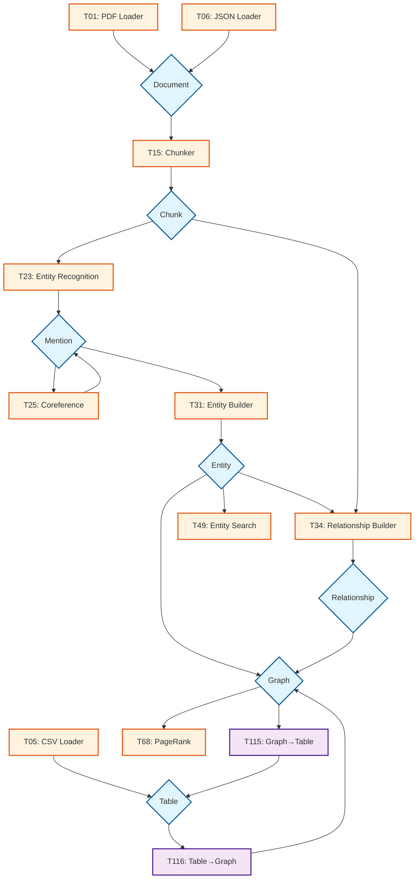

# Tool Compatibility Visualizations

## 1. Network Graph Visualization



## 2. Compatibility Table View

### Tool-to-Tool Direct Compatibility

| From Tool | Outputs | Can Feed Into | Cannot Feed Into |
|-----------|---------|---------------|------------------|
| T01 (PDF Loader) | Document | T15, T16 (Chunkers) | T23 (NER) - needs chunks first |
| T15 (Chunker) | Chunks | T23, T24 (NER), T41 (Embedder) | T31 (Builder) - needs mentions |
| T23 (NER) | Mentions | T25 (Coref), T26 (Linker), T29 (Disambig) | T68 (PageRank) - needs full graph |
| T25 (Coref) | Mentions (linked) | T31 (Entity Builder) | T34 (Rel Builder) - needs entities |
| T31 (Builder) | Entities | T34 (Rel Builder), T49 (Search), T76 (Store) | T15 (Chunker) - wrong direction |
| T34 (Rel Builder) | Relations | T76 (Store), Analysis tools | Ingestion tools - wrong direction |

### Data Type Compatibility Matrix

|              | Document | Chunk | Mention | Entity | Relation | Graph | Table |
|--------------|:--------:|:-----:|:-------:|:------:|:--------:|:-----:|:-----:|
| **Accepts:** |          |       |         |        |          |       |       |
| T15 Chunker  | ✓        | ✗     | ✗       | ✗      | ✗        | ✗     | ✗     |
| T23 NER      | ✗        | ✓     | ✗       | ✗      | ✗        | ✗     | ✗     |
| T25 Coref    | ✗        | ✗     | ✓       | ✗      | ✗        | ✗     | ✗     |
| T31 Builder  | ✗        | ✗     | ✓       | ✗      | ✗        | ✗     | ✗     |
| T34 RelBuild | ✗        | ✓     | ✗       | ✓      | ✗        | ✗     | ✗     |
| T68 PageRank | ✗        | ✗     | ✗       | ✓      | ✓        | ✓     | ✗     |
| T115 G→T     | ✗        | ✗     | ✗       | ✓      | ✓        | ✓     | ✗     |
| T116 T→G     | ✗        | ✗     | ✗       | ✗      | ✗        | ✗     | ✓     |

## 3. Three-Level Identity Flow Diagram

```
Document: "Apple announced that Cook believes Apple will dominate. AAPL up 5%."
                |
                v
        [T15: Chunker]
                |
                v
Chunk: "Apple announced that Cook believes Apple will dominate. AAPL up 5%."
                |
                v
        [T23: NER]
                |
                v
Mentions:   
┌─────────────────┐  ┌─────────────────┐  ┌─────────────────┐
│ Mention_001     │  │ Mention_002     │  │ Mention_003     │
│ Surface: "Apple"│  │ Surface: "Apple"│  │ Surface: "AAPL" │
│ Position: 0     │  │ Position: 32    │  │ Position: 52    │
│ Context: "Apple │  │ Context: "Cook  │  │ Context: "AAPL  │
│ announced..."   │  │ believes Apple..│  │ up 5%"          │
└────────┬────────┘  └────────┬────────┘  └────────┬────────┘
         │                    │                     │
         v                    v                     v
              [T25: Coreference Resolution]
                           |
                           v
Coreference Chain: ["Mention_001", "Mention_002", "Mention_003"] 
                           |
                           v
                  [T31: Entity Builder]
                           |
                           v
┌─────────────────────────────────────────┐
│ Entity_001                              │
│ Canonical: "Apple Inc."                 │
│ Type: "ORG"                            │
│ Surface forms: ["Apple", "AAPL"]       │
│ Mention refs: [001, 002, 003]          │
│ Confidence: 0.92                       │
└─────────────────────────────────────────┘
```

## 4. Pipeline Compatibility Patterns

### Pattern A: Linear Pipeline
```
PDF → Document → Chunks → Mentions → Entities → Graph → Analysis
```

### Pattern B: Parallel Merge
```
CSV → Table ─┐
              ├→ Graph → Analysis
PDF → ... ────┘
```

### Pattern C: Format Switching
```
Graph → [T115] → Table → Statistical Analysis → Results
                   ↓
              [T116] → Graph → Further Analysis
```

## 5. Compatibility Rules Summary

### Strong Compatibility (Direct Connection)
- Output type matches input type exactly
- No data loss or transformation needed
- Examples: Document→Chunker, Chunks→NER

### Weak Compatibility (Needs Adapter)
- Data can be transformed but requires conversion
- Some information might be lost
- Examples: Graph→Table (via T115), Table→Graph (via T116)

### Incompatible (Cannot Connect)
- Data types are fundamentally different
- No meaningful transformation possible
- Examples: Entity→Chunker, Graph→NER

## 6. Quality & Confidence Flow

```
Document (conf: 0.95)
    ↓ (propagate)
Chunks (conf: 0.95)
    ↓ (extraction uncertainty)
Mentions (conf: 0.87)
    ↓ (resolution uncertainty)  
Entities (conf: 0.82)
    ↓ (relationship uncertainty)
Relations (conf: 0.75)
    ↓ (aggregation)
Graph Analysis (conf: 0.78)
```

The confidence typically degrades as we move through the pipeline, which is why tracking it at every step is critical.

## 7. Implementation Priority Based on Connectivity

### Hub Tools (Many Connections)
1. **T31 Entity Builder** - Central to everything
2. **T15 Chunker** - Gateway from documents
3. **T23 NER** - Gateway to mentions
4. **T76 Neo4j Storage** - Central storage

### Bridge Tools (Format Converters)
1. **T115 Graph→Table** - Enables statistical analysis
2. **T116 Table→Graph** - Enables graph analysis of structured data
3. **T25 Coreference** - Bridges mentions to entities

### Leaf Tools (Specialized)
1. **T68-T75** - Analysis tools
2. **T82-T89** - NLP tools
3. **T90-T106** - Monitoring/UI tools

This visualization shows that our architecture has clear data flow paths with explicit transformation points, making it implementable and debuggable.