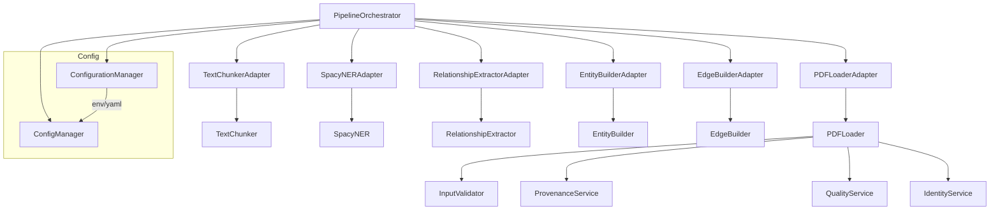
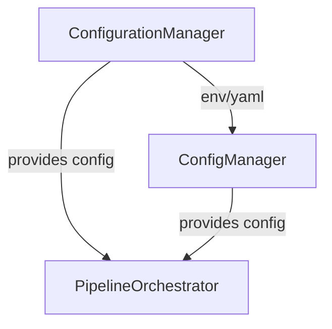

# Abstraction Mapping and Redundancy Review

## Document Processing Flow
- **PDFLoaderAdapter** → **PDFLoader** → **InputValidator**, **ProvenanceService**, **QualityService**, **IdentityService**
- **TextChunkerAdapter** → **TextChunker**
- **SpacyNERAdapter** → **SpacyNER**
- **RelationshipExtractorAdapter** → **RelationshipExtractor**
- **EntityBuilderAdapter** → **EntityBuilder**
- **EdgeBuilderAdapter** → **EdgeBuilder**
- **PipelineOrchestrator** coordinates the above via tool protocol

### Observations
- Many adapters (e.g., PDFLoaderAdapter) mostly pass through to the underlying tool, adding little logic.
- ServiceManager and ConfigManager are used to provide dependencies, but sometimes just wrap direct instantiation.
- Tool protocol and adapters add indirection; could be flattened if not needed for dynamic loading or interface enforcement.

## Config Loading Flow
- **ConfigurationManager** and **ConfigManager** both exist, each with their own logic for loading and overriding config.
- Both support environment variable overrides and YAML config files.
- Redundant logic for getting Neo4j, API, and system config.

### Redundancy Candidates
- Adapters that only wrap a single tool with no added logic.
- Multiple config managers with overlapping responsibilities.
- Service managers that only pass through to underlying services.

## Flow Diagram

### Layer Redundancy/Flattening Notes
- **Adapters (e.g., PDFLoaderAdapter):**
  - If removed, PipelineOrchestrator would need to call the underlying tool directly.
  - If adapters add no logic, merging is safe and reduces indirection.
- **ServiceManager/ConfigManager:**
  - If only passing through to direct instantiation, can be merged or removed.
- **Multiple Config Managers:**
  - Merge into a single config manager to avoid confusion and duplication.

### What Would Break?
- If dynamic loading or interface enforcement is needed (e.g., for plugin systems), adapters may be required.
- If not, flattening will simplify the codebase and improve maintainability.

## Next Steps
- Diagram the above flows for clarity.
- For each adapter/wrapper, document what would break if it were removed or merged.
- Consider merging config managers and flattening tool adapters if possible. 

## Config Loading Flow Diagram

### Notes on Merging Config Managers
- Both managers load config from YAML and environment variables.
- Both provide similar methods for getting Neo4j, API, and system config.
- Merging would:
  - Eliminate duplication
  - Reduce confusion for developers
  - Centralize config validation and overrides
- Migration considerations:
  - Update all imports/usages to the unified manager
  - Ensure all config keys/fields are supported
  - Add deprecation warnings for old manager if needed 

## Summary & Recommendations

### Prioritized Recommendations
1. **Merge ConfigurationManager and ConfigManager** into a single, unified config system.
2. **Flatten tool adapters** where they add no logic—call tools directly from the orchestrator.
3. **Remove or merge ServiceManager if it only passes through to direct instantiation.**
4. **Document any remaining adapters/wrappers with a clear rationale.**

### Refactoring Checklist
- [ ] Diagram/document all flows and layers (done above)
- [ ] Identify and list all adapters/wrappers
- [ ] For each, note what would break if removed/merged
- [ ] Plan migration for config manager unification
- [ ] Plan migration for adapter flattening
- [ ] Add tests to ensure no regressions during refactor 

## Detailed Adapter Inventory (src/core/tool_adapters.py)

| Adapter Class                      | Wraps/Calls                | Logic Added?         | Used In                        | Flattening Candidate? |
|------------------------------------|----------------------------|----------------------|-------------------------------|----------------------|
| PDFLoaderAdapter                   | PDFLoader                  | Minimal (validation) | ToolFactory, Orchestrator      | Yes                  |
| TextChunkerAdapter                 | TextChunker                | Minimal (validation) | ToolFactory, Orchestrator      | Yes                  |
| SpacyNERAdapter                    | SpacyNER                   | Minimal (theory_aware)| ToolFactory, Orchestrator     | Yes                  |
| RelationshipExtractorAdapter       | RelationshipExtractor      | Minimal (theory_aware)| ToolFactory, Orchestrator     | Yes                  |
| EntityBuilderAdapter               | EntityBuilder              | Minimal (config pass) | ToolFactory, Orchestrator      | Yes                  |
| EdgeBuilderAdapter                 | EdgeBuilder                | Minimal (config pass) | ToolFactory, Orchestrator      | Yes                  |
| PageRankAdapter                    | PageRankCalculator         | Minimal              | ToolFactory, Orchestrator      | Yes                  |
| MultiHopQueryAdapter               | MultiHopQuery              | Minimal              | ToolFactory, Orchestrator      | Yes                  |
| VectorEmbedderAdapter              | VectorEmbedder             | Minimal              | ToolFactory, Orchestrator      | Yes                  |
| OntologyAwareExtractorAdapter      | OntologyAwareExtractor     | Minimal              | ToolFactory (Phase 2)          | Yes                  |
| OntologyGraphBuilderAdapter        | OntologyGraphBuilder       | Minimal              | ToolFactory (Phase 2)          | Yes                  |
| InteractiveGraphVisualizerAdapter  | InteractiveGraphVisualizer | Minimal              | ToolFactory (Phase 2)          | Yes                  |
| MultiDocumentFusionAdapter         | MultiDocumentFusion        | Minimal              | ToolFactory (Phase 3)          | Yes                  |

### Notes
- All adapters inherit from BaseToolAdapter, which provides config/services.
- Most adapters only add input validation and config passing.
- All are strong candidates for flattening unless dynamic loading or interface enforcement is required. 

## Complete Abstraction Layer Inventory

### Manager Classes
| Class                     | Location                      | Purpose                          | Redundancy Assessment |
|---------------------------|-------------------------------|----------------------------------|----------------------|
| ConfigManager             | src/core/config_manager.py    | Configuration management         | Redundant with ConfigurationManager |
| ConfigurationManager      | src/core/config.py            | Configuration management         | Redundant with ConfigManager |
| ServiceManager            | src/core/service_manager.py   | Service lifecycle management     | Necessary for DI |
| APIAuthManager            | src/core/api_auth_manager.py  | API authentication management    | Necessary |
| Neo4jDockerManager        | src/core/neo4j_manager.py     | Neo4j Docker management          | Necessary |
| LoggingConfigManager      | src/core/logging_config.py    | Logging configuration            | Necessary |
| DataModelsManager         | src/core/data_models.py       | Data model management            | Assess usage |
| UIPhaseManager            | src/ui/ui_phase_adapter.py    | UI phase management              | Necessary for UI |
| Phase1MCPToolsManager     | src/tools/phase1/phase1_mcp_tools.py | MCP tools management      | Assess usage |

### Factory Classes
| Class                     | Location                      | Purpose                          | Redundancy Assessment |
|---------------------------|-------------------------------|----------------------------------|----------------------|
| ToolFactory               | src/core/tool_factory.py      | Tool creation and configuration  | Necessary |

### Orchestrator Classes
| Class                     | Location                      | Purpose                          | Redundancy Assessment |
|---------------------------|-------------------------------|----------------------------------|----------------------|
| PipelineOrchestrator      | src/core/pipeline_orchestrator.py | Main pipeline execution       | Necessary |
| IntegratedPipelineOrchestrator | src/core/phase_adapters.py | Integrated phase orchestration | Assess vs PipelineOrchestrator |

### Bridge Classes
| Class                     | Location                      | Purpose                          | Redundancy Assessment |
|---------------------------|-------------------------------|----------------------------------|----------------------|
| ToolAdapterBridge         | src/core/tool_adapter_bridge.py | Tool validation bridge        | Necessary for validation |

### Adapter Classes
| Class                     | Location                      | Purpose                          | Redundancy Assessment |
|---------------------------|-------------------------------|----------------------------------|----------------------|
| BaseToolAdapter           | src/core/tool_adapters.py     | Base for all tool adapters      | Necessary if keeping adapters |
| Phase1Adapter             | src/core/phase_adapters.py    | Phase 1 workflow adapter        | Assess vs direct orchestrator |
| Phase2Adapter             | src/core/phase_adapters.py    | Phase 2 workflow adapter        | Assess vs direct orchestrator |
| Phase3Adapter             | src/core/phase_adapters.py    | Phase 3 workflow adapter        | Assess vs direct orchestrator |
| StandardWorkflowAdapter   | src/core/api_contracts.py     | Standard workflow interface      | Assess usage |
| [13 Tool Adapters]        | src/core/tool_adapters.py     | Individual tool adapters         | Strong candidates for flattening |

### Registry Classes
| Class                     | Location                      | Purpose                          | Redundancy Assessment |
|---------------------------|-------------------------------|----------------------------------|----------------------|
| ToolAdapterRegistry       | src/core/tool_adapters.py     | Tool adapter registration        | Necessary if keeping adapters |

### Protocol Classes
| Class                     | Location                      | Purpose                          | Redundancy Assessment |
|---------------------------|-------------------------------|----------------------------------|----------------------|
| WorkflowInterface         | src/core/api_contracts.py     | Workflow interface protocol      | Assess usage |
| WorkflowStateInterface    | src/core/api_contracts.py     | Workflow state protocol          | Assess usage | 