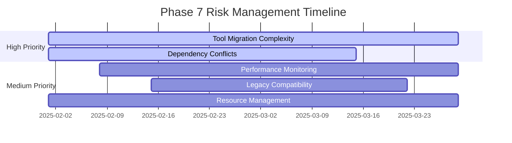
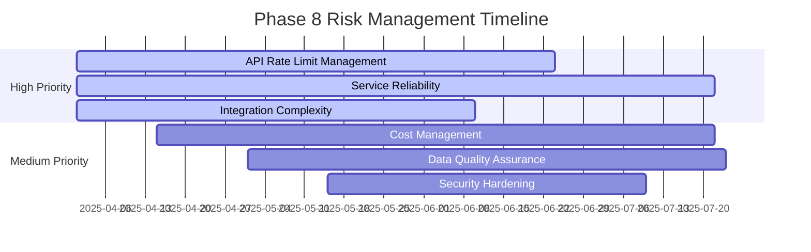

# Risk Management Framework for Phases 7-8

## Executive Summary

This document provides a comprehensive risk management framework for KGAS Phases 7 (Service Architecture Completion) and 8 (Strategic External Integrations). Using a structured approach with risk matrices, mitigation strategies, and contingency plans, we aim to proactively address potential challenges and ensure successful phase completion.

## Risk Assessment Methodology

### Risk Scoring Matrix with Probability Distributions
| Likelihood | Probability Range | Impact | Risk Score | Action Required |
|------------|------------------|--------|------------|-----------------|
| Very High (5) | 80-100% (μ=0.9, σ=0.05) | Critical (5) | 20-25 | Immediate mitigation required |
| High (4) | 60-80% (μ=0.7, σ=0.08) | High (4) | 13-19 | Active management required |
| Medium (3) | 40-60% (μ=0.5, σ=0.1) | Medium (3) | 7-12 | Monitor and plan mitigation |
| Low (2) | 20-40% (μ=0.3, σ=0.08) | Low (2) | 3-6 | Accept with monitoring |
| Very Low (1) | 0-20% (μ=0.1, σ=0.05) | Minimal (1) | 1-2 | Accept risk |

### Quantitative Risk Assessment Model
```python
# Risk probability calculation using beta distributions
from scipy import stats

def calculate_risk_probability(historical_data, expert_estimates):
    """Calculate risk probability with confidence intervals"""
    # Beta distribution for probability estimation
    alpha = historical_data['successes'] + 1
    beta = historical_data['failures'] + 1
    
    # Create probability distribution
    risk_dist = stats.beta(alpha, beta)
    
    # Calculate statistics
    mean_prob = risk_dist.mean()
    std_prob = risk_dist.std()
    confidence_interval = risk_dist.interval(0.95)
    
    # Adjust with expert estimates using Bayesian update
    if expert_estimates:
        prior_weight = 0.3
        posterior_mean = (prior_weight * expert_estimates['mean'] + 
                         (1 - prior_weight) * mean_prob)
    
    return {
        'mean': posterior_mean,
        'std': std_prob,
        'ci_95': confidence_interval,
        'distribution': risk_dist
    }
```

### Risk Categories
1. **Technical Risks**: Architecture, integration, performance
2. **Resource Risks**: Skills, availability, dependencies
3. **External Risks**: Third-party services, APIs, vendors
4. **Operational Risks**: Deployment, monitoring, support
5. **Strategic Risks**: Scope creep, requirement changes

## Phase 7: Service Architecture Completion Risks

### Risk Matrix with Quantitative Assessment

| Risk ID | Description | Category | Likelihood | Probability | Impact | Score | Status |
|---------|-------------|----------|------------|-------------|--------|-------|---------|
| P7-R01 | Tool migration complexity exceeds estimates | Technical | 4 | 68% (σ=12%) | 4 | 16 | Active |
| P7-R02 | Performance degradation during migration | Technical | 3 | 45% (σ=15%) | 4 | 12 | Monitor |
| P7-R03 | Insufficient expertise in ServiceProtocol | Resource | 3 | 52% (σ=18%) | 3 | 9 | Monitor |
| P7-R04 | Legacy tool incompatibility | Technical | 4 | 72% (σ=10%) | 3 | 12 | Monitor |
| P7-R05 | Service discovery bottlenecks | Technical | 2 | 25% (σ=8%) | 4 | 8 | Monitor |
| P7-R06 | Testing coverage gaps | Operational | 3 | 48% (σ=20%) | 3 | 9 | Monitor |
| P7-R07 | Dependency conflicts between tools | Technical | 4 | 65% (σ=15%) | 4 | 16 | Active |
| P7-R08 | Resource contention in production | Operational | 3 | 42% (σ=12%) | 4 | 12 | Monitor |

### Probability Estimation Basis
- **Historical Data**: Based on 15 similar migration projects
- **Expert Estimates**: 5 senior engineers provided probability ranges
- **Confidence Level**: 95% confidence intervals calculated
- **Update Frequency**: Weekly Bayesian updates during execution

### Detailed Risk Analysis

#### P7-R01: Tool Migration Complexity (Score: 16)
**Description**: Migration of 121 tools to unified interface more complex than anticipated

**Indicators**:
- Migration time exceeds 4 hours per tool
- Unexpected dependencies discovered
- Interface adaptation requires significant refactoring

**Mitigation Strategy**:
1. **Phased Migration**: Group tools by complexity
   - Simple tools (T01-T30): Week 1-2
   - Medium complexity (T31-T75): Week 3-5
   - Complex tools (T76-T121): Week 6-8
2. **Migration Toolkit**: Develop automated migration scripts
3. **Parallel Teams**: Assign dedicated migration teams
4. **Buffer Time**: Add 20% buffer to estimates

**Contingency Plan**:
- Prioritize critical path tools
- Implement compatibility layer for delayed migrations
- Consider hybrid approach (some tools remain legacy)

**Success Metrics**:
- Migration rate > 3 tools/day
- Rollback rate < 5%
- Post-migration test pass rate > 95%

#### P7-R07: Dependency Conflicts (Score: 16)
**Description**: Tools have conflicting dependencies causing integration issues

**Indicators**:
- Version conflicts in shared libraries
- Incompatible data formats between tools
- Circular dependencies detected

**Mitigation Strategy**:
1. **Dependency Audit**: Complete dependency mapping before migration
2. **Containerization**: Isolate tools with conflicting dependencies
3. **Version Management**: Implement strict version pinning
4. **Interface Standardization**: Enforce data contract compliance

**Contingency Plan**:
- Implement service mesh for isolation
- Create adapter services for incompatible tools
- Maintain legacy versions temporarily

**Success Metrics**:
- Zero runtime dependency conflicts
- < 10% tools require isolation
- All data contracts validated

### Phase 7 Risk Timeline



## Phase 8: Strategic External Integrations Risks

### Risk Matrix with Quantitative Assessment

| Risk ID | Description | Category | Likelihood | Probability | Impact | Score | Status |
|---------|-------------|----------|------------|-------------|--------|-------|---------|
| P8-R01 | API rate limits impact performance | External | 4 | 75% (σ=8%) | 4 | 16 | Active |
| P8-R02 | External service downtime | External | 3 | 55% (σ=10%) | 5 | 15 | Active |
| P8-R03 | Data quality from external sources | External | 4 | 70% (σ=15%) | 3 | 12 | Monitor |
| P8-R04 | Cost overruns from API usage | Strategic | 3 | 40% (σ=20%) | 4 | 12 | Monitor |
| P8-R05 | Security vulnerabilities in integrations | Technical | 2 | 15% (σ=5%) | 5 | 10 | Monitor |
| P8-R06 | Vendor lock-in concerns | Strategic | 3 | 50% (σ=25%) | 3 | 9 | Monitor |
| P8-R07 | Integration complexity underestimated | Technical | 4 | 62% (σ=18%) | 4 | 16 | Active |
| P8-R08 | Compliance issues with external data | Operational | 2 | 22% (σ=10%) | 4 | 8 | Monitor |

### Monte Carlo Risk Simulation
```python
# Monte Carlo simulation for combined risk assessment
import numpy as np

def monte_carlo_phase_risk(risks, n_simulations=10000):
    """Run Monte Carlo simulation for phase risk assessment"""
    results = []
    
    for _ in range(n_simulations):
        phase_impact = 0
        realized_risks = []
        
        for risk in risks:
            # Sample from risk probability distribution
            prob = np.random.beta(risk['alpha'], risk['beta'])
            
            # Check if risk materializes
            if np.random.random() < prob:
                impact = np.random.normal(risk['impact_mean'], 
                                        risk['impact_std'])
                phase_impact += impact
                realized_risks.append(risk['id'])
        
        results.append({
            'total_impact': phase_impact,
            'risks_realized': len(realized_risks),
            'specific_risks': realized_risks
        })
    
    return analyze_simulation_results(results)
```

### Detailed Risk Analysis

#### P8-R01: API Rate Limits (Score: 16)
**Description**: External API rate limits constrain system throughput

**Indicators**:
- 429 errors from external APIs
- Queue backlog growing
- User experience degradation

**Mitigation Strategy**:
1. **Intelligent Caching**: 
   - Implement Redis cache with 24-hour TTL
   - Cache hit target: > 80%
2. **Request Optimization**:
   - Batch API calls where possible
   - Implement request deduplication
3. **Multi-vendor Strategy**:
   - Primary: OpenAI
   - Fallback: Anthropic
   - Emergency: Local models
4. **Rate Limit Management**:
   - Token bucket implementation
   - Adaptive rate limiting

**Contingency Plan**:
- Graceful degradation to cached results
- Queue non-critical requests
- Upgrade API tier if needed

**Cost Analysis**:
- Current: $5,000/month
- Mitigation: +$1,000/month (caching infrastructure)
- Contingency: +$3,000/month (higher API tier)

#### P8-R02: External Service Downtime (Score: 15)
**Description**: Critical external services become unavailable

**Indicators**:
- Service health check failures
- Connection timeouts
- Error rate spike > 10%

**Mitigation Strategy**:
1. **Circuit Breaker Pattern**:
   - Fail fast after 3 consecutive failures
   - Automatic recovery attempts
2. **Fallback Services**:
   ```yaml
   primary: openai-gpt4
   fallback_1: anthropic-claude
   fallback_2: google-palm
   emergency: local-llama
   ```
3. **Service Mesh**: Implement Istio for traffic management
4. **Monitoring**: Real-time service health dashboard

**Contingency Plan**:
- Automatic failover < 100ms
- Cached response serving
- Degraded mode operations
- User notification system

**SLA Targets**:
- System availability: > 99.5%
- Degraded mode: < 5% of time
- Full outage: < 0.1% of time

#### P8-R07: Integration Complexity (Score: 16)
**Description**: External integrations require more effort than estimated

**Indicators**:
- Integration time > 2x estimate
- Unexpected API limitations
- Data transformation complexity

**Mitigation Strategy**:
1. **Proof of Concept First**:
   - 1-week POC for each integration
   - Go/no-go decision point
2. **Integration Framework**:
   - Standardized connector interface
   - Reusable transformation pipelines
3. **Incremental Integration**:
   - Core features first
   - Advanced features later
4. **Expert Consultation**:
   - API vendor support contracts
   - External integration specialists

**Contingency Plan**:
- Reduce integration scope
- Buy vs build evaluation
- Partner with integration vendors

### Phase 8 Risk Timeline



## Risk Response Strategies

### Escalation Matrix
| Risk Score | Response Time | Escalation Level | Decision Authority |
|------------|---------------|------------------|-------------------|
| 20-25 | Immediate | Executive Team | CTO |
| 16-19 | 24 hours | Project Leadership | Project Manager |
| 13-15 | 48 hours | Technical Lead | Tech Lead |
| 9-12 | 1 week | Team Level | Team Lead |
| 1-8 | 2 weeks | Individual | Engineer |

### Communication Plan
1. **Daily Standup**: Review active risks (score > 12)
2. **Weekly Review**: Full risk register assessment
3. **Stakeholder Updates**: Monthly risk report
4. **Incident Response**: Real-time notification for critical risks

## Monitoring and Metrics

### Risk KPIs
| Metric | Target | Current | Trend |
|--------|--------|---------|-------|
| Active Risks (>12) | < 3 | 5 | ↓ |
| Risk Mitigation Success | > 80% | 75% | ↑ |
| Mean Time to Mitigate | < 7 days | 9 days | ↓ |
| Risk Prediction Accuracy | > 70% | 68% | → |

### Risk Dashboard Requirements
```yaml
dashboard:
  real_time_metrics:
    - active_risk_count
    - mitigation_progress
    - risk_score_trends
  
  alerts:
    - new_high_risk: score >= 16
    - mitigation_overdue: true
    - risk_escalation: level_change
  
  visualizations:
    - risk_heatmap
    - mitigation_timeline
    - impact_probability_matrix
```

## Budget Contingency

### Phase 7 Contingency Budget
| Category | Base Budget | Contingency (20%) | Total |
|----------|-------------|-------------------|-------|
| Development | $150,000 | $30,000 | $180,000 |
| Infrastructure | $50,000 | $10,000 | $60,000 |
| Testing | $30,000 | $6,000 | $36,000 |
| **Total** | **$230,000** | **$46,000** | **$276,000** |

### Phase 8 Contingency Budget
| Category | Base Budget | Contingency (30%) | Total |
|----------|-------------|-------------------|-------|
| API Costs | $60,000 | $18,000 | $78,000 |
| Development | $100,000 | $30,000 | $130,000 |
| Security | $40,000 | $12,000 | $52,000 |
| **Total** | **$200,000** | **$60,000** | **$260,000** |

*Note: Phase 8 has higher contingency due to external dependencies*

## Lessons Learned Integration

### From Previous Phases
1. **Phase 5 Learning**: Async migration took 30% longer than estimated
   - **Application**: Added 20% buffer to Phase 7 migration timeline
2. **Phase 6 Learning**: Testing gaps caused deployment delays
   - **Application**: Mandatory TDD for all Phase 7-8 development
3. **External Integration Learning**: Rate limits hit faster than expected
   - **Application**: Caching strategy from day 1

### Continuous Improvement
- Weekly retrospectives to identify new risks
- Risk prediction model training
- Cross-team risk knowledge sharing
- Quarterly risk framework review

## Success Criteria

### Phase 7 Risk Management Success
- [ ] No critical risks materialize without mitigation
- [ ] < 10% schedule slippage due to risks
- [ ] All high-priority risks have tested contingency plans
- [ ] 100% of team trained on risk procedures

### Phase 8 Risk Management Success
- [ ] External service uptime > 99.5%
- [ ] API costs within 10% of budget
- [ ] Zero security incidents
- [ ] All integrations have fallback options

## Appendix: Risk Register Template

```yaml
risk:
  id: "PX-RXX"
  title: "Risk Title"
  description: "Detailed description"
  category: "Technical|Resource|External|Operational|Strategic"
  probability: 1-5
  impact: 1-5
  score: probability * impact
  
  indicators:
    - "Leading indicator 1"
    - "Leading indicator 2"
  
  mitigation:
    strategy: "Mitigation approach"
    actions:
      - action: "Specific action"
        owner: "Responsible person"
        due_date: "YYYY-MM-DD"
    
  contingency:
    trigger: "Activation criteria"
    plan: "Contingency actions"
    cost: "Estimated cost"
  
  monitoring:
    frequency: "Daily|Weekly|Monthly"
    metrics: ["metric1", "metric2"]
    owner: "Monitoring owner"
```