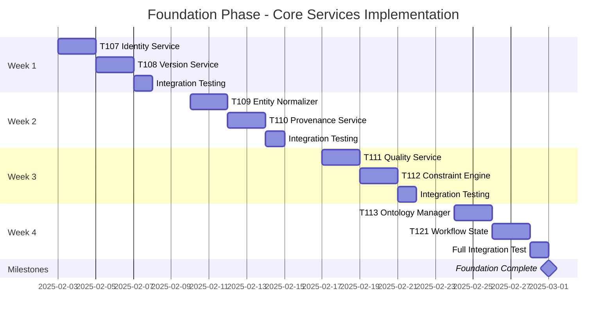
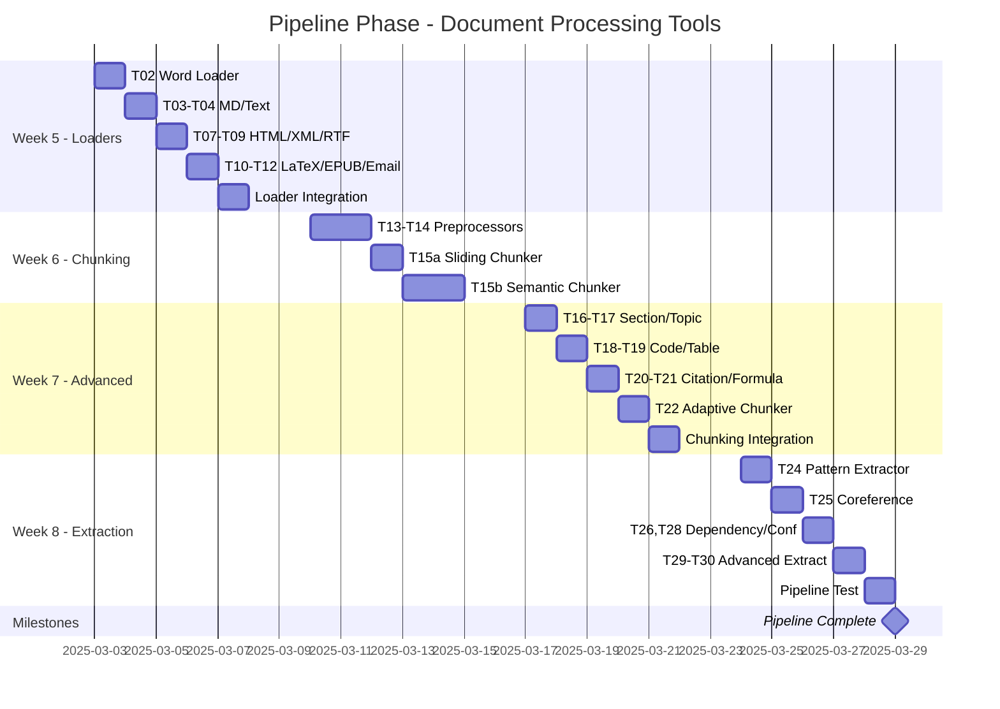
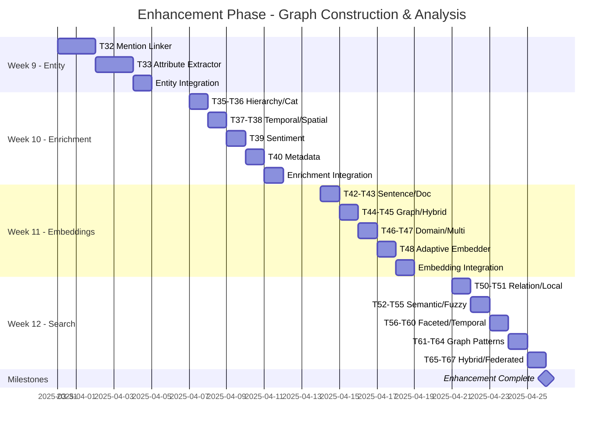
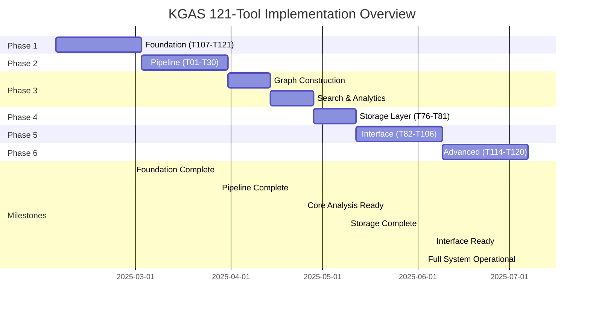
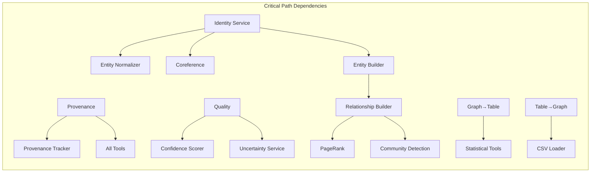
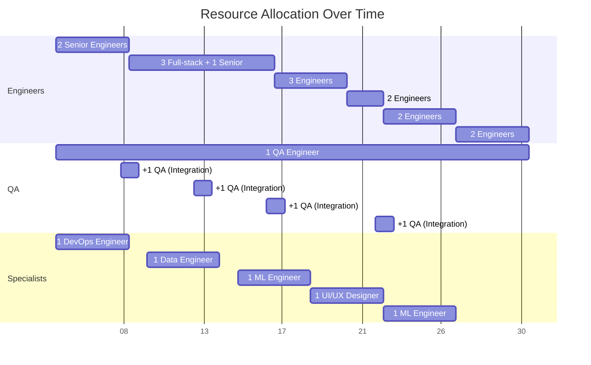
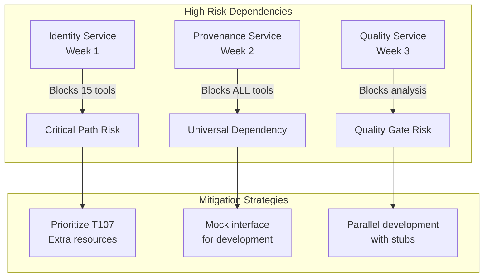

# Tool Rollout Timeline - Gantt Chart Visualization

## Foundation Phase (Weeks 1-4): Core Services

## Pipeline Phase (Weeks 5-8): Document Processing

## Enhancement Phase (Weeks 9-12): Graph Construction

## Complete 26-Week Overview

## Critical Path Analysis

## Resource Loading Chart

## Dependency Risk Visualization

## Weekly Progress Tracking

| Week | Phase | Tools | Cumulative | % Complete | Key Milestones |
|------|-------|-------|------------|------------|----------------|
| 1 | Foundation | 2 | 2 | 1.7% | Identity & Version services |
| 2 | Foundation | 2 | 4 | 3.3% | Normalizer & Provenance |
| 3 | Foundation | 2 | 6 | 5.0% | Quality & Constraints |
| 4 | Foundation | 2 | 8 | 6.6% | **Foundation Complete** |
| 5 | Pipeline | 12 | 20 | 16.5% | All loaders operational |
| 6 | Pipeline | 4 | 24 | 19.8% | Basic chunking ready |
| 7 | Pipeline | 7 | 31 | 25.6% | Advanced chunking |
| 8 | Pipeline | 7 | 38 | 31.4% | **Pipeline Complete** |
| 9 | Enhancement | 2 | 40 | 33.1% | Entity enhancement |
| 10 | Enhancement | 6 | 46 | 38.0% | Graph enrichment |
| 11 | Enhancement | 7 | 53 | 43.8% | Embeddings ready |
| 12 | Enhancement | 18 | 71 | 58.7% | **Search Complete** |
| 13-16 | Analysis | 17 | 88 | 72.7% | Analytics & cross-modal |
| 17-18 | Storage | 6 | 94 | 77.7% | **Persistence Ready** |
| 19-22 | Interface | 25 | 119 | 98.3% | UI/Export complete |
| 23-26 | Advanced | 2 | 121 | 100% | **Full System Ready** |

## Slack Time Analysis

Built-in slack time for risk mitigation:
- Week 4: 1 day buffer after Foundation
- Week 8: 1 day buffer after Pipeline  
- Week 12: 2 day buffer after Enhancement
- Week 18: 2 day buffer after Storage
- Week 22: 3 day buffer after Interface
- Week 26: 3 day buffer for final integration

Total slack: 12 days (9.2% of schedule)